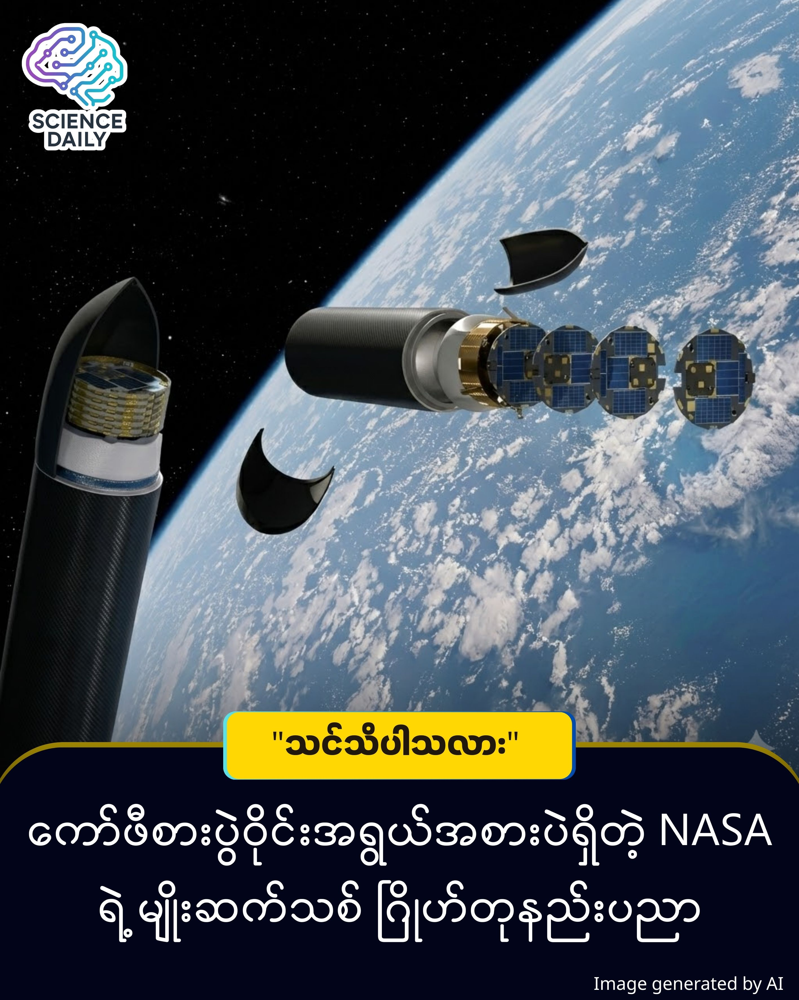

title: NASA ၏ ပန်းကန်ပြားပျံ ဂြိုဟ်တုအသစ်များ
summary:ဂြိုဟ်တုအသေးစားလေးတွေ (Small Satellites) ဆိုလိုက်တာနဲ့ မျက်လုံးထဲမှာ လေးထောင့်ပုံးပုံစံ (CubeSat) တွေကိုပဲ ပြေးမြင်မိကြမှာပါ။ 
Date: 2025-12-25
Image: images/DiskSat.jpg

NASA ၏ "ပန်းကန်ပြားပျံ" ဂြိုဟ်တုအသစ်များ - DiskSat ဆိုတာဘာလဲ

ဂြိုဟ်တုအသေးစားလေးတွေ (Small Satellites) ဆိုလိုက်တာနဲ့ မျက်လုံးထဲမှာ လေးထောင့်ပုံးပုံစံ (CubeSat) တွေကိုပဲ ပြေးမြင်မိကြမှာပါ။ ဒါပေမဲ့ ဒီတစ်ခါ NASA က လွှတ်တင်လိုက်တာကတော့ လုံးဝကို ခွဲထွက်နေပါတယ်။ "ပန်းကန်ပြား" ပုံစံ ဂြိုဟ်တုအပြားတွေကို အာကာသထဲ အောင်မြင်စွာ ပို့ဆောင်လိုက်နိုင်ပါပြီ ။ ဒါဟာ ဂြိုဟ်တုနည်းပညာသမိုင်းမှာ ဒီဇိုင်းပိုင်းဆိုင်ရာ အလှည့်အပြောင်းတစ်ခု ဖြစ်လာနိုင်ပါတယ်။

ဒီပရောဂျက်ကို DiskSat လို့ခေါ်ပါတယ်။ သူ့ရဲ့ပုံစံက ရှုပ်ရှုပ်ထွေးထွေး မဟုတ်ပါဘူး။ အချင်း လက်မ ၄၀၊ အထူ ၁ လက်မလောက်ပဲရှိတဲ့ အပြားဝိုင်းကြီးပါ ။ မြင်အောင်ပြောရရင် ကော်ဖီစားပွဲဝိုင်း အသေးစားလေးလောက်ပေါ့ ။

"ဘာလို့များ လေးထောင့်မလုပ်ဘဲ ဒီလိုအပြားပုံစံ လုပ်ရတာလဲ" ဆိုတော့ အဓိက အားသာချက် (၂) ချက် ရှိလို့ပါ

စွမ်းအင်ပိုရတယ် - လေးထောင့်ပုံးအသေးလေးတွေမှာ ဆိုလာပြားတပ်ရတာ နေရာအရမ်းကျဉ်းပါတယ်။ အခုလို အပြားပုံစံလုပ်လိုက်တော့ မျက်နှာပြင်ကျယ်သွားပြီး ဆိုလာပြားတွေ ပိုတပ်လို့ရသလို၊ စွမ်းအားမြင့် အင်တင်နာကြီးတွေပါ တပ်ဆင်လာနိုင်ပါတယ် ။

လေဒဏ်ခံနိုင်တယ် - ကမ္ဘာ့လေထုပါးပါးလေးရှိတဲ့ အနိမ့်ပိုင်းပတ်လမ်း (Low Earth Orbit) မှာ ပျံသန်းတဲ့အခါ ဒီအပြားပုံစံက လေတိုးတာကို သက်သာစေပြီး ပျံသန်းရ ပိုငြိမ်စေပါတယ် ။

ပြီးခဲ့တဲ့ ဒီဇင်ဘာလ ၁၈ ရက်နေ့ကမှ Rocket Lab ရဲ့ Electron ဒုံးပျံနဲ့ ဒီ DiskSat ဂြိုဟ်တု ၄ စင်းကို အာကာသထဲ လွှတ်တင်ခဲ့တာပါ ။ အာကာသထဲရောက်တော့မှ ဒုံးပျံဘူးခွံ (Dispenser) ထဲကနေ ဂြိုဟ်တု ၄ စင်းလုံး တစ်စင်းပြီးတစ်စင်း ထွက်လာကြတာဖြစ်ပြီး  ၊ သူတို့မှာပါတဲ့ ကိုယ်ပိုင် တွန်းကန်အားစနစ် (Electric propulsion) တွေကိုသုံးပြီး ကိုယ့်ပတ်လမ်းအသီးသီးကို ဆက်သွားကြမှာ ဖြစ်ပါတယ် ။ 

ဒါဟာ စာရွက်ပေါ်က သီအိုရီအဆင့် မဟုတ်တော့ပါဘူး။ NASA နဲ့ The Aerospace Corporation တို့ ပူးပေါင်းပြီး တကယ် လက်တွေ့စမ်းသပ်နေတဲ့ ပရောဂျက်တစ်ခု ဖြစ်ပါတယ် ။ အခုလွှတ်တင်လိုက်တဲ့ ဂြိုဟ်တုတွေဆိုရင် ကမ္ဘာနဲ့ မိုင် ၁၈၆ အောက် အနိမ့်ပိုင်းပတ်လမ်းတွေအထိ ဆင်းသက်ပြီး စမ်းသပ်မောင်းနှင်ပြသွားမှာပါ ။

ဒီစမ်းသပ်မှုသာ အောင်မြင်သွားရင် ဂြိုဟ်တုလောက ပြောင်းလဲသွားနိုင်ပါတယ်။ စရိတ်လည်းသက်သာမယ် ၊ ကမ္ဘာနဲ့ ပိုနီးနီးကပ်ပျံနိုင်တဲ့အတွက် အင်တာနက်လိုင်းဆွဲအားတွေ ပိုကောင်းလာနိုင်သလို (Latency နည်းမယ်) ၊ ကမ္ဘာမြေပုံတွေကိုလည်း ပိုပြီး ကြည်လင်ပြတ်သားစွာ ရိုက်ကူးနိုင်တော့မှာ ဖြစ်ပါတယ် ။

Source: Interesting Engineering

#NASA #DiskSat #SpaceTech #Satellite #MyanmarTech #ScienceNews #Innovation #FutureTech

