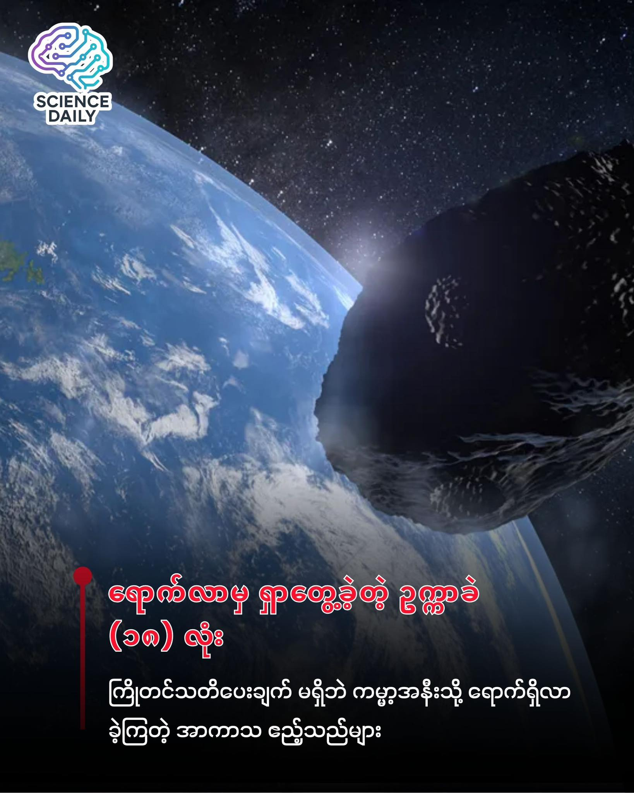

summary:နိုဝင်ဘာလအတွင်း ကမ္ဘာ့အနီးသို့ စံချိန်တင် ဖြတ်သန်းသွားခဲ့သည့် ဥက္ကာခဲ ၁၈ လုံးအကြောင်း
Date: 2025-12-02

🌍☄️ နိုဝင်ဘာလအတွင်း ကမ္ဘာ့အနီးသို့ စံချိန်တင် ဖြတ်သန်းသွားခဲ့သည့် ဥက္ကာခဲ ၁၈ လုံးအကြောင်း" 🌍☄️

အာကာသဟာ အလွန်ကျယ်ပြောလှပြီး တိတ်ဆိတ်ငြိမ်သက်နေတယ်လို့ ကျွန်တော်တို့ ထင်ထားတတ်ကြပါတယ်။ ဒါပေမဲ့ ပြီးခဲ့တဲ့ နိုဝင်ဘာလအတွင်းမှာတော့ ကျွန်တော်တို့ရဲ့ ကမ္ဘာမြေပတ်ဝန်းကျင်ဟာ မထင်မှတ်ထားလောက်အောင် "အသွားအလာ များပြားခဲ့တဲ့" ကာလတစ်ခု ဖြစ်ခဲ့ပါတယ်။ 🌍☄️

ပြီးခဲ့တဲ့ နိုဝင်ဘာလ တစ်လတည်းမှာတင် ဥက္ကာခဲ (Asteroids) ပေါင်း (၁၈) ခုဟာ ကမ္ဘာမြေနဲ့ လကမ္ဘာကြား အကွာအဝေးထက် ပိုမိုနီးကပ်တဲ့ နေရာကနေ ဖြတ်သန်းသွားခဲ့ကြပါတယ်။ ဒီဖြစ်စဉ်မှာ အံ့ဩစရာအကောင်းဆုံးနဲ့ မီးမောင်းထိုးပြစရာ အချက်ကတော့ **အဲဒီ ဥက္ကာခဲ (၁၈) ခုစလုံးကို ၎င်းတို့ ကမ္ဘာနားရောက်လာတဲ့ နိုဝင်ဘာလကျမှသာ ရှာဖွေတွေ့ရှိခဲ့ခြင်း** ဖြစ်ပါတယ်။ 🔭

ပုံမှန်အားဖြင့် ဥက္ကာခဲကြီးတွေကို ကျွန်တော်တို့ နှစ်ပေါင်းများစွာ ကြိုတင် တွက်ချက်ထားနိုင်ကြပေမယ့် ဒီဥက္ကာခဲတွေကတော့ ကမ္ဘာနားကို ကပ်လာခါနီး (သို့မဟုတ်) ရောက်လာတဲ့ အချိန်ကျမှ "ဟော... ဒီမှာပါလား" ဆိုပြီး သိလိုက်ရတဲ့ သဘောပါ။ ဒီအချက်အလက်တွေကို နက္ခတ္တဗေဒပညာရှင် Tony Dunn က ကမ္ဘာပတ်လမ်းကြောင်း သရုပ်ပြပုံရိပ်တွေနဲ့တကွ ထုတ်ဖော်ပြသခဲ့တာ ဖြစ်ပါတယ်။ သူ ဖန်တီးပြသထားတဲ့ Simulation အရ ဆိုရင် နိုဝင်ဘာလအတွင်း ကမ္ဘာ့အနီးကို ဥက္ကာခဲတွေ အုံနဲ့ကျင်းနဲ့ ရောက်လာသလိုတောင် မြင်တွေ့ရပါတယ်။ 🌌

ဒီနေရာမှာ မေးစရာရှိတာက "ဒါဆို ကမ္ဘာကြီးအတွက် အန္တရာယ်ရှိလား" ဆိုတာပါပဲ။ ကံကောင်းစွာနဲ့ပဲ အဖြေက "မရှိပါဘူး"။ အခုတွေ့ခဲ့ရတဲ့ ဥက္ကာခဲတွေဟာ အရွယ်အစားအားဖြင့် သိပ်မကြီးမားကြပါဘူး။ အကြီးဆုံးဥက္ကာခဲက ၁၂ မီတာကနေ ၂၈ မီတာ (ပေ ၄၀ ကနေ ၉၀) ဝန်းကျင်၊ ပြောရရင် အိမ်တစ်လုံးစာ အရွယ်အစားလောက်သာ ရှိကြတာပါ။ ဥပမာအားဖြင့် "2025 WV13" လို့ အမည်ပေးထားတဲ့ ဥက္ကာခဲဆိုရင် ကမ္ဘာနဲ့ ကီလိုမီတာ ၂၄,၀၀၀ (၁၅,၀၀၀ မိုင်) အကွာလောက်ထိ ကပ်ပြီး ဖြတ်သန်းသွားခဲ့တာ ဖြစ်ပါတယ်။ 🏠💫

ဒီဖြစ်စဉ်က ကျွန်တော်တို့အတွက် အချက်နှစ်ချက်ကို မီးမောင်းထိုးပြနေပါတယ်။ ပထမတစ်ချက်ကတော့ စိုးရိမ်စရာပါ။ အာကာသထဲက ကျောက်တုံးအသေးစားလေးတွေဟာ ကြိုတင်သတိပေးချက်မရှိဘဲ အချိန်မရွေး ရောက်ချလာနိုင်တယ်ဆိုတဲ့ အချက်ပါပဲ။ တကယ်လို့သာ လူနေထူထပ်တဲ့ မြို့ကြီးတစ်မြို့ပေါ် ကျရောက်ခဲ့မယ်ဆိုရင် ကြီးမားတဲ့ ပေါက်ကွဲမှုတွေ ဖြစ်စေနိုင်ပါတယ်။ (လွန်ခဲ့တဲ့ နှစ်အနည်းငယ်က ရုရှားမှာ ဖြစ်ခဲ့တဲ့ Chelyabinsk ဥက္ကာခဲပေါက်ကွဲမှုလိုမျိုးပေါ့)။ 💥

ဒုတိယတစ်ချက်ကတော့ ဝမ်းသာစရာပါ။ အခုလို ဥက္ကာခဲ ၁၈ ခုလုံးကို တစ်လတည်းမှာ ရှာဖွေတွေ့ရှိလိုက်နိုင်တယ် ဆိုတာက ကျွန်တော်တို့ လူသားတွေရဲ့ "ကမ္ဘာဂြိုဟ် ကာကွယ်ရေးစနစ် (Planetary Defense)" နဲ့ ထောက်လှမ်းရေး နည်းပညာတွေ (ဥပမာ \- Catalina Sky Survey နဲ့ ATLAS telescopes တို့လိုမျိုး) ဘယ်လောက်ထိ တိုးတက်ကောင်းမွန်လာလဲ ဆိုတာကို ပြသနေပါတယ်။ အရင်ကဆိုရင် ဒီလိုကျောက်တုံးသေးသေးလေးတွေကို ကမ္ဘာနားကပ်လာရင်တောင် မြင်တွေ့နိုင်ဖို့ ခဲယဉ်းပါတယ်။ အခုတော့ ကျွန်တော်တို့ မျက်ခြည်မပြတ် စောင့်ကြည့်နိုင်နေပါပြီ။ 🛰️

နိဂုံးချုပ်ရရင်တော့ ပြီးခဲ့တဲ့ နိုဝင်ဘာလဟာ အာကာသသိပ္ပံပညာရှင်တွေအတွက်တော့ ရင်ခုန်စရာ လတစ်လ ဖြစ်ခဲ့ပါတယ်။ ကမ္ဘာမြေကို ဝင်တိုက်မယ့် အန္တရာယ် မရှိခဲ့ပေမယ့် ဒီဖြစ်စဉ်က ကျွန်တော်တို့ဟာ စကြာဝဠာကြီးထဲမှာ ဘယ်လောက်သေးငယ်ကြောင်းနဲ့ အာကာသ စောင့်ကြည့်ရေး နည်းပညာတွေက ကျွန်တော်တို့ အသက်အန္တရာယ် ကာကွယ်ရေးအတွက် ဘယ်လောက် အရေးပါကြောင်း သတိပေးလိုက်တဲ့ ခေါင်းလောင်းသံလေး တစ်ခုပဲ ဖြစ်ပါတယ်။ 🔔🌏

