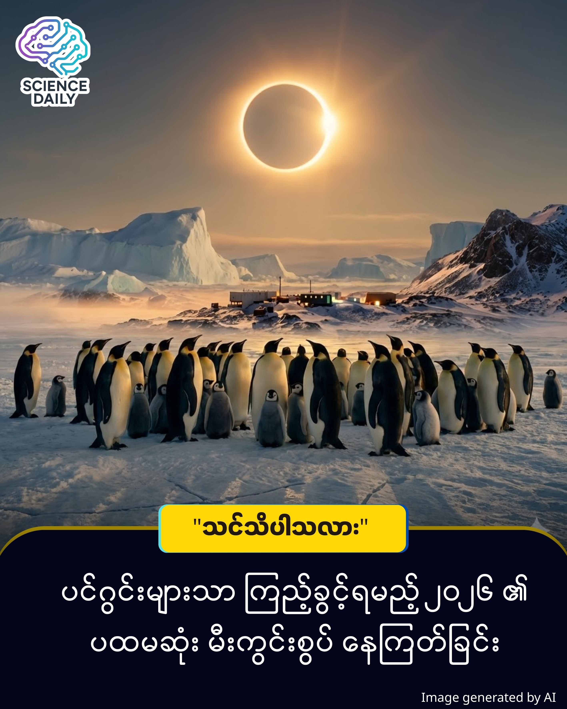

title: ၂၀၂၆ ခုနှစ်၏ ပထမဆုံး မီးကွင်းစွပ် နေကြတ်ခြင်း (Ring of Fire) နှင့် ပင်ဂွင်းများသာ ကြည့်ခွင့်ရမည့် သဘာဝပြကွက်
summary: ၂၀၂၆ ခုနှစ်ဟာ နက္ခတ်တာရာ ဝါသနာရှင်မိတ်ဆွေတွေအတွက် စိတ်လှုပ်ရှားဖွယ်ရာ နှစ်တစ်နှစ် ဖြစ်လာတော့မှာပါ။ ဘာကြောင့်လဲဆိုတော့ လာမယ့် ဖေဖော်ဝါရီလ ၁၇ ရက်နေ့မှာပဲ ၂၀၂၆ ခုနှစ်ရဲ့ ပထမဆုံးသော နေကြတ်ခြင်းဖြစ်စဉ် စတင်တော့မှာ ဖြစ်လို့ပါပဲ ။
Date: 2026-01-22
Image: images/2026's First Eclipse.jpg

၂၀၂၆ ခုနှစ်၏ ပထမဆုံး "မီးကွင်းစွပ်" နေကြတ်ခြင်း (Ring of Fire) နှင့် ပင်ဂွင်းများသာ ကြည့်ခွင့်ရမည့် သဘာဝပြကွက်

၂၀၂၆ ခုနှစ်ဟာ နက္ခတ်တာရာ ဝါသနာရှင်မိတ်ဆွေတွေအတွက် စိတ်လှုပ်ရှားဖွယ်ရာ နှစ်တစ်နှစ် ဖြစ်လာတော့မှာပါ။ ဘာကြောင့်လဲဆိုတော့ လာမယ့် ဖေဖော်ဝါရီလ ၁၇ ရက်နေ့မှာပဲ ၂၀၂၆ ခုနှစ်ရဲ့ ပထမဆုံးသော နေကြတ်ခြင်းဖြစ်စဉ် စတင်တော့မှာ ဖြစ်လို့ပါပဲ ။ ဒါဟာ ရိုးရိုးနေကြတ်ခြင်းမဟုတ်ဘဲ "မီးကွင်းစွပ်" (Ring of Fire) လို့ တင်စားခေါ်ဝေါ်ကြတဲ့ ကွင်းပုံသဏ္ဌာန် နေကြတ်ခြင်း (Annular Solar Eclipse) တစ်ခု ဖြစ်ပါတယ် ။
 

ကျွန်တော်တို့ သိပ္ပံနည်းကျ လေ့လာကြည့်မယ်ဆိုရင် ဒီဖြစ်စဉ်ဟာ လကမ္ဘာ (Moon) က ကမ္ဘာမြေ (Earth) နဲ့ နေမင်း (Sun) ကြားထဲကို ဖြတ်သန်းသွားတဲ့အချိန်မှာ ဖြစ်ပေါ်တာပါ ။ ဒါပေမဲ့ ထူးခြားချက်ကတော့ ဒီအချိန်မှာ လကမ္ဘာဟာ ကမ္ဘာနဲ့ အဝေးဆုံးအမှတ် (Apogee) နားကို ရောက်ရှိနေတာ ဖြစ်ပါတယ်။ ဒါကြောင့် ကမ္ဘာကကြည့်ရင် လရဲ့ အရွယ်အစားဟာ ပုံမှန်ထက် အနည်းငယ် သေးငယ်နေသယောင် မြင်ရတတ်ပါတယ် ။

ရလဒ်အနေနဲ့ကတော့ လဟာ နေကို လုံးဝ (၁၀၀ ရာခိုင်နှုန်း) ဖုံးကွယ်သွားခြင်းမရှိဘဲ၊ နေရဲ့ ၉၂ ရာခိုင်နှုန်းခန့်ကိုသာ ဖုံးကွယ်နိုင်မှာ ဖြစ်ပါတယ် ။ ဒီအခါမှာ လရဲ့ မည်းနက်နေတဲ့ အရိပ်ဝန်းကျင်မှာ နေရောင်ခြည်ဟာ တောက်ပတဲ့ လက်စွပ်ကွင်းသဏ္ဌာန် (Halo of light) အဖြစ် ပေါ်ထွက်လာတာမို့ "Ring of Fire" လို့ တင်စားခေါ်ဝေါ်ကြခြင်း ဖြစ်ပါတယ် ။ ဒီဖြစ်စဉ်ဟာ အများဆုံး ၂ မိနစ်နဲ့ ၁၉ စက္ကန့်အထိ ကြာမြင့်နိုင်ပါတယ် ။

ဘယ်သူတွေ ကြည့်ခွင့်ရမလဲ 

ဒီနေရာမှာတော့ မိတ်ဆွေတို့အတွက် သတင်းဆိုးတစ်ခု ရှိနေပါတယ်။ ဒီလောက်လှပတဲ့ သဘာဝပြကွက်ကို လူသားအများစု မြင်တွေ့ခွင့်ရမှာ မဟုတ်ပါဘူး ။ ဘာကြောင့်လဲဆိုတော့ နေကြတ်ခြင်းလမ်းကြောင်းဟာ လူသူအရောက်အပေါက်နည်းတဲ့ အန္တာတိက (Antarctica) တိုက်ပေါ်မှာ ကျရောက်မှာ ဖြစ်လို့ပါပဲ ။

ပြောရမယ်ဆိုရင်တော့ တောင်ဝင်ရိုးစွန်းမှာ တာဝန်ထမ်းဆောင်နေတဲ့ သုတေသီအနည်းငယ်နဲ့ ပင်ဂွင်းငှက်လေးတွေကလွဲရင် ဘယ်သူမှ ဒီ "မီးကွင်းစွပ်" ကို အပြည့်အဝ မြင်တွေ့ရမှာ မဟုတ်ပါဘူး ။ ဒါပေမဲ့ တောင်အာဖရိကနဲ့ တောင်အမေရိကတိုက်ရဲ့ တောင်ဘက်အစွန်ဆုံး ဒေသအချို့ကတော့ တစ်စိတ်တစ်ပိုင်း နေကြတ်ခြင်း (Partial Eclipse) ကို မြင်တွေ့ရနိုင်ခြေ ရှိပါတယ် ။

နောင်လာမည့် အခွင့်အရေးများ 

ဒီပွဲကို မမှီလိုက်လို့ မိတ်ဆွေတို့ စိတ်မကောင်း မဖြစ်ပါနဲ့။ ၂၀၂၆ ဩဂုတ်လ ၁၂ ရက်နေ့မှာ ဥရောပတိုက်ကို ဖြတ်သန်းမယ့် နေအပြည့်အဝကြတ်ခြင်း (Total Solar Eclipse) နဲ့ ၂၀၂၇ ခုနှစ် ဩဂုတ်လ ၂ ရက်နေ့မှာ ဖြစ်ပေါ်မယ့် "ရာစုနှစ်၏ နေကြတ်ခြင်း" (Eclipse of the Century) ဆိုတဲ့ ၆ မိနစ်ကျော်ကြာမြင့်မယ့် ဖြစ်စဉ်ကြီးတွေ ကျန်ရှိနေပါသေးတယ် ။

နိဂုံး 

စကြဝဠာကြီးရဲ့ သဘာဝတရားတွေဟာ အမြဲတမ်း ဆန်းကြယ်လှပနေပါတယ်။ အန္တာတိကတိုက်ထက်က ဒီဖြစ်စဉ်ကို ကျွန်တော်တို့ ကိုယ်တိုင် မမြင်ရပေမယ့်၊ သိပ္ပံပညာရဲ့ တွက်ချက်နိုင်စွမ်းနဲ့ နည်းပညာတွေကြောင့် ဒီအကြောင်းအရာတွေကို အသေးစိတ် သိရှိခွင့်ရတာဟာလည်း ဂုဏ်ယူစရာတစ်ခုပါပဲခင်ဗျာ။

Short Sources Reference (Source Guide)

ဤဆောင်းပါးပါ အချက်အလက်များသည် IFLScience ၏ "Get Set: February 17, 2026, Will See An Annular Solar Eclipse Over Antarctica" ဆောင်းပါး ထုတ်ပြန်ချက်များကို ကိုးကားထားခြင်း ဖြစ်ပါသည်။

မူရင်းသတင်းဆောင်းပါးကို IFLScience တရားဝင် ဝက်ဘ်ဆိုက်တွင် ဝင်ရောက်ဖတ်ရှုနိုင်ပါသည်။

နေကြတ်ခြင်း လမ်းကြောင်းနှင့် အချိန်ဇယား အတိအကျကို NASA Eclipse ဝက်ဘ်ဆိုက်များတွင် ရှာဖွေလေ့လာနိုင်ပါသည်။

#SolarEclipse2026 #RingOfFire #AstronomyMyanmar #SpaceScience #IFLScience #AntarcticaEclipse #ScienceKnowledge #MyanmarArticle #GeneralKnowledge

