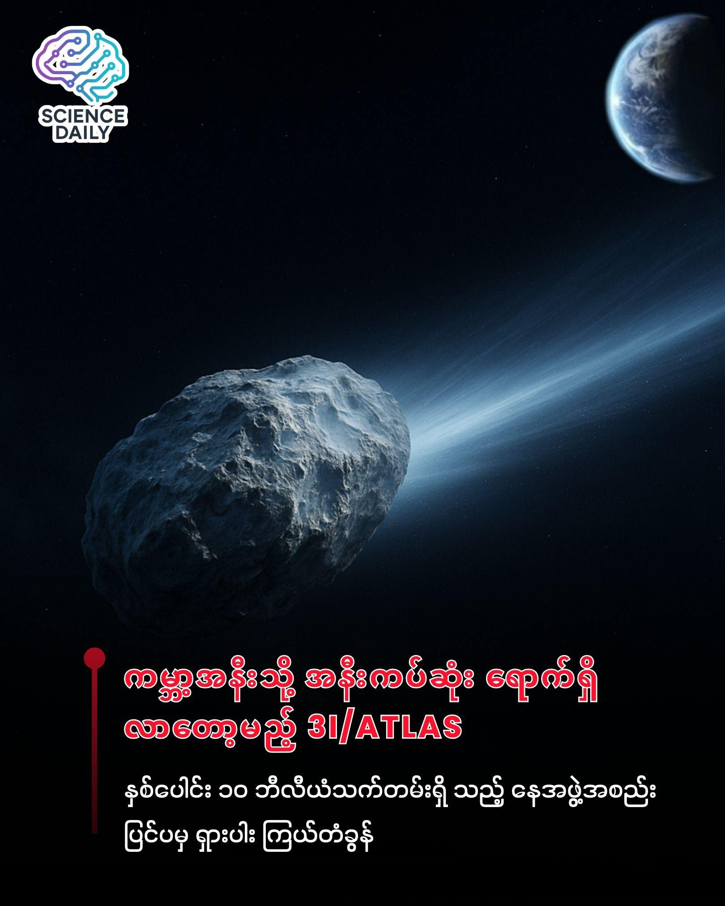

summary:နေအဖွဲ့အစည်းပြင်ပမှ တတိယမြောက်ဧည့်သည် "3I/ATLAS" ကြယ်တံခွန် ကမ္ဘာ့အနီးသို့ ရောက်ရှိလာမည့် အချိန်ခါ
Date: 2025-12-02

🌌 နေအဖွဲ့အစည်းပြင်ပမှ တတိယမြောက်ဧည့်သည် "3I/ATLAS" ကြယ်တံခွန် ကမ္ဘာ့အနီးသို့ ရောက်ရှိလာမည့် အချိန်ခါ

ကျွန်ုပ်တို့နေထိုင်ရာ နေအဖွဲ့အစည်း (Solar System) ဟာ အမြဲတမ်း ငြိမ်သက်နေတာတော့ မဟုတ်ပါဘူး။ တစ်ခါတစ်ရံမှာ မိုင်ပေါင်းသန်းချီဝေးတဲ့ စကြဝဠာရဲ့ အခြားတစ်နေရာကနေ မမျှော်လင့်ထားတဲ့ ဧည့်သည်တွေ ရောက်ရှိလာတတ်ပါတယ်။ အခုအချိန်မှာတော့ နက္ခတ္တဗေဒပညာရှင်တွေနဲ့ ဝါသနာရှင်တွေ စောင့်မျှော်နေကြတဲ့ တတိယမြောက် အတည်ပြုနိုင်ခဲ့သော ကြယ်တာရာကြားဖြတ် (Interstellar Comet ) "3I/ATLAS" ဟာ ကမ္ဘာမြေနဲ့ အနီးဆုံးနေရာကို ရောက်ရှိလာတော့မှာ ဖြစ်ပါတယ်။ ☄️

ဒီကြယ်တံခွန်ကို ပြီးခဲ့တဲ့ ဇူလိုင်လ ၁ ရက်နေ့တုန်းက ATLAS (Asteroid Terrestrial-impact Last Alert System) ကနေ စတင်တွေ့ရှိခဲ့တာပါ။ စတွေ့တုန်းက သူဟာ တစ်နာရီကို မိုင်ပေါင်း ၁၃၇,၀၀၀ (ကီလိုမီတာ ၂၂၁,၀၀၀ ခန့်) နှုန်းနဲ့ ခရီးနှင်နေပြီး နေရဲ့ ဆွဲငင်အားကြောင့် နေနဲ့အနီးဆုံးရောက်ချိန်မှာတော့ အရှိန်ဟာ တစ်နာရီကို မိုင်ပေါင်း ၁၅၃,၀၀၀ (ကီလိုမီတာ ၂၄၆,၀၀၀) အထိ မြင့်တက်လာခဲ့ပါတယ်။ နာဆာ (NASA) ရဲ့ အဆိုအရ ဒီကြယ်တံခွန်ဟာ ကျွန်ုပ်တို့ နေအဖွဲ့အစည်းထဲကို ဝင်လာတုန်းက အရှိန်အတိုင်း ပြန်လည်ထွက်ခွာသွားမယ်လို့ ဆိုပါတယ်။ 🚀

၂၀၂၅ ခုနှစ်၊ သြဂုတ်လ ၂၀ ရက်နေ့မှာ Hubble Space Telescope က ရရှိတဲ့ အချက်အလက်တွေအရ ဒီကြယ်တံခွန်ရဲ့ အူတိုင် (Nucleus) ဟာ အနည်းဆုံး ပေ ၁,၄၀၀ (၄၄၀ မီတာ) ကနေ အများဆုံး ၃.၅ မိုင် (၅.၆ ကီလိုမီတာ) အထိ ရှိနိုင်တယ်လို့ ခန့်မှန်းထားပါတယ်။ ပိုပြီး စိတ်ဝင်စားစရာကောင်းတာက ဒီအရာဝတ္ထုဟာ သက်တမ်းအားဖြင့် နှစ်ပေါင်း ၁၀ ဘီလီယံ (ကုဋေ ၁၀၀၀) လောက် ရှိနေပြီ ဖြစ်ပြီး စကြဝဠာရဲ့ အခြားခေတ်တစ်ခုက အချက်အလက်တွေကို သယ်ဆောင်လာတဲ့ "Time Capsule" တစ်ခုသဖွယ် ဖြစ်နေတာပါပဲ။ ဒါ့အပြင် သူ့ဆီမှာ ရေခဲမီးတောင် လှုပ်ရှားမှု (Cryovolcanism) တွေ ရှိနေတာကလည်း သိပ္ပံပညာရှင်တွေရဲ့ စိတ်ဝင်စားမှုကို အကြီးအကျယ် ရရှိစေခဲ့ပါတယ်။ 🧪✨

ဒီကြယ်တံခွန်ကြီးဟာ ကမ္ဘာနား မရောက်ခင် ပြီးခဲ့တဲ့ အောက်တိုဘာ ၃ ရက်နေ့တုန်းက အင်္ဂါဂြိုဟ် (Mars) အနားကနေ (၁၈) သန်းအကွာလောက်က ဖြတ်သန်းသွားခဲ့ပါသေးတယ်။ အဲဒီတုန်းက အင်္ဂါဂြိုဟ်ပေါ်က Perseverance ယာဉ်နဲ့ ဂြိုဟ်ပတ်လမ်းကြောင်းပေါ်က ယာဉ်တွေက သူ့ကို ဓာတ်ပုံရိုက် မှတ်တမ်းတင်နိုင်ခဲ့ကြပါတယ်။ အခု လာမယ့် ဒီဇင်ဘာ ၁၉ ရက်နေ့မှာတော့ ကမ္ဘာမြေနဲ့ အနီးဆုံးအကွာအဝေးကို ရောက်ရှိလာမှာ ဖြစ်ပါတယ်။ 🌍

"အနီးဆုံး" လို့ ဆိုလိုက်ပေမဲ့ စိုးရိမ်စရာ လုံးဝ မရှိပါဘူး။ သူဟာ ကမ္ဘာကနေ ကီလိုမီတာ သန်း ၂၇၀ (မိုင် ၁၆၈ သန်း) အကွာကနေ ဖြတ်သန်းသွားမှာ ဖြစ်ပြီး ဒါဟာ ကမ္ဘာနဲ့ နေ အကွာအဝေးရဲ့ (၁.၈) ဆတောင် ရှိနေတာပါ။ European Space Agency (ESA) ကလည်း သူဖြတ်သန်းချိန်မှာ နေရဲ့ တစ်ဖက်ခြမ်းမှာ ရှိနေမှာဖြစ်လို့ ကမ္ဘာမြေနဲ့ တခြားဂြိုဟ်တွေကို ဝင်တိုက်မယ့် အန္တရာယ် လုံးဝမရှိကြောင်း အတည်ပြုထားပါတယ်။ ✅

ဒါဆို ဒီရှားပါးဖြစ်စဉ်ကို ဘယ်လို ကြည့်ရှုကြမလဲ။ 🔭 3I/ATLAS ရဲ့ တောက်ပမှုပမာဏ (Magnitude) ဟာ 10.3 ဝန်းကျင်ရှိတာမို့ သာမန်မျက်စိနဲ့တော့ မမြင်နိုင်ပါဘူး။ အဝေးကြည့်မှန်ပြောင်း (Binoculars) ကောင်းကောင်း တစ်လက် ဒါမှမဟုတ် (၁၂) လက်မလောက်ရှိတဲ့ တယ်လီစကုပ် (Telescope) တစ်ခု လိုအပ်ပါလိမ့်မယ်။ ကြည့်ရှုချင်သူတွေအနေနဲ့ မနက်အရုဏ်မတက်ခင် အရှေ့ဘက် နဲ့ အရှေ့မြောက်ဘက် ကြားလောက်မှာရှိတဲ့ Leo ကြယ်စုထဲက Regulus ကြယ်ကြီးရဲ့ အောက်ဘက်နားကို ချိန်ရွယ် ရှာဖွေနိုင်ပါတယ်။

ကမ္ဘာကို နှုတ်ဆက်ပြီးတာနဲ့ ဒီဧည့်သည်ကြီးဟာ ၂၀၂၆ ခုနှစ်၊ မတ်လ ၁၆ ရက်နေ့မှာ နေအဖွဲ့အစည်းရဲ့ အကြီးဆုံး ဂျူပီတာဂြိုဟ်ကြီး (Jupiter) နားကနေ ဖြတ်သန်းဦးမှာပါ။ အဲဒီအခါကျရင်တော့ ဂျူပီတာရဲ့ ဆွဲငင်အားနဲ့ ကြယ်တံခွန်ရဲ့ ဓာတ်ငွေ့ထုတ်လွှတ်မှုတွေအပေါ် မူတည်ပြီး သူ့ရဲ့ လမ်းကြောင်း အပြောင်းအလဲ ဖြစ်သွားနိုင်ပါတယ်။ ဘာပဲဖြစ်ဖြစ် ဒီတစ်ခေါက်ဟာ ကျွန်ုပ်တို့အနေနဲ့ စကြဝဠာ ဟိုဘက်ခြမ်းက ဧည့်သည်တစ်ယောက်ကို အနီးကပ်ဆုံး လေ့လာခွင့်ရလိုက်တဲ့ သမိုင်းဝင် အခွင့်အရေးတစ်ခုပါပဲ။ 👋🌌

