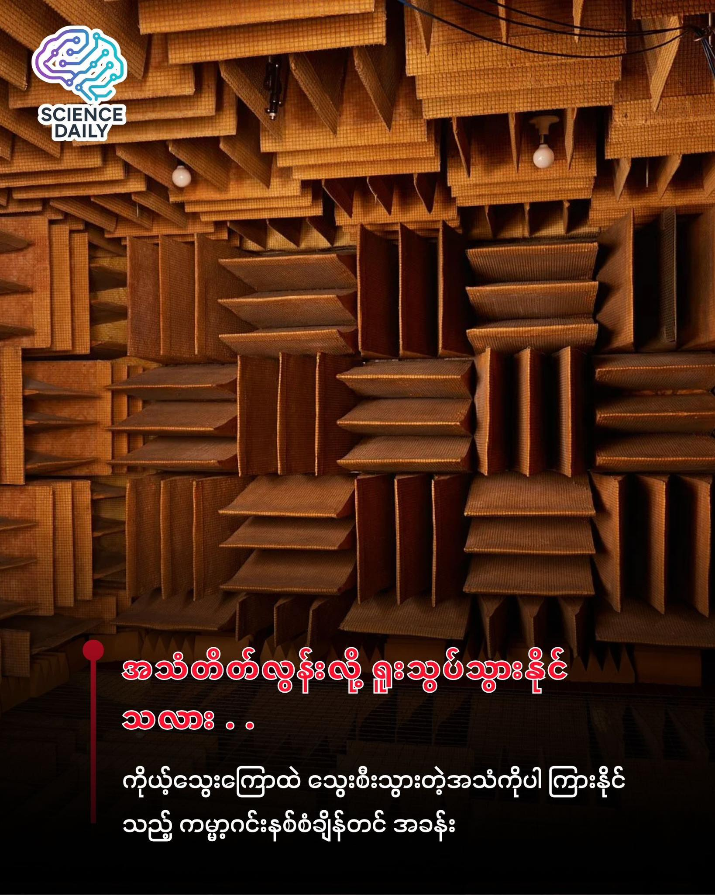

summary:တိတ်ဆိတ်ငြိမ်သက်ခြင်းက အေးချမ်းတယ်" လို့ လူအများက တင်စားလေ့ရှိကြပါတယ်။
Date: 2025-12-02

တိတ်ဆိတ်ငြိမ်သက်ခြင်းက အေးချမ်းတယ်" လို့ လူအများက တင်စားလေ့ရှိကြပါတယ်။ ဒါပေမဲ့ တကယ့်တကယ် လုံးဝ (လုံးဝ) အသံမရှိတော့တဲ့ အခြေအနေတစ်ခုကို ရောက်သွားတဲ့အခါမှာတော့ အဲဒီတိတ်ဆိတ်မှုက သင့်ကို အေးချမ်းစေမှာလား၊ ဒါမှမဟုတ် ရူးသွပ်သွားစေနိုင်သလား . . . 🤔

ကမ္ဘာပေါ်မှာ အသံအဆိတ်ငြိမ်ဆုံးလို့ ဂင်းနစ်စံချိန်တင်ထားတဲ့ နေရာတစ်ခု ရှိပါတယ်။ အဲဒီနေရာကတော့ အမေရိကန်နိုင်ငံ၊ မင်နီဆိုးတားပြည်နယ် (Minnesota) မှာရှိတဲ့ Orfield Laboratories ထဲက Anechoic Chamber လို့ခေါ်တဲ့ အသံလုံအခန်းငယ်လေး တစ်ခုပဲ ဖြစ်ပါတယ်။ 🔇

အသံထွက်ခွင့်မရှိတဲ့ နယ်မြေ (-၂၄.၉ ဒီစီဘယ်)

သာမန်လူတစ်ယောက်ရဲ့ အကြားအာရုံဟာ ၀ (Zero) ဒီစီဘယ်မှာ စတင်ပါတယ်။ စာကြည့်တိုက်လို တိတ်ဆိတ်တဲ့နေရာမျိုးတောင် ၄၀ ဒီစီဘယ်လောက် အသံရှိတတ်ပါတယ်။ ဒါပေမဲ့ ဒီအခန်းထဲမှာတော့ အသံပမာဏဟာ အနုတ် ၂၄.၉ ဒီစီဘယ် (-24.9 decibels) အထိ ရှိနေတာပါ။ 📉

ဒါဟာ ရူပဗေဒသဘောတရားအရ အသံလုံးဝမရှိနိုင်တော့တဲ့ အခြေအနေ (Absolute Zero of Sound) နဲ့ ကပ်နေပါပြီ။ ဒီလောက် တိတ်ဆိတ်သွားတဲ့အခါ ဘာတွေဆက်ဖြစ်လာမလဲ။

သင်ကိုယ်တိုင်က အသံတစ်ခု ဖြစ်လာတဲ့အခါ

Orfield Lab ရဲ့ တည်ထောင်သူ Steven Orfield က "ဒီအခန်းထဲမှာ သင်ကိုယ်တိုင်က အသံတစ်ခု ဖြစ်လာလိမ့်မယ်" လို့ ဆိုပါတယ်။ အပြင်က အသံတွေ လုံးဝပြတ်တောက်သွားတဲ့အခါ သင့်နားတွေက အသံကို မရမက လိုက်ရှာပါတော့တယ်။ အဲဒီအခါမှာ ပုံမှန်ဆို ဘယ်တော့မှ မကြားနိုင်တဲ့ ကိုယ့်ခန္ဓာကိုယ်ထဲက အသံတွေကို စတင်ကြားလာရပါတော့တယ်။ 👂
ကိုယ့်ရဲ့ နှလုံးခုန်သံက အလွန်ကျယ်လောင်တဲ့ ဒရမ်တစ်ခုတီးနေသလို ဖြစ်လာမယ်။
အဆုတ်ထဲ လေဝင်လေထွက်လုပ်နေတဲ့ အသံကို ကြားရမယ်။
ကိုယ့်အစာအိမ်ထဲက အစာချေဖျက်နေတဲ့ အသံတွေ၊ အရိုးအဆစ်တွေ လှုပ်ရှားတဲ့အသံတွေကအစ ပီပီသသ ကြားနေရမှာပါ။
နောက်ဆုံးမှာ ကိုယ့်သွေးကြောထဲ သွေးစီးသွားတဲ့ အသံကိုပါ ကြားရတဲ့အထိ ထူးခြားခြောက်ခြားဖွယ် ကောင်းလှပါတယ်။ 🩸

မိနစ် (၄၅) ကြာရင် ရူးသွားနိုင်သလား

ဒီအခန်းအကြောင်း ပြောကြတဲ့အခါ လူပြောအများဆုံးကတော့ "ဒီထဲမှာ ဘယ်သူမှ ၄၅ မိနစ်ထက် ပိုမနေနိုင်ဘူး" ဆိုတဲ့ အချက်ပါ။ တကယ်တော့ ဒါက ဒဏ္ဍာရီဆန်ဆန် ပြောစမှတ်တစ်ခု ဖြစ်ပေမဲ့ အမှန်တရားလည်း ပါဝင်နေပါတယ်။ ⏳
အကြောင်းကတော့ လူသားတွေဟာ ဟန်ချက်ညီဖို့အတွက် (Balance) နားထဲက အချက်ပြစနစ်ကို အသုံးပြုရပါတယ်။ လမ်းလျှောက်တဲ့အခါ ခြေသံ၊ ပတ်ဝန်းကျင်အသံတွေကို အခြေခံပြီး ခန္ဓာကိုယ်ကို ထိန်းသိမ်းရတာပါ။ ဒီအခန်းထဲမှာ အဲဒီအသံတွေ ပျောက်ဆုံးသွားတဲ့အတွက် မတ်တတ်ရပ်ဖို့ ခက်ခဲလာပြီး မူးဝေလာတတ်ပါတယ်။ ဒါကြောင့် အထဲဝင်သူတွေကို ထိုင်ခုံတစ်ခု ပေးထားရပါတယ်။ 🪑
အချိန်ကြာလာတာနဲ့အမျှ ဦးနှောက်က အသံတိတ်လွန်းတာကို လက်မခံနိုင်တော့ဘဲ ကိုယ်ပိုင်အသံတွေ ဖန်တီးလာတတ်ပြီး အမြင်အာရုံတွေပါ ဝေဝါးကာ "Hallucination" လို့ခေါ်တဲ့ စိတ်ကယောင်ကတမ်း ဖြစ်မှုတွေပါ ကြုံတွေ့ရနိုင်ပါတယ်။

ဘယ်လို တည်ဆောက်ထားသလဲ

ဒီအခန်းကို "အခန်းတွင်းက အခန်း" (Room within a room) ပုံစံမျိုး တည်ဆောက်ထားတာပါ။ ၁။ အသံလှိုင်းတွေကို စုပ်ယူနိုင်တဲ့ (၃.၃) ပေ အထူရှိတဲ့ ဖိုက်ဘာဖန် (Fiberglass) အချွန်အတက်တွေနဲ့ မျက်နှာကြက်၊ ကြမ်းခင်း၊ နံရံ အားလုံးကို ကာရံထားပါတယ်။ ၂။ အခန်းတစ်ခုလုံးကို ကွန်ကရစ်၊ သံမဏိတွေနဲ့ အထပ်ထပ် ကာရံထားပြီး အဆောက်အအုံရဲ့ ကျန်တဲ့ အစိတ်အပိုင်းတွေနဲ့ မထိတွေ့အောင် စပရိန်တွေနဲ့ ကြားခံပြီး တည်ဆောက်ထားတာ ဖြစ်ပါတယ်။ 🏗️

ဘာအတွက် သုံးတာလဲ

ဒီလောက်ကြောက်စရာကောင်းတဲ့ အခန်းကို ဘာလို့ ဆောက်ထားတာလဲလို့ မေးစရာရှိပါတယ်။ အဓိကကတော့ သိပ္ပံနည်းကျ စမ်းသပ်မှုတွေ အတွက်ပါ။ နှလုံးအတု (Heart Valve) တွေရဲ့ အသံကို စစ်ဆေးဖို့၊ လူ့ခန္ဓာကိုယ်နဲ့ အနီးကပ်သုံးရမယ့် ဆေးဘက်ဆိုင်ရာ ပစ္စည်းတွေရဲ့ ဆူညံသံကို တိုင်းတာဖို့၊ ဖုန်း display တွေ၊ စက်ပစ္စည်းတွေရဲ့ အသံအရည်အသွေးကို စစ်ဆေးဖို့အတွက် ဒီအခန်းက မရှိမဖြစ် အရေးပါပါတယ်။ 📱🩺

တိတ်ဆိတ်ခြင်းဆိုတာ အနားယူဖို့ ကောင်းတယ်ဆိုပေမဲ့ ဒီလောက်ထိ တိတ်ဆိတ်လွန်းတဲ့ နေရာမျိုးကတော့ လူသားတွေအတွက် စိန်ခေါ်မှုကြီး တစ်ခုပါပဲ။
