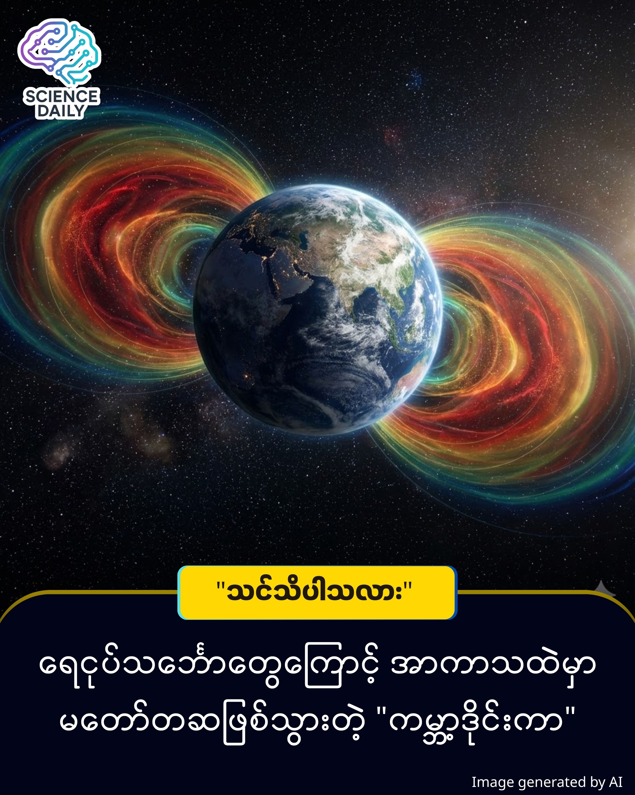

title: ကမ္ဘာ့အပြင်ဘက်မှာ လူတွေ မတော်တဆဖန်တီးမိလိုက်တဲ့ ဒိုင်းကာ
summary:လူသားတွေဟာ ကမ္ဘာကြီးကို ပြောင်းလဲနိုင်စွမ်း ရှိပါတယ်။ ရာသီဥတုဖောက်ပြန်မှုလိုမျိုး ဆိုးကျိုးတွေကို ဖြစ်စေသလို၊ ကျောက်ကြီးရောဂါကို အမြစ်ဖြတ်နိုင်ခဲ့တာမျိုးလည်း ရှိပါတယ်။
Date: 2025-12-27
Image: images/Barrier.jpg

ကမ္ဘာ့အပြင်ဘက်မှာ လူတွေ မတော်တဆဖန်တီးမိလိုက်တဲ့ "ဒိုင်းကာ"

လူသားတွေဟာ ကမ္ဘာကြီးကို ပြောင်းလဲနိုင်စွမ်း ရှိပါတယ်။ ရာသီဥတုဖောက်ပြန်မှုလိုမျိုး ဆိုးကျိုးတွေကို ဖြစ်စေသလို၊ ကျောက်ကြီးရောဂါကို အမြစ်ဖြတ်နိုင်ခဲ့တာမျိုးလည်း ရှိပါတယ်။ အခုတစ်ခါမှာတော့ ကျွန်တော်တို့ဟာ ကိုယ်တိုင်တောင် သတိမထားမိဘဲ အာကာသထဲမှာ ကမ္ဘာကြီးကို ကာကွယ်ပေးနိုင်တဲ့ "အတားအဆီး" (Barrier) တစ်ခုကို မတော်တဆ ဖန်တီးမိရက်သား ဖြစ်သွားပါတယ် ။ ဒါဟာ ဂြိုဟ်သိမ်ဂြိုဟ်မွှားတွေကို လမ်းလွှဲတာမျိုးမဟုတ်ဘဲ အာကာသထဲက ရောင်ခြည်သင့်မှုကို တွန်းထုတ်လိုက်တာပါ ။

ကမ္ဘာ့သံလိုက်စက်ကွင်းဟာ နေမင်းဆီကလာတဲ့ အန္တရာယ်ရှိ ရောင်ခြည်တွေနဲ့ ဆိုလာမုန်တိုင်းတွေကို ကာကွယ်ပေးထားပါတယ် ။ ဒီသံလိုက်စက်ကွင်းကြောင့် ကမ္ဘာ့ပတ်လည်မှာ Van Allen belts လို့ခေါ်တဲ့ ရောင်ခြည်သင့်ဒေသ (Radiation bands) တွေ ဖြစ်ပေါ်နေပြီး ပုံမှန်အားဖြင့် ဒိုးနပ်ကွင်းပုံစံ ရှိပါတယ် ။

ဒါပေမဲ့ ၁၉၆၀ ပြည့်လွန်နှစ်တွေက တိုင်းတာချက်တွေနဲ့ ယှဉ်ကြည့်ရင် အခုခေတ်မှာ ဒီရောင်ခြည်သင့်ခါးပတ်ရဲ့ အတွင်းဘက်အနားသတ်ဟာ ကမ္ဘာနဲ့ ပိုဝေးတဲ့နေရာကို ရွေ့သွားတာ တွေ့ရပါတယ် ။ အကြောင်းရင်းကတော့ -

VLF ရေဒီယိုလှိုင်းများ - ရေငုပ်သင်္ဘောတွေ ဆက်သွယ်ဖို့သုံးတဲ့ VLF (Very Low Frequency) ရေဒီယိုလှိုင်းတွေဟာ အာကာသထဲအထိ ရောက်သွားပါတယ် ။ ဒီလှိုင်းတွေက အာကာသထဲက အမှုန်တွေနဲ့ ဓာတ်ပြုပြီး ကမ္ဘာ့လေထုအပြင်ဘက်မှာ "ပူဖောင်း" (Bubble) သဏ္ဌာန် အကာအကွယ်တစ်ခု ဖြစ်ပေါ်စေပါတယ် ။  ဒီ VLF ပူဖောင်း ရှိနေတဲ့နေရာအထိ ရောင်ခြည်သင့် Van Allen belt က တိုးမဝင်နိုင်တော့ဘဲ နောက်ဆုတ်သွားရပါတယ် ။

ဒါဟာ ထင်ကြေးသက်သက် မဟုတ်ပါဘူး။ ၂၀၁၉ ခုနှစ်မှာ တာဝန်ပြီးဆုံးသွားတဲ့ NASA ရဲ့ Van Allen Probes စူးစမ်းလေ့လာရေးယာဉ်တွေကနေ ရရှိတဲ့ အချက်အလက်တွေကို အခြေခံထားတာ ဖြစ်ပါတယ် ။ MIT Haystack Observatory က ပညာရှင် Phil Erickson ကိုယ်တိုင်ကလည်း VLF လှိုင်းတွေဟာ အာကာသထဲက စွမ်းအင်မြင့်ရောင်ခြည်သင့်ဝန်းကျင်ကို ပြောင်းလဲနိုင်စွမ်းရှိကြောင်း အတည်ပြုပြောကြားခဲ့ပါတယ် ။

ဒီအတားအဆီးဟာ သိပ္ပံခေတ်လွန်ဇာတ်လမ်းတွေထဲကလို "Force Field" ကြီးတစ်ခုလုံးတော့ မဟုတ်ပါဘူး ။ ဒါပေမဲ့ ကမ္ဘာဆီကို ဦးတည်လာတဲ့ အန္တရာယ်ရှိ စကြာဝဠာရောင်ခြည် (Cosmic Radiation) အချို့ကို လမ်းလွှဲပေးနိုင်စွမ်း ရှိပါတယ် ။ လက်ရှိမှာတော့ ဒီ VLF ထုတ်လွှင့်စက်တွေကို အသုံးပြုပြီး ဆိုလာမုန်တိုင်းဒဏ်ကနေ ကာကွယ်ဖို့ အမှန်တကယ် အသုံးချနိုင်မလားဆိုတာကို ပညာရှင်တွေ ဆက်လက်စမ်းသပ်နေကြပါတယ် ။

Source Reference: Source: IFLScience

#SpaceScience #NASA #EarthShield #VanAllenBelts #ScienceNews #MyanmarScience #GeneralKnowledge #IFLScience

