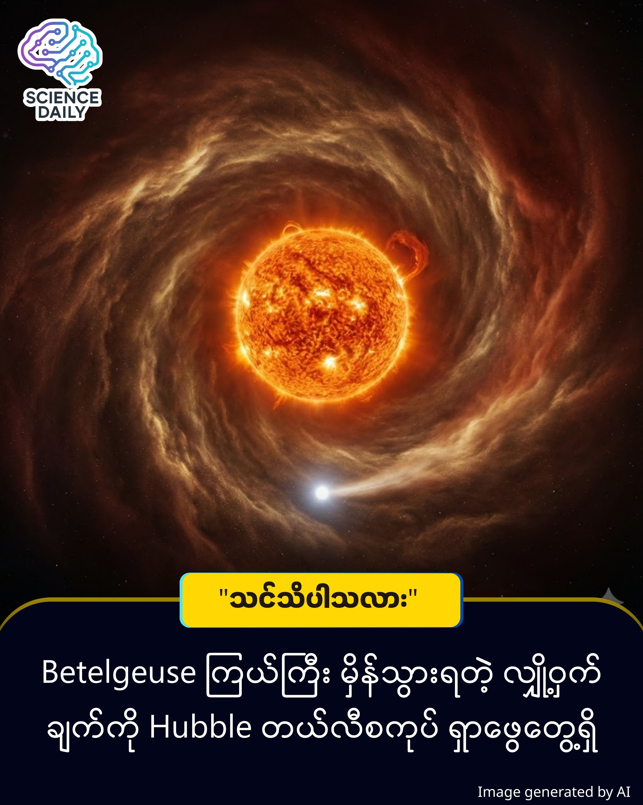

title: ကောင်းကင်ပေါ်က Betelgeuse ကြယ်ကြီး ဘာလို့ မှိတ်တုတ်မှိတ်တုတ် ဖြစ်နေတာလဲ?
summary: ညဖက် ကောင်းကင်ကို မော့ကြည့်ရင် "မုဆိုး" (Orion) လို့ခေါ်တဲ့ ကြယ်သုံးလုံးတန်းကို မြင်ဖူးကြမှာပါ။ အဲဒီနားမှာ အနီရောင် တောက်တောက်နဲ့ အရမ်းကြီးတဲ့ "Betelgeuse" (ဘီတယ်လ်ဂျူးစ်) ဆိုတဲ့ ကြယ်ကြီးတစ်လုံး ရှိပါတယ်။
Date: 2026-01-08
Image: images/Betelgeuse is Not Alone.jpg

ကောင်းကင်ပေါ်က Betelgeuse ကြယ်ကြီး ဘာလို့ မှိတ်တုတ်မှိတ်တုတ် ဖြစ်နေတာလဲ?

ညဖက် ကောင်းကင်ကို မော့ကြည့်ရင် "မုဆိုး" (Orion) လို့ခေါ်တဲ့ ကြယ်သုံးလုံးတန်းကို မြင်ဖူးကြမှာပါ။ အဲဒီနားမှာ အနီရောင် တောက်တောက်နဲ့ အရမ်းကြီးတဲ့ "Betelgeuse" (ဘီတယ်လ်ဂျူးစ်) ဆိုတဲ့ ကြယ်ကြီးတစ်လုံး ရှိပါတယ်။ 

လွန်ခဲ့တဲ့ နှစ်တွေတုန်းက ဒီကြယ်ကြီးဟာ ရုတ်တရက် အလင်းရောင် မှိန်သွားလိုက်၊ ပြန်လင်းလာလိုက် ဖြစ်နေလို့ ကမ္ဘာ့သိပ္ပံပညာရှင်တွေ တော်တော် ခေါင်းရှုပ်သွားခဲ့ပါတယ်။ "ဒီကြယ်ကြီး ပေါက်ကွဲတော့မလို့လား" လို့တောင် ထင်ခဲ့ကြတာပါ။

ဒါပေမဲ့ အခုတော့ NASA ရဲ့ Hubble တယ်လီစကုပ်ကြီးက အဖြေကို ရှာတွေ့သွားပါပြီ။

တကယ်တော့ Betelgeuse ကြယ်ကြီးက တစ်ယောက်တည်း မဟုတ်ပါဘူး။ သူ့အနားမှာ ကပ်ပြီး လှည့်ပတ်နေတဲ့ "အဖော်ကြယ်" အသေးလေး တစ်လုံး ရှိနေတာပါ။

ဒီအဖော်ကြယ်လေးကို "Siwarha" (ဆီဝါဟာ) လို့ နာမည်ပေးထားပါတယ်။ အဓိပ္ပာယ်ကတော့ "သူမရဲ့ လက်ကောက်" တဲ့။

ဒီအဖော်ကြယ်လေးက ဘာလုပ်သလဲဆိုတာ မြင်အောင်ကြည့်ရအောင်။

မီးခိုးလုံးကြီးထဲ တိုးဝင်ခြင်း

Betelgeuse ကြယ်ကြီးရဲ့ ဘေးပတ်လည်မှာ ပူပြင်းတဲ့ ဓာတ်ငွေ့တွေ၊ ဖုန်မှုန့်တွေ (လေထု) ဖုံးလွှမ်းနေပါတယ်။ အဖော်ကြယ်လေး Siwarha က အဲဒီ ဓာတ်ငွေ့တွေကြားထဲကို အတင်းတိုးဝှေ့ပြီး ပတ်နေတာပါ။

လှိုင်းဂယက်ထခြင်း 

ငြိမ်နေတဲ့ ရေပြင်ပေါ်မှာ စက်လှေတစ်စင်း မောင်းသွားရင် အနောက်မှာ ရေလှိုင်းတွေ ကျန်ခဲ့သလိုမျိုးပါပဲ။ Siwarha ကြယ်လေး ဖြတ်သွားတဲ့အခါ ကြယ်ကြီးရဲ့ လေထုထဲမှာ ဖုန်မှုန့်လှိုင်းကြီးတွေ ထသွားစေပါတယ်။

အလင်းကွယ်ခြင်း 

အဲဒီ ဖုန်မှုန့်လှိုင်းကြီးတွေ ထလာတဲ့အခါကျမှ ကမ္ဘာကနေ လှမ်းကြည့်တဲ့ ကျွန်တော်တို့ရဲ့ မျက်လုံး (ဒါမှမဟုတ် တယ်လီစကုပ်) ကို လာကာလိုက်သလိုဖြစ်ပြီး ကြယ်ကြီးရဲ့ အလင်းရောင် မှိန်သွားတာ ဖြစ်ပါတယ်။

🔭 နောက်တစ်ခါ ဘယ်တော့မြင်ရမလဲ?

ဒီဖြစ်စဉ်က ရက်ပေါင်း ၂၁၀၀ (၅ နှစ်ကျော်ကျော်) မှာ တစ်ခါ ဖြစ်လေ့ရှိပါတယ်။  အခုလက်ရှိမှာတော့ ဒီအဖော်ကြယ်လေး Siwarha ဟာ ကြယ်ကြီးရဲ့ အနောက်ဖက်မှာ ပုန်းနေပါတယ်။ ၂၀၂၇ ခုနှစ် သြဂုတ်လ ရောက်ရင်တော့ သူပြန်ထွက်လာမှာ ဖြစ်လို့ ကမ္ဘာ့သိပ္ပံပညာရှင်တွေက စောင့်ကြည့်ဖို့ အသင့်ပြင်နေကြပါပြီ။ 

အတိုချုပ်ပြောရရင် - ကြယ်ကြီး သေခါနီးလို့ မှိန်သွားတာ မဟုတ်ပါဘူး။ သူ့ရဲ့ သူငယ်ချင်းလေးက ဖုန်မှုန့်တွေ လိုက်ဖွနေလို့ မျက်စိရှုပ်ပြီး မှိန်သွားတာပါခင်ဗျာ။

Source Material: "NASA's Hubble Space Telescope Observations Resolve 'One Of The Biggest Mysteries' About Betelgeuse" by James Felton (IFLScience).

Data Source: Observations from Hubble Space Telescope and ground-based observatories over 8 years.

#Betelgeuse #NASA #Hubble #Astronomy #Siwarha #SpaceMysteries #MyanmarScience #Astrophysics

