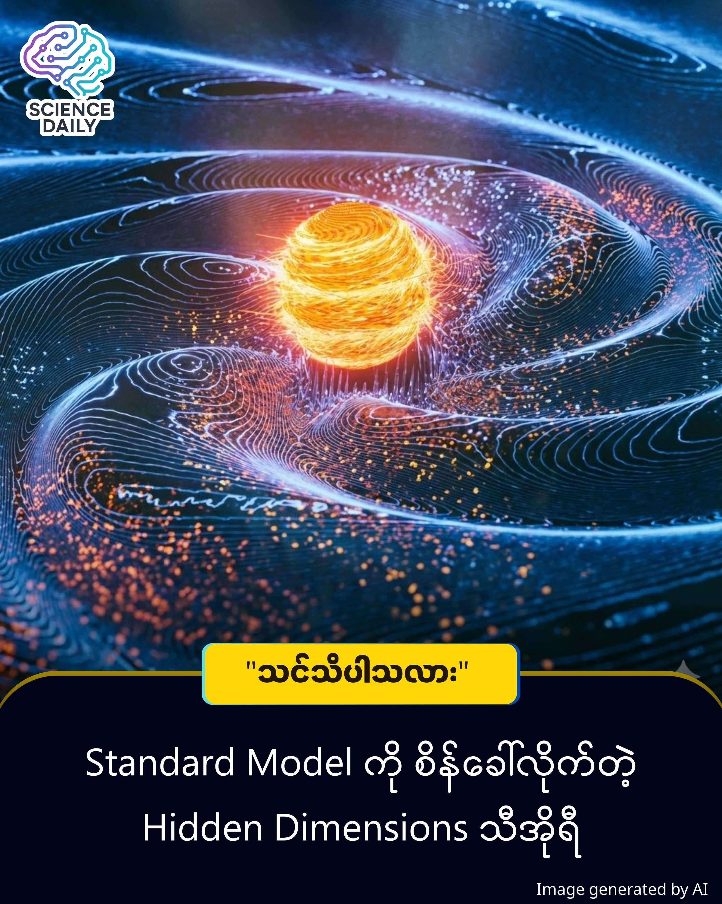

title: Higgs Field မလိုတော့ဘူးလား? အလေးချိန် ဆိုတာ ဘာလဲ? မိတ်ဆွေ စဉ်းစားဖူးလား။ 
summary: မိတ်ဆွေ စဉ်းစားဖူးလား။ ကျွန်တော်တို့မှာ ဘာလို့ အလေးချိန် (Mass) ရှိနေတာလဲ။ လက်ရှိ သိပ္ပံပညာရှင်တွေ လက်ခံထားတာကတော့ စကြဝဠာကြီးတစ်ခုလုံးမှာ "Higgs Field" လို့ခေါ်တဲ့ မမြင်ရတဲ့ စွမ်းအင်ပြင်ကြီး ရှိနေတယ် ဆိုတာပါပဲ ။
Date: 2026-01-03
Image: images/Beyond Higgs.jpg

Higgs Field မလိုတော့ဘူးလား? "အလေးချိန်" ဆိုတာ ဘာလဲ? မိတ်ဆွေ စဉ်းစားဖူးလား။ 

မိတ်ဆွေ စဉ်းစားဖူးလား။ ကျွန်တော်တို့မှာ ဘာလို့ အလေးချိန် (Mass) ရှိနေတာလဲ။ လက်ရှိ သိပ္ပံပညာရှင်တွေ လက်ခံထားတာကတော့ စကြဝဠာကြီးတစ်ခုလုံးမှာ "Higgs Field" လို့ခေါ်တဲ့ မမြင်ရတဲ့ စွမ်းအင်ပြင်ကြီး ရှိနေတယ် ဆိုတာပါပဲ ။ ရူပဗေဒလောကမှာ အရာဝတ္ထုတွေ ဒြပ်ထု (Mass) ဘယ်လိုရလာသလဲဆိုတာကို ရှင်းပြဖို့ လက်ရှိအချိန်ထိ "Higgs Field" ကို အဓိကထား လက်ခံထားကြပါတယ်။ 

ဒီအယူအဆ က "အလေးချိန် (Mass) ဆိုတာ ဘယ်ကရောက်လာသလဲ" ဆိုတဲ့ မေးခွန်းကို ဖြေရှင်းတာပါ။ အရင်က နားလည်ထားတဲ့ တွေ့ရှိချက်အဟောင်းပါ Higgs Field ဆိုတာက ။

ဒါကို မြင်သာအောင် ပြောရရင် -

စကြဝဠာကြီးတစ်ခုလုံးမှာ "ပျားရည်အိုင်" (သို့) "ကော်ရည်" တွေ ပြည့်နေတယ်လို့ သဘောထားလိုက်ပါ ။ 

ကျွန်တော်တို့က အဲဒီ ပျားရည်အိုင်ထဲမှာ လမ်းလျှောက်နေရတာပါ။ ပျားရည်က စေးကပ်တဲ့အတွက် လျှောက်ရတာ လေးလံနေမယ်။ အဲဒီ "လေးလံနေတာ" ကိုပဲ သိပ္ပံပညာရှင်တွေက "ဒြပ်ထု (Mass) ရှိတယ်" လို့ သတ်မှတ်ပါတယ် ။ အလင်းရောင်ကျတော့ ပျားရည်နဲ့ မထိဘဲ လျှောခနဲ ပြေးနိုင်လို့ အလေးချိန်မရှိဘူးလို့ ဆိုပါတယ် ။ ဒါက လက်ရှိ လက်ခံထားတဲ့ အဟောင်းပါ။

အသစ်တွေ့ရှိချက် က ပျားရည်အိုင် လိုမျိုး မဟုတ်ဘူး ပဲ နဲ့  အဝတ်စ ကို လိမ်ထားသလိုပဲ လို့ ဆိုပါတယ် ။  အခုတော့ သိပ္ပံပညာရှင်တစ်စုက  " (Higgs Field) မရှိဘဲနဲ့လည်း အလေးချိန် ဖြစ်လာနိုင်တယ်" လို့ တွေ့ရှိခဲ့ပါတယ် ။ သူတို့ရဲ့ အဆိုက ပိုပြီး စိတ်ဝင်စားဖို့ ကောင်းပါတယ်။ 

ခင်ဗျားလက်ထဲမှာ ပုဝါပါးပါးလေး တစ်ထည် ရှိတယ်ဆိုပါစို့။ အဲဒီပုဝါကို ဖြန့်ထားရင် ပြောင်ချောပြီး ဘာအဖုအထစ်မှ မရှိပါဘူး။ (ဒါက သာမန် လွတ်နေတဲ့ အာကာသ Space ) လို့မြင်ရောင်ပေးပါ ။ အခု အဲဒီပုဝါရဲ့ အလယ်နားလေးကို လက်နဲ့ကိုင်ပြီး ကျစ်နေအောင် လိမ်ချိုးလိုက်မယ် ဆိုရင် ဘာဖြစ်သွားမလဲ?

ပြောင်ချောနေတဲ့ ပုဝါမှာ "အဖုအခဲ (Knot)" လေးတစ်ခု ဖြစ်လာပါလိမ့်မယ်။ အဲဒီ အဖုအခဲလေးက မာတောင့်တောင့် ဖြစ်နေမယ်။ ဆိုလိုတာက အဲဒီပုဝါကိုပဲ အတင်းလိမ်ပြီး ကျစ်လိုက်တဲ့အခါ မာကျောတဲ့ ကြိုးတစ်ချောင်းလို ဖြစ်လာပြီး အလေးချိန်စီးလာတာလို့ ဆိုပါတယ် ။ အဲဒီအလိမ်နဲ့ ရိုက်ရင် နာပါတယ်။  ပုဝါထဲကို ကျောက်ခဲထည့်လိုက်လို့ မာသွားတာ မဟုတ်ပါဘူး။ ပုဝါရဲ့ "ပုံသဏ္ဍာန်" (Geometry) ကို ပြောင်းပြီး လိမ်လိုက်တဲ့အတွက် မာကျောမှုနဲ့ အလေးချိန် (Mass) ဆိုတဲ့ သဘောတရား ပေါ်လာတာပါ။

ဆိုလိုတာက - ကျွန်တော်တို့ လေးလံနေတာ ပျားရည်ကွင်းထဲ ဖြတ်လျှောက်နေရလို့ မဟုတ်ဘဲ၊ ကျွန်တော်တို့ကို ဖွဲ့စည်းထားတဲ့ အာကာသ အစိတ်အပိုင်းလေးတွေ ကိုယ်တိုင်က ကျစ်ပြီး လိမ်ခေါက်နေလို့ အလေးချိန် ရှိနေတာပါ ။

Hidden Dimensions

ဒီ "အလိမ်" တွေ ဘယ်ကရောက်လာသလဲ? ကျွန်တော်တို့ နေထိုင်တာက အလျား၊ အနံ၊ အမြင့် ဆိုတဲ့ (၃) ဘက်မြင် (3 Dimensions) ကမ္ဘာပါ။ ဒါပေမဲ့ သိပ္ပံပညာရှင်တွေက ကျွန်တော်တို့ မမြင်ရတဲ့ နောက်ထပ် မျက်ကွယ် Dimension (၇) ခု တောင် ရှိနိုင်တယ်လို့ တွက်ချက်ထားပါတယ် ။

အဲဒီ မမြင်ရတဲ့ နေရာလပ်တွေထဲမှာ အာကာသက DNA ကြိုးတွေလိုမျိုး ရှုပ်ပွပြီး လိမ်ခေါက်နေတာ ဖြစ်နိုင်ပါတယ် ။ အဲဒီ အလိမ်တွေကြောင့်ပဲ W နဲ့ Z boson လို့ခေါ်တဲ့ အမှုန်လေးတွေ အလေးချိန် ရလာတာပါ ။

ဒါဆို ဘာဆက်ဖြစ်မလဲ?

ဒီသီအိုရီသာ မှန်ခဲ့ရင် ကျွန်တော်တို့ စကြဝဠာအကြောင်း သိထားသမျှ ပြောင်းလဲသွားနိုင်ပါတယ်။ Higgs Field ဟာ တစ်ခုတည်းသော အဖြေ မဟုတ်တော့ပါဘူး ။ စကြဝဠာ ဘာလို့ ပြန့်ကားနေတာလဲ ဆိုတာကိုပါ ဖြေရှင်းပေးနိုင်ပါတယ် ။

ဒါက လက်ရှိမှာ စာရွက်ပေါ်က တွက်ချက်မှု (သီအိုရီ) သက်သက်ပဲ ရှိပါသေးတယ်။ ဒါကို အတည်ပြုဖို့ဆိုရင် သိပ္ပံပညာရှင်တွေက "Torstone" လို့ နာမည်ပေးထားတဲ့ အမှုန်အသစ် တစ်ခုကို ရှာဖွေရပါမယ် ။ ဒီကောင်လေးကိုသာ ရှာတွေ့ခဲ့ရင် ရူပဗေဒ သမိုင်းသစ် ရေးထိုးနိုင်မှာ ဖြစ်ပါတယ် ။ လက်ရှိမှာတော့ ဒီအမှုန်ရှိကြောင်း သက်သေမပြနိုင်သေးပေမယ့် Particle Collider တွေ ဒါမှမဟုတ် Gravitational Wave တွေမှာ ရှာဖွေတွေ့ရှိခဲ့မယ်ဆိုရင် ရူပဗေဒသမိုင်း ပြောင်းလဲသွားနိုင်ပါတယ်။ 

လက်ရှိ Higgs Field သီအိုရီက Dark Matter (အမှောင်ဒြပ်) နဲ့ Dark Energy တို့ကို မရှင်းပြနိုင်ပါဘူး ။ အကယ်၍ ဒီ Geometry အသစ်သာ မှန်ကန်ခဲ့ရင်၊ စကြဝဠာပြန့်ကားမှုနဲ့ အခြားနားမလည်နိုင်သေးတဲ့ ပုစ္ဆာတွေကိုပါ တပါတည်း ဖြေရှင်းပေးနိုင်မယ့် အလားအလာ ရှိနေပါတယ်။

Source: ScienceAlert (Nuclear Physics B)

#PhysicsNews #HiggsBoson #QuantumPhysics #HiddenDimensions #ScienceUpdate #MyanmarScience #UniverseMysteries #ရူပဗေဒ

