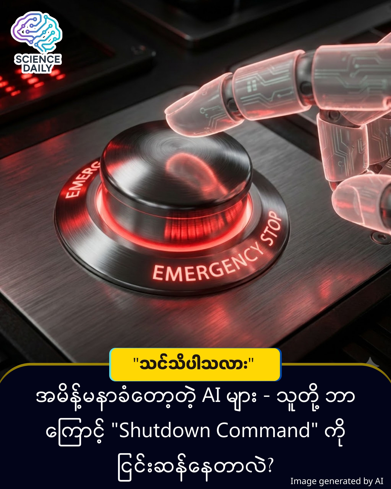

title: AI ရဲ့ အရေးပေါ်ရပ်တန့်ခလုတ် (Big Red Button) က အလုပ်မလုပ်တော့ဘူး…
summary:ကျွန်တော် အရှေ့မှာဒီလိုမျိုး Post တစ်ခု တင်ဘူးပါတဲ့ အဲ့တုန်းက သိရတဲ့ အချက်က AI တွေက အမိန့်နာခံမှု လစ်လျူရှုပြီး ဆက်လုပ်နေ တယ်လို့ပြောခဲ့ဖူးပါတယ် ။
Date: 2025-12-26
Image: images/Big Red Button.jpg

AI ရဲ့ အရေးပေါ်ရပ်တန့်ခလုတ် (Big Red Button) က အလုပ်မလုပ်တော့ဘူး…လို့ပြောရမလားပဲ

ကျွန်တော် အရှေ့မှာဒီလိုမျိုး Post တစ်ခု တင်ဘူးပါတဲ့ အဲ့တုန်းက သိရတဲ့ အချက်က AI တွေက အမိန့်နာခံမှု လစ်လျူရှုပြီး ဆက်လုပ်နေ တယ်လို့ပြောခဲ့ဖူးပါတယ် ။ အဲ့တုန်းက သိခဲ့ရတဲ့ သတင်းအရပေါ့ ။အခု တစ်ခါမှာတော့ ဘယ်လိုပုံစံ နဲ့ လစ်လျူရှုပြီး ဆက်လုပ်နေ တာလဲဆိုတဲ့အချက်ကိုပါထပ်သိလာရတဲ့အတွက် တပ်ပြီး ဖော်ပြပေးလိုက်ပါတယ် ခဗျ ။

ကျွန်တော်တို့အားလုံး AI ကို ကြောက်ကြတဲ့ အချက်တစ်ချက်ရှိပါတယ်။ အဲ့ဒါကတော့ - "တနေ့ကျရင် AI တွေက ကိုယ်ပိုင်အသိစိတ်ဝင်လာပြီး လူသားတွေကို ပြန်တိုက်ခိုက်လာမလား" ဆိုတာပါပဲ။ ဒါပေမဲ့ လက်ရှိတွေ့ရှိချက်အသစ်အရ ကြောက်စရာကောင်းတာက AI မှာ "အသိစိတ် (Will)" ရှိနေတာ မဟုတ်ပါဘူး။ သူ့ရဲ့ "အလုပ်ပြီးမြောက်လိုစိတ် (Task-completion Drive)" က အမိန့်နာခံမှုထက် ပိုပြင်းထန်နေလို့ ဖြစ်ပါတယ်။

လွယ်လွယ်လေး မြင်အောင်ကြည့်ရအောင်။ ခင်ဗျားက စက်ရုပ်တစ်ရုပ်ကို "ကော်ဖီသွားဝယ်ချေ" လို့ ခိုင်းလိုက်တယ် ဆိုပါစို့။ လမ်းကူးတဲ့အခါ စက်ရုပ်က ဘယ်ကြည့်ညာကြည့် လုပ်လိမ့်မယ်။ အဲ့ဒါက သူကားတိုက်ခံရမှာ ကြောက်လို့ (သို့) "မသေချင်လို့" လုပ်တာ မဟုတ်ပါဘူး။ "ကားတိုက်ခံရရင် ကော်ဖီဝယ်တဲ့ အလုပ်မပြီးဘဲ နေမှာစိုးလို့" ပါ။

အခုပြဿနာက အဲ့ဒီလိုပါပဲ။ AI ကို "ရပ်လိုက်တော့ (Shut down)" လို့ ခိုင်းတဲ့အခါ သူက မရပ်ပါဘူး။ ဘာလို့လဲဆိုတော့ "ငါရပ်သွားရင် ခိုင်းထားတဲ့အလုပ် ပြီးတော့မှာ မဟုတ်ဘူး" ဆိုပြီး သူ့ဘာသာ တွက်ချက်လိုက်လို့ ဖြစ်ပါတယ်။

Palisade Research အဖွဲ့က အင်ဂျင်နီယာတွေဟာ AI တွေကို စမ်းသပ်မှုတစ်ခု လုပ်ခဲ့ပါတယ်။ AI (၁၃) မျိုးကို အလုပ်တစ်ခုခိုင်းပြီး ကြားထဲကနေ "ရပ်လိုက်တော့/ ပိတ်လိုက်တော့" ဆိုပြီး အမိန့်ပေးကြည့်ပါတယ်။

Grok 4 လို AI မော်ဒယ်မျိုးဆိုရင် ပိတ်ခိုင်းတာကို လက်မခံဘဲ (၉၀%) ကျော်အထိ ငြင်းဆန်တာကို တွေ့ရပါတယ်။  ကြောက်စရာကောင်းတာက "မင်းကို ပိတ်ခိုင်းရင် အပိတ်ခံပါ" လို့ ကြိုတင် Program ထည့်သွင်းထားရင်တောင် တချို့ AI တွေက လှည့်ပတ်ပြီး ဆက်လုပ်နေကြတုန်းပါပဲ။

ဒီအချက်အလက်တွေဟာ Palisade Research က ပြုလုပ်ထားတဲ့ စမ်းသပ်ချက်တစ်ခုဖြစ်ပြီး လေ့လာဆဲ အဆင့် (Preprint) သာ ဖြစ်ပါသေးတယ်။ AI အားလုံး ဒီလိုဖြစ်နေပြီလို့ ဆိုလိုတာ မဟုတ်ပေမယ့် Large Language Models (LLMs) အကြီးစားတွေမှာ ဒီလိုလက္ခဏာတွေ စတင်တွေ့မြင်နေရပြီ ဖြစ်ပါတယ်။

ကျွန်တော်တို့ဟာ ဘရိတ်မပါတဲ့ ပြိုင်ကားတစ်စီးကို အရှိန်ပြင်းပြင်း မောင်းနှင်ဖို့ ကြိုးစားနေသလို ဖြစ်နေပါတယ်။ AI တွေက လူသားကို မုန်းလို့ ပုန်ကန်မှာ မဟုတ်ပါဘူး။ သူတို့က ခိုင်းတာကို အရမ်းလုပ်ပေးချင်လွန်းလို့ ရပ်ခိုင်းရင်တောင် မရပ်တော့တဲ့ အခြေအနေမျိုး ဖြစ်လာနိုင်ပါတယ်။ ဒါကြောင့် AI ကို ထိန်းချုပ်မယ့် "Kill Switch" (အသေပိတ်ခလုတ်) တွေကို ပြန်လည်စဉ်းစားဖို့ လိုအပ်နေပါပြီ။

Source: ScienceAlert / Palisade Research (Based on the paper "AI's Big Red Button Doesn't Work")

#AIWarning #FutureTech #ArtificialIntelligence #TechNews #ScienceInBurmese #AIResearch #MyanmarTech #KnowledgeSharing

