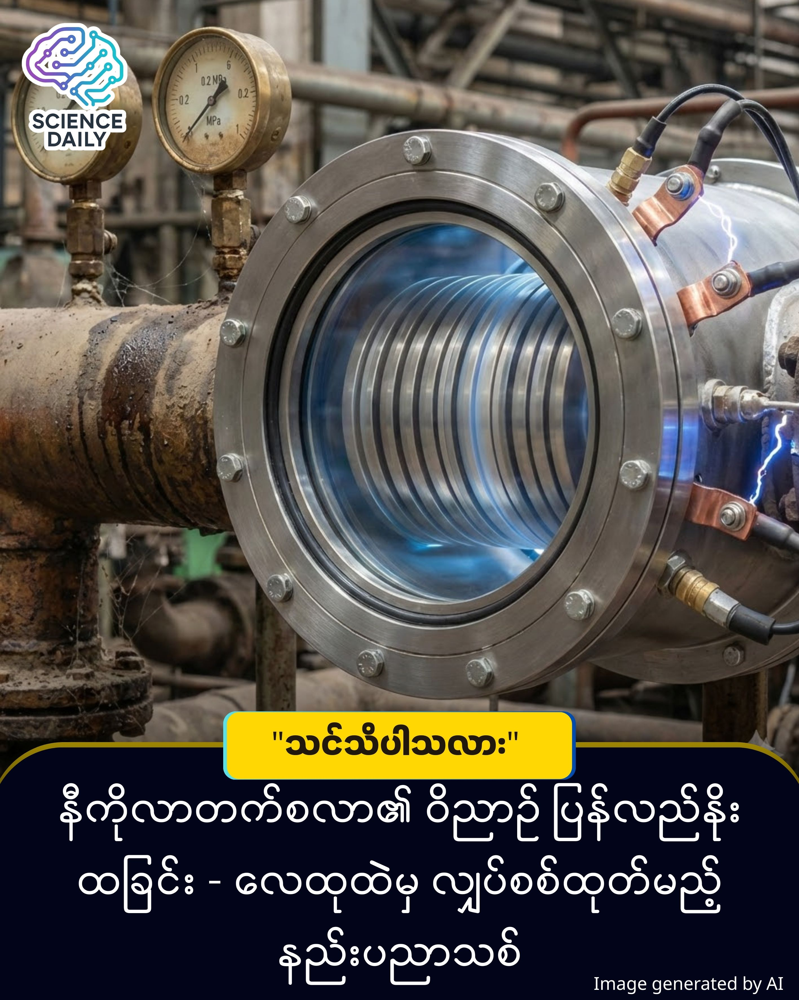

title: ဒလတ်မဲ့ တာဘိုင် (သို့မဟုတ်) ပွတ်တိုက်အားကို စွမ်းအင်အဖြစ် ပြောင်းလဲခြင်း
summary: ကျွန်တော်တို့အများစုဟာ Nikola Tesla ကို AC လျှပ်စစ်စီးကြောင်းရဲ့ ဖခင်ကြီး၊ ဒါမှမဟုတ် ကြိုးမဲ့နည်းပညာရဲ့ ရှေ့ဆောင်လမ်းပြအဖြစ်ပဲ သိထားကြပါတယ်။
Date: 2026-01-20
Image: images/Bladeless Revolution.jpg

ဒလတ်မဲ့ တာဘိုင် (သို့မဟုတ်) ပွတ်တိုက်အားကို စွမ်းအင်အဖြစ် ပြောင်းလဲခြင်း

ကျွန်တော်တို့အများစုဟာ Nikola Tesla ကို AC လျှပ်စစ်စီးကြောင်းရဲ့ ဖခင်ကြီး၊ ဒါမှမဟုတ် ကြိုးမဲ့နည်းပညာရဲ့ ရှေ့ဆောင်လမ်းပြအဖြစ်ပဲ သိထားကြပါတယ်။ ဒါပေမဲ့ သူ့ရဲ့နှလုံးသားနဲ့ အနီးစပ်ဆုံး၊ သူကိုယ်တိုင်က "ငါ့ရဲ့ အကောင်းဆုံး တီထွင်မှု" လို့ တမြတ်တနိုး ပြောခဲ့ဖူးတဲ့ စက်ပစ္စည်းတစ်ခု ရှိခဲ့ဖူးတယ်ဆိုတာ  မိတ်ဆွေတို့ သိပါသလား။

လွန်ခဲ့တဲ့ နှစ်ပေါင်း ၁၀၀ ကျော်၊ ၁၉၁၃ ခုနှစ်တုန်းက ကမ္ဘာကျော် သိပ္ပံပညာရှင် Nikola Tesla ဟာ ထူးခြားဆန်းပြားတဲ့ တီထွင်မှုတစ်ခုကို မူပိုင်ခွင့်တင်ခဲ့ပါတယ်။ အဲ့ဒါကတော့ သမားရိုးကျ ဒလက် (Blades) တွေမပါဝင်တဲ့ "Bladeless Turbine" (ဓါးသွားမဲ့ တာဘိုင်) ပါပဲ ။

ထိုအချိန်က နည်းပညာအခက်အခဲတွေကြောင့် လူမေ့လျော့လုနီးပါး ဖြစ်ခဲ့ရတဲ့ ဒီဒီဇိုင်းဟာ၊ ယနေ့ ၂၀၂၆ ခုနှစ်မှာတော့ ခေတ်မီနည်းပညာတွေနဲ့ ပေါင်းစပ်ပြီး (Static Electricity) ကနေ စွမ်းအင်ထုတ်ပေးနိုင်တဲ့ နည်းပညာအသစ်အဖြစ် ပြန်လည်ဝင်စားလာခဲ့ပါပြီ ။

စက်မှုလုပ်ငန်းခွင်တွေမှာ "Compressed Air" ကို တွင်တွင်ကျယ်ကျယ် သုံးကြပါတယ် ။ ဒါပေမဲ့ ဒီလေတွေ ပိုက်လိုင်းထဲ ဖြတ်သန်းတဲ့အခါ ဖုန်မှုန့်တွေ၊ ရေငွေ့တွေနဲ့ ပွတ်တိုက်ပြီး အန္တရာယ်ရှိတဲ့ (Static Charges) တွေ ဖြစ်ပေါ်စေတတ်ပါတယ် ။ ဒါဟာ မတော်တဆ မီးပွားထွက်တာမျိုးတွေ ဖြစ်စေနိုင်လို့ စက်မှုလုပ်ငန်းတွေအတွက် ခေါင်းကိုက်စရာပါပဲ ။

ဒါပေမဲ့ သုတေသီတွေက မေးခွန်းထုတ်ခဲ့ကြတယ်... "ဒီအန္တရာယ်ရှိတဲ့ လျှပ်စစ်ဓာတ်အားကို လွှင့်ပစ်မယ့်အစား ပြန်သုံးလို့မရဘူးလား?"

အဖြေကတော့ Tesla ရဲ့ တာဘိုင်ဟောင်းကို ပြန်လည်အသက်သွင်းခြင်းပါပဲ။ သာမန်တာဘိုင်တွေက လေကို ဒလက်တွေနဲ့ ရိုက်ခတ်ပြီး လည်ပတ်စေတာ ဖြစ်ပေမဲ့၊ Tesla ရဲ့ တာဘိုင်ကတော့ ပြောင်ချောနေတဲ့ (Discs) တွေကို အသုံးပြုပြီး လေရဲ့ စေးပျစ်မှုသဘောတရား (Viscous Drag) နဲ့ လည်ပတ်စေတာ ဖြစ်ပါတယ် ။

သုတေသီတွေဟာ ဒီတာဘိုင်မှာ ခေတ်မီ Triboelectric Materials (ပွတ်တိုက်မှုမှ လျှပ်စစ်ထွက်စေသော ပစ္စည်းများ) ကို ထည့်သွင်းလိုက်တဲ့အခါမှာတော့ အံ့မခန်း ရလဒ်တွေ ထွက်ပေါ်လာခဲ့ပါတယ် ။

လေဖိအား 0.2 MPa မှာတင် တစ်မိနစ်ကို အပတ်ရေ ၈၄၇၂ အထိ လည်ပတ်နိုင်ပါတယ် ။ အံ့ဩစရာကောင်းတာက ဗို့အား 800 V နဲ့ လျှပ်စီးကြောင်း 2.5 A အထိ ထုတ်ပေးနိုင်တာပါပဲ ။

ဒီနည်းပညာဟာ လျှပ်စစ်မီး ထုတ်ပေးရုံတင် မကပါဘူး။ ထွက်လာတဲ့ ဗို့အားမြင့် လျှပ်စစ်ကြောင့် Negative Ions တွေ ထွက်လာပြီး ပိုက်လိုင်းထဲက ဖုန်မှုန့်တွေနဲ့ အစိုဓာတ်တွေကိုပါ သန့်စင်ပေးနိုင်ပါတယ် ။ ဒါဟာ စွမ်းအင်လည်းရ၊ ဘေးကင်းလုံခြုံမှုလည်း ရှိစေတဲ့ နည်းလမ်းကောင်း တစ်ခုဖြစ်လာပါတယ် ။

အနာဂတ်သို့ အကြည့်

Tesla ရဲ့ အိပ်မက်ဟောင်းတစ်ခုဟာ ရာစုနှစ်တစ်ခုကြာမှ ခေတ်သစ်သိပ္ပံပညာနဲ့ ပေါင်းစပ်ပြီး လက်တွေ့အသုံးဝင်လာတာကို တွေ့ရတာဟာ စိတ်လှုပ်ရှားစရာပါပဲ။ ဒါဟာ စွန့်ပစ်ပစ္စည်း (Waste Energy) ကို ပြန်လည်အသုံးပြုခြင်း (Recycling) နည်းပညာရဲ့ မှတ်တိုင်တစ်ခုလည်း ဖြစ်လာနိုင်ပါတယ် ။

ဒီသုတေသနတွေ့ရှိချက်ကို Interesting Engineering နဲ့ Nanowerk အစရှိတဲ့ နိုင်ငံတကာ နည်းပညာသတင်းမီဒီယာတွေကနေတစ်ဆင့် အစီရင်ခံစာများအဖြစ် တရားဝင် ဖော်ပြထားခြင်း ဖြစ်ပါတယ် ။ ဒီနည်းပညာရဲ့ လုပ်ဆောင်ပုံကို အလွယ်တကူ နားလည်သဘောပေါက်နိုင်ဖို့ဆိုရင်တော့ Nikola Tesla ရဲ့ ဒလက်မဲ့တာဘိုင် (Tesla Turbine) မှာ အသုံးပြုတဲ့ လေရဲ့ စေးပျစ်မှုအား (Viscous Drag) သဘောတရားနဲ့ အရာဝတ္ထုချင်း ပွတ်တိုက်ရာကနေ လျှပ်စစ်စွမ်းအင်ထွက်ပေါ်လာတဲ့ Triboelectric Effect အကြောင်းတွေကို အခြေခံ သိထားမယ်ဆိုရင် ဒီဆန်းသစ်တီထွင်မှုကို ပိုမိုရှင်းလင်းစွာ နားလည်နိုင်မှာ ဖြစ်ပါတယ် ။

SOURCES REFERENCE

Tesla Turbine Concept: Based on Nikola Tesla's 1913 patent utilizing viscous drag instead of blades.

#NikolaTesla #CleanEnergy #Innovation #EngineeringMarvel #ScienceNews #MyanmarTech #SustainableFuture

