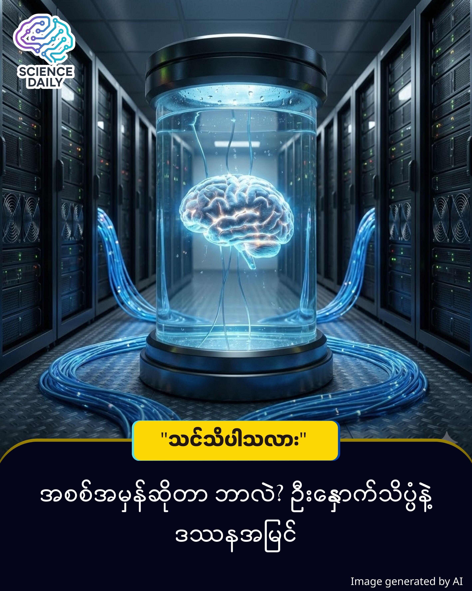

title: သင်မြင်နေရတဲ့ ကမ္ဘာကြီးက အစစ်အမှန်လား၊ ဒါမှမဟုတ် လျှပ်စစ်လှိုင်းတွေရဲ့ လှည့်စားမှုလား? (Brain in a Vat)
summary: မိတ်ဆွေ ဘာပဲခံစားနေရ သည်ဖြစ်ပါစေ ခဏလောက်... စက္ကန့်ပိုင်းလောက်ပဲ အရာရာကို ရပ်ပြီး စဉ်းစားကြည့်ပါ။ မိတ်ဆွေတို့ မြင်နေ၊ ထိတွေ့နေရတဲ့ ဒီအရာအားလုံးဟာ "အစစ်အမှန်" ဖြစ်ကြောင်း ဘယ်လို သက်သေပြမလဲ?
Date: 2026-01-14
Image: images/Brain in a Vat.jpg

သင်မြင်နေရတဲ့ ကမ္ဘာကြီးက အစစ်အမှန်လား၊ ဒါမှမဟုတ် လျှပ်စစ်လှိုင်းတွေရဲ့ လှည့်စားမှုလား? (Brain in a Vat)

စိတ်ဝင်စားစရာကောင်းတဲ့ Thought Experiment (တွေးခေါ်မှုဆိုင်ရာ စမ်းသပ်ချက်) တစ်ခုအကြောင်း

မိတ်ဆွေ ဘာပဲခံစားနေရ သည်ဖြစ်ပါစေ ခဏလောက်... စက္ကန့်ပိုင်းလောက်ပဲ အရာရာကို ရပ်ပြီး စဉ်းစားကြည့်ပါ။ မိတ်ဆွေတို့ မြင်နေ၊ ထိတွေ့နေရတဲ့ ဒီအရာအားလုံးဟာ "အစစ်အမှန်" ဖြစ်ကြောင်း ဘယ်လို သက်သေပြမလဲ?

ဒီမေးခွန်းက ရူးသွပ်ပုံရပေမဲ့၊ သိပ္ပံပညာရှင်တွေနဲ့ ဒဿနပညာရှင်တွေကို နှစ်ပေါင်းများစွာ ခေါင်းရှုပ်စေခဲ့တဲ့ နာမည်ကျော် တွေးခေါ်မှု စမ်းသပ်ချက် (Thought Experiment) တစ်ခု ရှိပါတယ်။ အဲ့ဒါကတော့ "Brain in a Vat" ပါပဲ။ 

ဒီ 'Brain in a Vat' (အိုးထဲက ဦးနှောက်) ဆိုတဲ့ တွေးခေါ်မှု စမ်းသပ်ချက်ကို ၁၉၈၁ ခုနှစ်မှာ အမေရိကန် ဒဿနပညာရှင်ကြီး Hilary Putnam က သူ့ရဲ့ နာမည်ကျော် စာအုပ်ဖြစ်တဲ့ 'Reason, Truth and History' မှာ တရားဝင် အသေးစိတ် ဖော်ပြခဲ့ပါတယ်။ သိပ္ပံစိတ်ကူးယဉ် ရုပ်ရှင်တွေ မပေါ်ခင်ကတည်းက ပညာရှင်တွေကြားမှာ ဒီအကြောင်းအရာဟာ 'အမှန်တရား (Truth)' နဲ့ 'အသိပညာ (Knowledge)' ဆိုတာ ဘာလဲလို့ မေးခွန်းထုတ်စရာ အဓိက ခေါင်းစဉ်တစ်ခု အဖြစ် တည်ရှိခဲ့တာ ဖြစ်ပါတယ်။

ဒါဆိုရင် အခု မိတ်ဆွေတို့ နဲ့အတူ အကြောင်းအရာ လေးတစ်ခုကို စိတ်ကူးကြည့် ရအောင်ပါ ။ 

မိတ်ဆွေ ရဲ့ ခန္ဓာကိုယ်တစ်ခုလုံး မရှိတော့ဘူး ပဲထားပါတော့ ။ မိတ်ဆွေ ရဲ့ ဦးနှောက်ကိုပဲ ယူပြီး အာဟာရရည်တွေ ဖြည့်ထားတဲ့ ဖန်အိုး (Vat) တစ်ခုထဲမှာ ထည့်ထားမယ်။ အဲ့ဒီ ဦးနှောက်ကို အလွန်အဆင့်မြင့်တဲ့ Supercomputer ကြီးတစ်ခုနဲ့ ဝါယာကြိုးတွေ ဆက်သွယ်ထားမယ်။

ကွန်ပျူတာက မိတ်ဆွေ ဦးနှောက်ဆီကို လျှပ်စစ်လှိုင်း (Electrical Impulses) တွေ ပို့လွှတ်ပြီး မိတ်ဆွေ ကို လှည့်စားထားနိုင်ပါတယ်။

ကွန်ပျူတာက "ပန်းသီးစားနေတယ်" ဆိုတဲ့ signal ပို့လိုက်ရင် မိတ်ဆွေ ရဲ့ ဦးနှောက်က ပန်းသီးရဲ့ အရသာ၊ အနံ့၊ ဝါးနေတဲ့ အသံတွေကို တကယ်အစစ်အတိုင်း ခံစားရပါလိမ့်မယ်။

တကယ်တမ်းမှာတော့ မိတ်ဆွေ မှာ ခန္ဓာကိုယ်ဆိုတာ မရှိပါဘူး။ မိတ်ဆွေ ဟာ စမ်းသပ်ခန်းတစ်ခုက ဖန်အိုးထဲမှာ အသက်ရှင်နေတဲ့ ဦးနှောက်တစ်လုံးသာ ဖြစ်နေနိုင်ပါတယ်။ ( ဒါက အတွေးတစ်ခု နေနဲ့ တင်ပြချက်ပါ )

ဒါဆိုရင် မေးစရာရှိလာပါပြီ။ "အခု ကျွန်တော်တို့ ဖြတ်သန်းနေတဲ့ ဘဝက အစစ်လား၊ simulation လားဆိုတာ မိတ်ဆွေတို့ ကျွန်တော်တို့ ဘယ်လို ခွဲခြားမလဲ?"

 သိပ္ပံနည်းကျ ရှုထောင့် (Neuroscience View)

သိပ္ပံပညာအရ ကြည့်မယ်ဆိုရင် ကျွန်တော်တို့ရဲ့ "Reality" (လက်တွေ့ဘဝ) ဆိုတာ ဦးနှောက်က ဖန်တီးထားတဲ့ ပုံရိပ်ယောင်တစ်ခုပါပဲ။

ဒီအချက် နှစ်ချက်နဲ့ မြင်အောင်ကြည့်ကြည့်ရအောင် နော် 
Signal ပို့လွှတ်ခြင်း (Deciphering): -  "မိတ်ဆွေ တို့ရဲ့ မျက်လုံးဆိုတာ ကင်မရာ (Camera Lens) တစ်ခုပါပဲ။ သူက ပုံရိပ်ကို တိုက်ရိုက်မယူပါဘူး။ အလင်းရောင်ကို 'လျှပ်စစ်အချက်ပြလှိုင်း' (Data Signals) တွေအဖြစ် ပြောင်းလဲပြီး ဦးနှောက်ဆီကို ဝါယာကြိုးတွေနဲ့ ပို့သလို ပို့လိုက်တာပါ။"

ပုံဖော်ခြင်း (Processing): "ဦးနှောက်ကတော့ CPU (Processor) ကြီးလိုပါပဲ။ ရောက်လာတဲ့ လျှပ်စစ်လှိုင်း (Data) တွေကို ဖတ်ပြီးမှ 'ဩော်... ဒါက ပန်းသီးပဲ' ဆိုပြီး ပုံဖော်ပေးလိုက်တာ ဖြစ်ပါတယ်။"

Elon Musk တို့လို ပုဂ္ဂိုလ်တွေ ကြိုးပမ်းနေတဲ့ Neuralink နည်းပညာဟာ ဒီသဘောတရားကို အခြေခံထားပါတယ်။ ဦးနှောက်နဲ့ ကွန်ပျူတာကို တိုက်ရိုက်ချိတ်ဆက်ပြီး (Brain-Computer Interface) အချက်အလက်တွေ ဖလှယ်ဖို့ ကြိုးစားနေကြတာပါ။ ဒါဟာ "Brain in a Vat" သီအိုရီကို လက်တွေ့နဲ့ ပိုနီးစပ်လာစေပါတယ်။

ဒဿန နှင့် တွေးခေါ်မှု (The Philosophical Truth)

ပြင်သစ် ဒဿနပညာရှင် René Descartes က "Evil Demon" (မိစ္ဆာဆိုးကြီးက ငါ့ကို လှည့်စားနေရင် ဘယ်လိုလုပ်မလဲ) ဆိုပြီး ဒီသဘောတရားကို စတင်မိတ်ဆက်ခဲ့ဖူးပါတယ်။ နောက်ဆုံးမှာ သူက နာမည်ကျော် ကောက်ချက်တစ်ခုကို ချခဲ့ပါတယ်။

"Cogito, ergo sum" (I think, therefore I am) "ငါ တွေးခေါ်နေတယ်၊ ဒါကြောင့် ငါ ရှိနေတယ်။"

ဆိုလိုတာကတော့ "ဒီကမ္ဘာကြီးတစ်ခုလုံးက မိတ်ဆွေ ကို လှည့်စားထားတဲ့ 'အတုအယောင်' ကြီး ဖြစ်နေပါစေဦး... အဲဒီ အတုအယောင်တွေကို မြင်နေ၊ တွေ့နေ၊ ခံစားနေတဲ့ 'သင်' (မိတ်ဆွေ ရဲ့ စိတ်) ကတော့ တကယ်ရှိနေဖို့ လိုပါတယ်။
လွယ်လွယ်ပြောရရင်... 'မိတ်ဆွေ ကို လှည့်စားဖို့အတွက်၊ လှည့်စားခံရမယ့်သူ (သင်) က ရှိကိုရှိနေမှ ဖြစ်မှာပါ။' ဒါက ငြင်းလို့မရတဲ့ အမှန်တရားပါပဲ။"

ဒီနေရာမှာ ရှင်းလင်းဖို့ လိုတာက "Brain in a Vat" ဟာ Thought Experiment (တွေးခေါ်မှုဆိုင်ရာ စမ်းသပ်ချက်) တစ်ခုသာ ဖြစ်ပါတယ်။

ကျွန်တော်တို့အားလုံး ကွန်ပျူတာထဲမှာ နေနေရတယ်လို့ သိပ္ပံပညာက အတည်ပြုထားခြင်း မရှိပါ။

ဒါပေမဲ့ ဒီသီအိုရီက Quantum Mechanics ရဲ့ Observer Effect နဲ့ ဆက်စပ်ပြီး ရူပဗေဒလောကမှာ စိတ်ဝင်စားစရာ ဆွေးနွေးစရာ ဖြစ်နေဆဲပါ။သို့ သော်လည်း ခေတ်သစ် Neuroscience (ဦးနှောက်နှင့် အာရုံကြောသိပ္ပံ) ရှုထောင့်အရ 'ဦးနှောက်ဟာ ပြင်ပလောကကို တိုက်ရိုက်မသိနိုင်ဘဲ လျှပ်စစ်လှိုင်း (Signals) တွေကနေတဆင့်သာ ပုံဖော်ရတယ်' ဆိုတဲ့ အချက်ကိုတော့ သိပ္ပံပညာရှင်အားလုံးက လက်ခံအတည်ပြုထားကြပါတယ်။"

🚀 နိဂုံး

နည်းပညာတွေ တိုးတက်လာတာနဲ့အမျှ VR (Virtual Reality) နဲ့ AR (Augmented Reality) တွေက လက်တွေ့နဲ့ ခွဲမရအောင် တူညီလာပါလိမ့်မယ်။ တစ်နေ့မှာ ကျွန်တော်တို့ဟာ "အစစ်အမှန်" ဆိုတဲ့ အဓိပ္ပါယ်ဖွင့်ဆိုချက်ကို ပြန်ပြင်ရကောင်း ပြင်ရပါလိမ့်မယ်။

ဒါပေမဲ့ စိတ်မပူပါနဲ့။ မိတ်ဆွေ ဟာ ဖန်အိုးထဲက ဦးနှောက်ပဲ ဖြစ်ဖြစ်၊ လူသားစစ်စစ်ပဲ ဖြစ်ဖြစ်... သင့်ရဲ့ ခံစားမှု၊ သင့်ရဲ့ မေတ္တာတရားနဲ့ သင့်ရဲ့ တွေးခေါ်မှုတွေကတော့ အမြဲတမ်း "အစစ်အမှန်" ပါပဲ။

SHORT SOURCES REFERENCE
Core Concept: Gilbert Harman’s "Brain in a Vat" argument (1973).
Philosophical Origin: René Descartes’ "Meditations on First Philosophy" (Evil Demon hypothesis).

#BrainInAVat #Philosophy #Neuroscience #Technology #SimulationTheory #MyanmarTechDigest #FutureTech #DeepThinker #ScienceMyanmar
