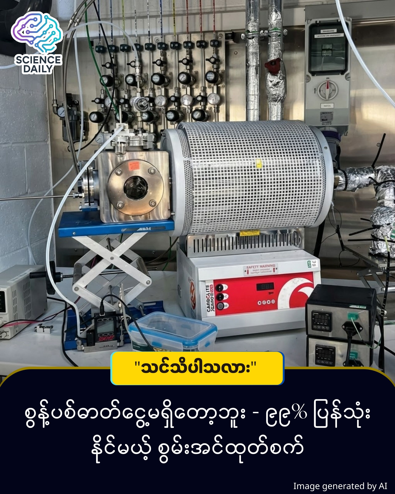

title: Cambridge University ရဲ့ ဓာတ်ငွေ့ ၉၉% ကို ပြန်လည်အသုံးပြုပြီး ဟိုက်ဒရိုဂျင်လောင်စာထုတ်မယ့် နည်းပညာသစ်
summary: ဟိုက်ဒရိုဂျင်လောင်စာ (Hydrogen Fuel) ဆိုတာ အနာဂတ်အတွက် အလွန်အရေးပါပေမယ့် လက်ရှိထုတ်လုပ်ပုံတွေက ကာဗွန်ထုတ်လွှတ်မှုများပြီး လေထုကို ညစ်ညမ်းစေနေပါတယ်။
Date: 2025-12-29
Image: images/Clean Hydrogen Fuel.jpg

Cambridge University ရဲ့ ဓာတ်ငွေ့ ၉၉% ကို ပြန်လည်အသုံးပြုပြီး ဟိုက်ဒရိုဂျင်လောင်စာထုတ်မယ့် နည်းပညာသစ်

ဟိုက်ဒရိုဂျင်လောင်စာ (Hydrogen Fuel) ဆိုတာ အနာဂတ်အတွက် အလွန်အရေးပါပေမယ့် လက်ရှိထုတ်လုပ်ပုံတွေက ကာဗွန်ထုတ်လွှတ်မှုများပြီး လေထုကို ညစ်ညမ်းစေနေပါတယ်။ ဒါပေမဲ့ အခုအခါမှာတော့ ကိမ်းဘရစ်တက္ကသိုလ် (Cambridge University) က သုတေသီတွေဟာ ဓာတ်ငွေ့ကို ၉၉% အထိ ပြန်လည်အသုံးပြုပြီး၊ ကာဗွန်ဒိုင်အောက်ဆိုက် လုံးဝမထွက်ဘဲ သန့်ရှင်းတဲ့ ဟိုက်ဒရိုဂျင်ထုတ်နိုင်မယ့် နည်းလမ်းကို ရှာတွေ့သွားပါပြီ ။

ဒီနည်းပညာရဲ့ အဓိကသော့ချက်က "Methane Pyrolysis" လို့ခေါ်တဲ့ နည်းလမ်းဖြစ်ပါတယ်။ ရိုးရိုးရှင်းရှင်း ပြောရရင် -

မီသိန်းဓာတ်ငွေ့ (Methane) ကို အပူချိန် ၁၃၀၀ ဒီဂရီစင်တီဂရိတ် (1300°C) အထိ ပေးလိုက်ပါတယ် ။ ဒီအပူချိန်မှာ မီသိန်းဓာတ်ငွေ့ဟာ "ကာဗွန် (Carbon)" နဲ့ "ဟိုက်ဒရိုဂျင် (Hydrogen)" ဆိုပြီး နှစ်ပိုင်း ကွဲထွက်သွားပါတယ် ။ ဒီနေရာမှာ နည်းနည်း ပြောချင်တာ က စာဖက်သူများ "မီးရှို့တာ (Combustion)" နဲ့ "အပူပေးဖြိုခွဲတာ (Pyrolysis)" မတူ ပါဘူး လို့ ပြောချင်ပါတယ် ခဗျ ။ အခု နည်းလမ်းက အပူပေးဖြိုခွဲတာ (Pyrolysis) တဲ့ နည်းလမ်းကို သုံးသွားတာပါ ခဗျ ။ ရလာတဲ့ ကာဗွန်က အီလက်ထရွန်နစ်ပစ္စည်းနဲ့ ဘက်ထရီတွေမှာသုံးတဲ့ တန်ဖိုးရှိ Carbon Nanotubes (CNT) ဖြစ်လာပြီး၊ ဟိုက်ဒရိုဂျင်ကတော့ သန့်ရှင်းတဲ့လောင်စာ ဖြစ်လာပါတယ် ။ 

အရင်တုန်းက ဒီနည်းလမ်းကို သုံးရာမှာ ဓာတ်ငွေ့ကို စက်ထဲမှာ တစ်ခါပဲ ဖြတ်စီးဆင်းစေတဲ့ (Single-pass) စနစ်ကို သုံးတော့ လေလွင့်မှုများပြီး စရိတ်ကြီးပါတယ် ။ 

Cambridge University အဖွဲ့ရဲ့ ထူးခြားချက်ကတော့ "Looping System" (ဓာတ်ငွေ့ကို လှည့်ပတ်စီးဆင်းစေခြင်း) ကို အသုံးပြုလိုက်တာပါပဲ ။ စက်ထဲမှာ ဓာတ်ငွေ့ကို ထပ်ခါထပ်ခါ လှည့်ပတ်ပေးလိုက်တဲ့အတွက် မီသိန်းဓာတ်ငွေ့ ၉၉% ကို အကျိုးရှိရှိ ပြန်သုံးနိုင်သွားပါတယ် ။ ဒီနည်းလမ်းကြောင့် ကာဗွန်ထွက်နှုန်း (Carbon yield) ၈ ဆကျော် ပိုကောင်းလာသလို၊ လုပ်ငန်းစဉ်တစ်ခုလုံးရဲ့ စွမ်းအင်အလေအလွင့် သက်သာမှုက အဆပေါင်း ၄၀၀ ကျော် ပိုကောင်းလာပါတယ် ။ 

ထပ်မံရှင်းပြချက် 

ဒီနည်းပညာရဲ့ အဓိကသော့ချက်က "Methane Pyrolysis" လို့ခေါ်တဲ့ နည်းလမ်းဖြစ်ပါတယ်။ ဒီနေရာမှာ လူအများစု ထင်မှားနိုင်တာတစ်ခုကို ရှင်းပြချင်ပါတယ်။ ပုံမှန် မီသိန်းဓာတ်ငွေ့ကို မီးရှို့ရင် လေထဲက အောက်ဆီဂျင်နဲ့ပေါင်းပြီး ကာဗွန်ဒိုင်အောက်ဆိုက် (CO_2) ထွက်လာစမြဲပါ။ဒါပေမဲ့ ဒီနည်းပညာမှာတော့ -မီသိန်းဓာတ်ငွေ့ (CH_4) ကို အောက်ဆီဂျင် လုံးဝမပါတဲ့ လေလုံပြွန်ချောင်းထဲထည့်ပြီး အပူချိန် ၁၃၀၀ ဒီဂရီစင်တီဂရိတ် (1300^\circ C) အထိ ပေးလိုက်ပါတယ် ။အောက်ဆီဂျင်မရှိတဲ့အတွက် ကာဗွန်ဒိုင်အောက်ဆိုက် (CO_2) လုံးဝ ဖြစ်ခွင့်မရတော့ပါဘူး ။အစားထိုးအနေနဲ့ မီသိန်းဟာ "ကာဗွန် (Carbon)" နဲ့ "ဟိုက်ဒရိုဂျင် (Hydrogen)" ဆိုပြီး သက်သက်စီ နှစ်ပိုင်းကွဲထွက်သွားပါတယ် ။ရလာတဲ့ ကာဗွန်က တန်ဖိုးရှိ Carbon Nanotubes (CNT) ဖြစ်လာပြီး၊ ဟိုက်ဒရိုဂျင်ကတော့ သန့်ရှင်းတဲ့လောင်စာ ဖြစ်လာပါတယ်  ။

ဒီတွေ့ရှိချက်ကို ကမ္ဘာကျော် သိပ္ပံဂျာနယ် Nature မှာ တရားဝင် ဖော်ပြထားပြီး ဖြစ်ပါတယ် ။ လက်ရှိမှာတော့ ဓာတ်ခွဲခန်းအဆင့် (Lab-scale) မှာ အောင်မြင်စွာ စမ်းသပ်နိုင်ခဲ့တာဖြစ်ပြီး၊ စီးပွားဖြစ် စက်ရုံကြီးတွေအထိ တိုးချဲ့ထုတ်လုပ်နိုင်မယ့် အလားအလာရှိကြောင်း ကွန်ပျူတာမော်ဒယ်တွေနဲ့ တွက်ချက် အတည်ပြုထားပါတယ် ။

ဒီနည်းပညာသာ တွင်တွင်ကျယ်ကျယ် ဖြစ်လာရင် -

လျှပ်စစ်ကား (EV) ဘက်ထရီတွေအတွက် မရှိမဖြစ်လိုအပ်တဲ့ Carbon Nanotubes တွေကို ဈေးသက်သက်သာသာ ထုတ်လုပ်နိုင်ပါမယ် ။

ကမ္ဘာကြီးပူနွေးလာမှုကို ကာကွယ်ပေးမယ့် "သန့်ရှင်းသော ဟိုက်ဒရိုဂျင်လောင်စာ" ကိုပါ ဘေးထွက်ပစ္စည်းအဖြစ် အမြောက်အမြား ရရှိလာမှာ ဖြစ်ပါတယ် ။

Source: Interesting Engineering / Nature Journal

#CleanEnergy #HydrogenFuel #CambridgeUniversity #ScienceNews #Innovation #CarbonNanotubes #EVBattery #Technology #BurmeseTechNews
