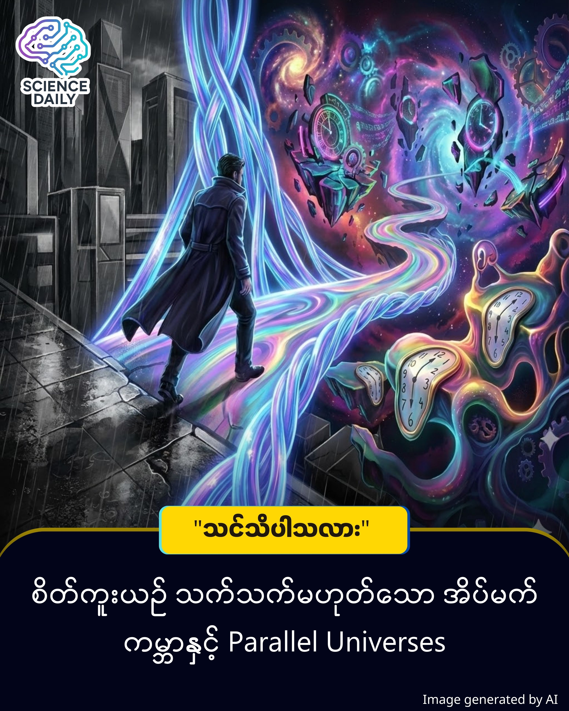

title: အိပ်မက်များနှင့် Dimensions များ: စကြဝဠာ၏ လျှို့ဝှက်တံခါးပေါက်များ (Dreams & Dimensions) 
summary: ညဘက် အိပ်ပျော်သွားတဲ့အချိန်မှာ သင့်စိတ်အာရုံဟာ ဘယ်နေရာကို ရောက်သွားသလဲလို့ ကိုယ့်ကိုယ်ကို မေးဖူးပါသလား။ သိပ္ပံပညာရှင်တွေနဲ့ ဒဿနပညာရှင်တွေ နှစ်ပေါင်းများစွာ ငြင်းခုံခဲ့ကြတဲ့ မေးခွန်းတစ်ခုရှိပါတယ်။
Date: 2026-01-20
Image: images/Dreams & Dimensions.jpg

အိပ်မက်များနှင့် Dimensions များ: စကြဝဠာ၏ လျှို့ဝှက်တံခါးပေါက်များ (Dreams & Dimensions) 

ညဘက် အိပ်ပျော်သွားတဲ့အချိန်မှာ သင့်စိတ်အာရုံဟာ ဘယ်နေရာကို ရောက်သွားသလဲလို့ ကိုယ့်ကိုယ်ကို မေးဖူးပါသလား။ သိပ္ပံပညာရှင်တွေနဲ့ ဒဿနပညာရှင်တွေ နှစ်ပေါင်းများစွာ ငြင်းခုံခဲ့ကြတဲ့ မေးခွန်းတစ်ခုရှိပါတယ်။ အဲဒါကတော့ - "အိပ်မက်ဆိုတာ ဦးနှောက်က ဖန်တီးလိုက်တဲ့ လှည့်စားမှု သက်သက်လား... ဒါမှမဟုတ် ကျွန်တော်တို့ မသိနားမလည်နိုင်တဲ့ အခြား Dimensions (အတိုင်းအတာ) တွေဆီကို ခဏတာ ခရီးထွက်သွားတာလား" ဆိုတာပါပဲ။

မြင်နိုင်သော ကမ္ဘာနှင့် မမြင်နိုင်သော အတိုင်းအတာများ

ကျွန်တော်တို့ လူသားတွေဟာ 3D (Three-Dimensional) လို့ခေါ်တဲ့ အလျား၊ အနံ၊ အမြင့် ရှိတဲ့ ကမ္ဘာကြီးထဲမှာ ရှင်သန်နေကြပါတယ်။ ကျွန်တော်တို့ရဲ့ အာရုံခံစားမှုတွေက ဒီအရာဝတ္ထုတွေကိုပဲ မြင်နိုင်၊ ထိတွေ့နိုင်အောင် ဒီဇိုင်းလုပ်ခံထားရတာပါ။ ဒါပေမဲ့ ရူပဗေဒပညာရှင်တွေ (အထူးသဖြင့် String Theory သမားတွေ) ကတော့ စကြဝဠာကြီးမှာ Dimensions ပေါင်း ၁၀ ခု၊ ၁၁ ခုမက ရှိနိုင်တယ်လို့ ဆိုကြပါတယ်။

ပုရွက်ဆိတ်လေးတစ်ကောင်ဟာ စာရွက်တစ်ရွက်ပေါ်မှာ လျှောက်သွားနေတယ်ဆိုပါစို့။ သူက "အပြားလိုက်" (2D) ကမ္ဘာကိုပဲ သိပါတယ်။ သူ့အပေါ်ကနေ ဖြတ်ပျံသွားတဲ့ ငှက်တစ်ကောင် (3D သတ္တဝါ) ကို သူဘယ်လိုမှ နားလည်နိုင်မှာ မဟုတ်ပါဘူး။ ကျွန်တော်တို့ လူသားတွေလည်း ထိုနည်းလည်းကောင်းပါပဲ။ ကျွန်တော်တို့ရဲ့ ဘေးနားမှာတင် ရှိနေနိုင်တဲ့ "စတုတ္ထမြောက် အတိုင်းအတာ" (4th Dimension) ကို ကျွန်တော်တို့ မျက်လုံးနဲ့ မမြင်နိုင်ပါဘူး။

အိပ်မက်: Multiverse ဆီသို့ တံခါးပေါက်လား?

ဒီနေရာမှာ စိတ်ဝင်စားစရာ အယူအဆတစ်ခု ဝင်လာပါတယ်။

Quantum Mechanics နှင့် အိပ်မက်: - Quantum Mechanics သီအိုရီအရ ဖြစ်နိုင်ခြေပေါင်းများစွာဟာ တစ်ပြိုင်နက်တည်း တည်ရှိနေနိုင်ပါတယ်။ (ဥပမာ - ဒီကမ္ဘာမှာ သင်ဟာ ဆရာဝန်ဖြစ်နေပေမဲ့၊ Parallel Universe တစ်ခုမှာတော့ သင်ဟာ အာကာသယာဉ်မှူး ဖြစ်နေနိုင်ပါတယ်)။

Subconscious ၏ စွမ်းအား: ကျွန်တော်တို့ နိုးထနေချိန်မှာ ဦးနှောက်က Logic (ယုတ္တိဗေဒ) နဲ့ 3D ကမ္ဘာကြီးရဲ့ စည်းမျဉ်းတွေအတိုင်း အလုပ်လုပ်ပါတယ်။ ဒါပေမဲ့ အိပ်ပျော်သွားတဲ့အခါ... အဲဒီ "ကန့်သတ်ချက်" တွေ ပျောက်ကွယ်သွားပါတယ်။

တချို့သော Visionary Thinkers တွေက အိပ်မက်မက်တယ်ဆိုတာ ကျွန်တော်တို့ရဲ့ အသိစိတ် (Consciousness) ဟာ ရုပ်ပိုင်းဆိုင်ရာ ခန္ဓာကိုယ်ရဲ့ ကန့်သတ်ချက်တွေကို ကျော်လွန်ပြီး အခြားသော Dimensions တွေ၊ ဒါမှမဟုတ် Parallel Universe တွေဆီကို ခဏတာ "ချိတ်ဆက်" မိခြင်း ဖြစ်နိုင်တယ်လို့ ယူဆကြပါတယ်။ ဒါကြောင့် အိပ်မက်ထဲမှာ ပျံသန်းနိုင်တာ၊ အချိန်ကာလကို ကျော်လွန်နိုင်တာ၊ သေဆုံးသွားသူတွေနဲ့ ပြန်တွေ့နိုင်တာတွေ ဖြစ်လာတာပါ။

အိပ်မက်တွေနဲ့ Dimensions တွေကို လေ့လာခြင်းက ရူပဗေဒ သက်သက် မဟုတ်ပါဘူး။ ဒါဟာ ကျွန်တော်တို့ရဲ့ စိတ်ဝိညာဉ် ဘယ်လောက်ထိ ကျယ်ပြန့်သလဲဆိုတာကို ရှာဖွေခြင်းလည်း ဖြစ်ပါတယ်။

အိပ်မက်တွေဟာ တကယ်မရှိတဲ့ အရာတွေ ဖြစ်ကောင်းဖြစ်နိုင်ပါတယ်။ ဒါပေမဲ့ အဲဒီ အိပ်မက်တွေက ပေးတဲ့ "ခံစားချက်" (Inspiration) တွေကတော့ စစ်မှန်ပါတယ်။ ဒီအရာတွေကပဲ အိုင်စတိုင်းလို လူမျိုးကို နှိုင်းရသီအိုရီကို တွေ့ရှိစေခဲ့ပြီး၊ ခရစ်စတိုဖာနိုလန်လို လူမျိုးကို "Interstellar" လို ရုပ်ရှင်မျိုး ဖန်တီးနိုင်စေခဲ့တာပါ။

နောက်တစ်ခါ သင် အိပ်မက်မက်တဲ့အခါ... အဲဒါကို ရုပ်ရှင်တစ်ကားလို သဘောမထားပါနဲ့။ သင့်ရဲ့ စိတ်ဟာ အာကာသနဲ့ အချိန်ကာလကို ဖြတ်ကျော်ပြီး အခြားသော Dimension တစ်ခုဆီကို ခရီးနှင်နေတာ ဖြစ်ကောင်းဖြစ်နိုင်တယ်ဆိုတဲ့ အသိနဲ့ ခံစားကြည့်ပါ။ စကြဝဠာကြီးက ကျွန်တော်တို့ ထင်ထားတာထက် ပိုကျယ်ပြန့်ပြီး၊ ပိုဆန်းကြယ်နေနိုင်ပါသေးတယ်။

"အိပ်မက်ကတဆင့် အခြား Dimensions ကို ရောက်နိုင်တယ်" ဆိုတဲ့အချက်ကို NASA သို့မဟုတ် CERN လို သိပ္ပံအဖွဲ့အစည်းကြီးတွေက တရားဝင် အတည်ပြုထားတာ မရှိသေးပါဘူး။ ဒါဟာ String Theory နဲ့ Quantum Mechanics လို ရူပဗေဒ သီအိုရီတွေကို အခြေခံပြီး ပညာရှင်တွေ ခန့်မှန်း တွက်ချက်ထားတဲ့ စိတ်ဝင်စားစရာ "အယူအဆ" (Hypothesis) တစ်ခုသာ ဖြစ်ပါတယ်။

ဒီအကြောင်းအရာကို ကောင်းကောင်းနားလည်ဖို့အတွက် "Dimensions" သဘောတရားကို အကြမ်းဖျင်း သိထားရင် အဆင်ပြေပါတယ်။ နောက်ထပ် သိထားသင့်တာကတော့ "Multiverse" သဘောတရား ဖြစ်ပါတယ်။

Concept Based on: String Theory (Multidimensional Universe) & Quantum Mechanics (Many-Worlds Interpretation).

Philosophical Reference: Carl Jung’s theory on the Collective Unconscious regarding dreams.

#DreamsAndDimensions #QuantumPhysics #BurmeseTechArticles #FutureThinking #Multiverse #PhilosophyOfScience #MyanmarKnowledgeShare #BeyondReality
