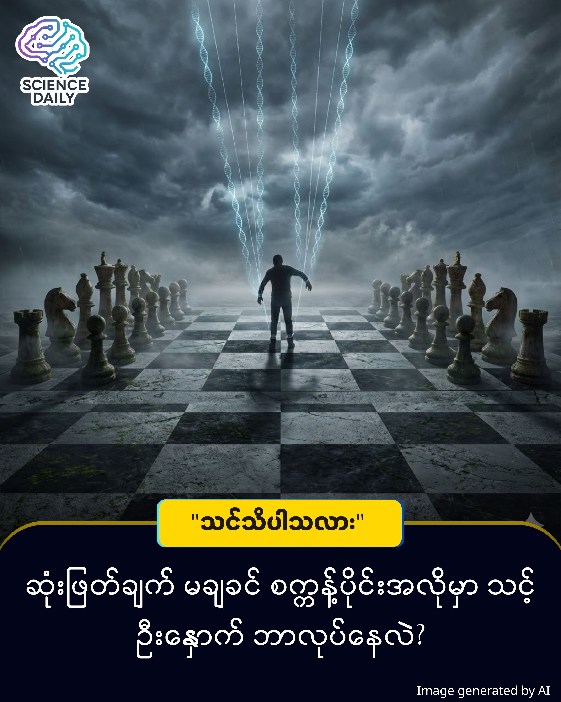

title: ကျွန်တော်တို့ရဲ့ ဆုံးဖြတ်ချက်တွေကို ဦးနှောက်က ကြိုတင်စီစဉ်နေသလား? (Free Will vs. Biology)
summary: အခု ဒီစာကို ဖတ်မယ်လို့ ဆုံးဖြတ်လိုက်တာ သင်ကိုယ်တိုင်လို့ ထင်နေပါသလား။ တကယ်တော့ သင့်မသိစိတ် (Subconscious mind) က ဒီစာကိုဖတ်ဖို့ သင့်ကိုယ်တိုင် သတိမထားမိခင် မီလီစက္ကန့်ပိုင်း အလိုကတည်းက ဆုံးဖြတ်ချက် ချပြီးသားပါ။
Date: 2026-01-03
Image: images/Free Will.jpg

ကျွန်တော်တို့ရဲ့ ဆုံးဖြတ်ချက်တွေကို ဦးနှောက်က ကြိုတင်စီစဉ်နေသလား? (Free Will vs. Biology)

အခု ဒီစာကို ဖတ်မယ်လို့ ဆုံးဖြတ်လိုက်တာ သင်ကိုယ်တိုင်လို့ ထင်နေပါသလား။ တကယ်တော့ သင့်မသိစိတ် (Subconscious mind) က ဒီစာကိုဖတ်ဖို့ သင့်ကိုယ်တိုင် သတိမထားမိခင် မီလီစက္ကန့်ပိုင်း အလိုကတည်းက ဆုံးဖြတ်ချက် ချပြီးသားပါ။

ကျွန်တော်တို့က ကိုယ့်စိတ်ကြိုက် ရွေးချယ်ပိုင်ခွင့် (Free Will) ရှိတယ်လို့ ခံစားရပေမဲ့၊ ဇီဝဗေဒ (Biology) ရှုထောင့်က ကြည့်ရင်တော့ ဒါဟာ "ထင်ယောင်ထင်မှား ဖြစ်မှု" (Illusion) တစ်ခုသာ ဖြစ်နိုင်ပါတယ်။ ရိုးရိုးလေး စဉ်းစားကြည့်ပါ။ သင့်ရဲ့ အပြုအမူမှန်သမျှဟာ အောက်ပါအချက်တွေရဲ့ ရလဒ်တွေပါ။

ဗီဇ (Genetics): မိဘတွေဆီက ရလိုက်တဲ့ DNA။

ဟော်မုန်း (Hormones): စိတ်ဖိစီးရင် ထွက်လာတဲ့ Cortisol သို့မဟုတ် ပျော်ရွှင်ရင် ထွက်လာတဲ့ Dopamine။

အတိတ်က အတွေ့အကြုံ (Environment): ငယ်ဘဝ ကြီးပြင်းလာပုံ။

ဒီအချက်တွေ အားလုံးပေါင်းပြီးမှ "ဆုံးဖြတ်ချက်" တစ်ခု ထွက်လာတာပါ။ အဲဒီတော့ "ငါ ရွေးချယ်လိုက်တာ" ဆိုတဲ့ အရာဟာ တကယ်တော့ ဦးနှောက်ထဲက ရှုပ်ထွေးတဲ့ ဓာတုဗေဒ လုပ်ဆောင်ချက်တွေရဲ့ နောက်ဆုံးရလဒ် (Output) သက်သက် ဖြစ်နေတတ်ပါတယ်။

ဒီအယူအဆကို ထောက်ခံတဲ့ နာမည်ကျော် စမ်းသပ်ချက်တစ်ခု ရှိပါတယ်။ Benjamin Libet ဆိုတဲ့ သိပ္ပံပညာရှင်ရဲ့ စမ်းသပ်ချက်အရ၊ လူတစ်ယောက်က လက်ချောင်းလေး လှုပ်မယ်လို့ စိတ်ကူးမရခင် (ဆုံးဖြတ်ချက် မချခင်) အချိန်အနည်းငယ် စောပြီး ဦးနှောက်ထဲမှာ လှုပ်ရှားဖို့ ပြင်ဆင်နေတဲ့ လှိုင်း (Readiness Potential) ကို တွေ့ရှိခဲ့ပါတယ်။ ဆိုလိုတာက "သင့်ဦးနှောက်က သင့်ထက်အရင် ဆုံးဖြတ်ချက် ချပြီးနေပါပြီ"။ သင်က နောက်မှ သိလိုက်ရတာပါ။ မကြာသေးမီက Stanford တက္ကသိုလ်က နာမည်ကြီး သိပ္ပံပညာရှင် Robert Sapolsky ကလည်း "Free Will ဆိုတာ မရှိဘူး" လို့ ပြတ်ပြတ်သားသား ပြောဆိုထားပြီး၊ လူ့အပြုအမူတိုင်းဟာ အကြောင်းတရား တစ်စုံတစ်ရာကြောင့် (Determined) ဖြစ်လာတာလို့ ဆိုပါတယ်။

ဒါဟာ သိပ္ပံလောကမှာ အကြီးအကျယ် ငြင်းခုံနေဆဲ ကိစ္စဖြစ်ပါတယ်။ ဦးနှောက်ရဲ့ လုပ်ဆောင်ပုံ အများစုကို ဇီဝဗေဒအရ ရှင်းပြနိုင်ပြီ ဖြစ်ပေမဲ့၊ Free Will လုံးဝမရှိဘူးလို့ အတိအကျ ပြောဖို့အတွက်တော့ "နောက်ထပ် အတည်ပြုချက်တွေ လိုပါသေးတယ်"။ ဒါဟာ သီအိုရီ (Theory) နဲ့ ဒဿန (Philosophy) ရောထွေးနေတဲ့ နယ်ပယ်တစ်ခု ဖြစ်ပါတယ်။

Source: Determined: A Science of Life Without Free Will by Robert Sapolsky / Libet’s Experiment on Volition.

#FreeWill #Neuroscience #Biology #ScienceExplainer #BrainFacts #ဗဟုသုတ #သိပ္ပံပညာ
