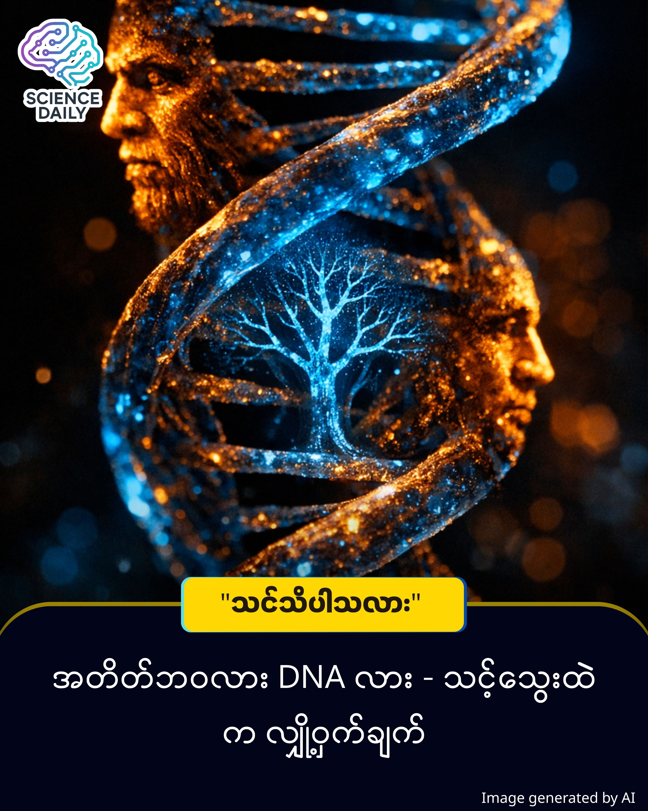

title: DNA မှတ်ဉာဏ် - သင့်ခန္ဓာကိုယ်က မှတ်မိနေသော သမိုင်းကြောင်းများ
summary: ကျွန်ုပ်တို့လူသားတွေမှာ ထူးဆန်းတဲ့ မွေးရာပါ အသိစိတ်တွေ ရှိနေတတ်ပါတယ်။ ပင့်ကူကို မြင်လိုက်တာနဲ့ သင်ပေးစရာမလိုဘဲ ကြောက်လန့်သွားတာမျိုး၊ မြင့်မားတဲ့ နေရာရောက်ရင် အလိုလို ဒူးတုန်လာတာမျိုးပေါ့။
Date: 2026-01-12
Image: images/Genetic Memory.jpg

DNA မှတ်ဉာဏ် - သင့်ခန္ဓာကိုယ်က မှတ်မိနေသော သမိုင်းကြောင်းများ

ကျွန်ုပ်တို့လူသားတွေမှာ ထူးဆန်းတဲ့ မွေးရာပါ အသိစိတ်တွေ ရှိနေတတ်ပါတယ်။ ပင့်ကူကို မြင်လိုက်တာနဲ့ သင်ပေးစရာမလိုဘဲ ကြောက်လန့်သွားတာမျိုး၊ မြင့်မားတဲ့ နေရာရောက်ရင် အလိုလို ဒူးတုန်လာတာမျိုးပေါ့။ ဒါတွေက ဘယ်ကလာတာလဲ။ ရှေးလူကြီးတွေ ပြောသလို "အတိတ်ဘဝက အမှတ်တရ" (Past Lives) တွေလား။ ဒါမှမဟုတ် "ဇီဝဗေဒဆိုင်ရာ အချက်အလက်" (Biological Data) တွေလား။

ဒီမေးခွန်းကို ဖြေဖို့အတွက် ကျွန်ုပ်တို့ဟာ သိပ္ပံပညာရဲ့ အနက်ရှိုင်းဆုံး နယ်ပယ်တစ်ခုဖြစ်တဲ့ Epigenetics ဆီသို့ ခရီးနှင်ရပါလိမ့်မယ်။

ကြွက်ကလေးများနှင့် ချယ်ရီပန်းရနံ့ စမ်းသပ်ချက် 

၂၀၁၃ ခုနှစ်မှာ Emory University က သိပ္ပံပညာရှင်တွေဟာ ကမ္ဘာကျော် စမ်းသပ်မှုတစ်ခု ပြုလုပ်ခဲ့ပါတယ်။ သူတို့ဟာ ကြွက်ထီးတွေကို Acetophenone လို့ခေါ်တဲ့ "ချယ်ရီပန်းရနံ့" ပေးရှူပြီးတိုင်း လျှပ်စစ်ရှော့ခ် အနည်းငယ် တိုက်ပါတယ်။ ကြာလာတော့ အဲ့ဒီကြွက်တွေဟာ ချယ်ရီပန်းနံ့ ရတာနဲ့ ကြောက်ရွံ့တုန်လှုပ်လာပါတော့တယ်။

အံ့သြစရာကောင်းတာက ဒီအချက်ပါပဲ။ အဲ့ဒီကြွက်တွေက မွေးဖွားလာတဲ့ "သားသမီးကြွက်တွေ" နဲ့ "မြေးကြွက်တွေ" ဟာ ချယ်ရီပန်းနံ့ကို တစ်ခါမှ မရဖူး၊ လျှပ်စစ်ရှော့ခ်လည်း တစ်ခါမှ မမိဖူးပါဘူး။ ဒါပေမဲ့ သူတို့ဟာ ချယ်ရီပန်းနံ့ ရလိုက်တာနဲ့ တုန်လှုပ်ခြောက်ခြားသွားကြပါတယ်။

သိပ္ပံပညာ၏ ရှင်းလင်းချက် (The Scientific Reality) ဒါဟာ မှော်ပညာ မဟုတ်ပါဘူး။ ဒါကို Transgenerational Epigenetic Inheritance လို့ ခေါ်ပါတယ်။

DNA ဆိုတာ ဟာ့ဒ်ဝဲ (Hardware) ဖြစ်ပြီး၊

Epigenetics ဆိုတာ အဲဒီ ဟာ့ဒ်ဝဲကို ဘယ်လို အလုပ်လုပ်ရမယ်ဆိုတာ ညွှန်ကြားတဲ့ ဆော့ဖ်ဝဲ (Software Switches) တွေ ဖြစ်ပါတယ်။

မိဘတွေ ပြင်းထန်တဲ့ စိတ်ဒဏ်ရာ (Trauma) ရတဲ့အခါ သူတို့ရဲ့ DNA ကုဒ်တွေ မပြောင်းသွားပေမဲ့၊ DNA ပေါ်က "မီးခလုတ်" (Chemical Tags) လေးတွေ ပြောင်းလဲသွားပါတယ်။ ဒီပြောင်းလဲမှုက သုက်ပိုး (Sperm) နဲ့ မျိုးဥ (Egg) ကတဆင့် သားသမီးဆီ လက်ဆင့်ကမ်း ပါသွားတတ်ပါတယ်။ ဒါကြောင့် သင့်မိဘဘိုးဘွားတွေ အစာငတ်မွတ်ဖူးရင်၊ စစ်ဘေးရှောင်ခဲ့ရရင် သင့်ခန္ဓာကိုယ်က အဲဒီ "ရှင်သန်ရေး သတိပေးချက်" (Survival Instinct) ကို အမွေရရှိထားနိုင်ပါတယ်။

ဒါဆို အတိတ်ဘဝကို မှတ်မိနိုင်သလား (Clarifying Misconceptions) 

ဒီနေရာမှာ သတိထားရမယ့် သိပ္ပံဆိုင်ရာ စည်း (Scientific Guardrail) တစ်ခုရှိပါတယ်။ သိပ္ပံပညာအရ Genetic Memory ဆိုတာ "အဖြစ်အပျက် ဇာတ်လမ်း" (Narrative Memory) ကို မှတ်မိတာ မဟုတ်ပါဘူး။ ဆိုလိုတာက သင့်အဘိုး မင်္ဂလာဆောင်ခဲ့တဲ့ ပုံရိပ်တွေ၊ သူစကားပြောခဲ့တာတွေကို သင်ပြန်မြင်ယောင်နိုင်မှာ မဟုတ်ပါဘူး။

ဒါပေမဲ့ "ခံစားမှုနဲ့ တုံ့ပြန်ပုံ" (Biological Bias) ကိုတော့ ရရှိနိုင်ပါတယ်။ ဥပမာ - အဘိုးက မြွေကိုက်ခံရဖူးရင်၊ သင်ဟာ မြွေမြင်တာနဲ့ အခြားသူထက် ပိုပြီး ထိတ်လန့်လွယ်တဲ့ "ဗီဇ" ပါလာနိုင်ပါတယ်။

နိဂုံး: သင်သည် တစ်ကိုယ်တည်း မဟုတ်ပါ ဒဿနအမြင်အရ ကြည့်မယ်ဆိုရင်တော့ ကျွန်ုပ်တို့ဟာ အတိတ်က လူသားတွေရဲ့ ဆက်လက်ရှင်သန်နေသော အသက်ရှူသံများ ဖြစ်ပါတယ်။ သင့်သွေးကြောထဲမှာ ဘိုးဘေးတွေရဲ့ ကြောက်ရွံ့မှုတွေ ရှိသလို၊ သူတို့ရဲ့ ရဲရင့်မှုတွေလည်း ကပ်ငြိနေပါတယ်။

"အတိတ်ဘဝ" ဆိုတာ ဝိညာဉ်ရေးရာ ယုံကြည်မှုတစ်ခု ဖြစ်နိုင်ပေမဲ့၊ သိပ္ပံပညာကတော့ သေချာပေါက် ပြောနိုင်ပါတယ် - "သင့်ရဲ့ DNA ဟာ သင့်ဘိုးဘေးတွေ ရေးခဲ့တဲ့ ဒိုင်ယာရီစာအုပ် တစ်အုပ်ဖြစ်တယ်" ဆိုတာပါပဲ။

SHORT SOURCES REFERENCE
Core Theory: Transgenerational Epigenetic Inheritance
Key Study: Dias & Ressler (2013) - Nature Neuroscience (Mice & Acetophenone study).
Clarification: Distinction between Narrative Memory (Episodic) and Biological/Instinctual Memory.

#GeneticMemory #Epigenetics #MyanmarTech #ScienceStorytelling #DNA #MentalHealth #GeneralKnowledge #အတိတ်ဘဝ #ဗဟုသုတ
