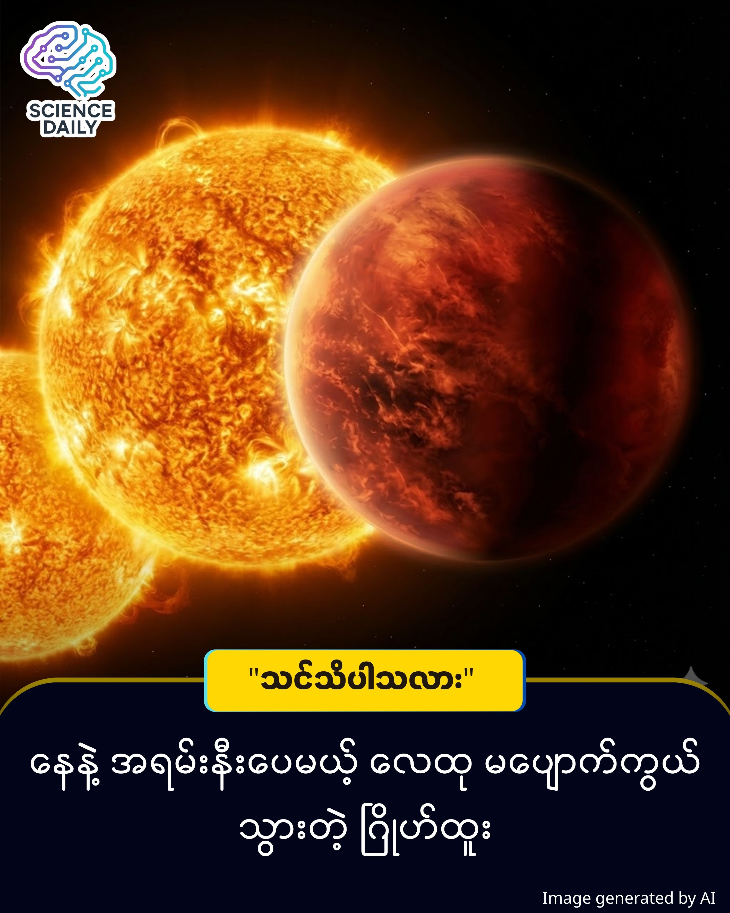

title: မီးတောင်ချော်ရည် ကမ္ဘာ - သိပ္ပံပညာရှင်တွေကို အံ့အားသင့်စေခဲ့တဲ့ ဂြိုဟ် ၊ သိပ္ပံနည်းကျ ခန့်မှန်းချက်တွေကို ဖောက်ထွက်သွားတဲ့ ရှာဖွေတွေ့ရှိမှု
summary: ပုံမှန်ဆိုရင် မိခင်ကြယ်နဲ့ အရမ်းနီးကပ်နေတဲ့ ဂြိုဟ်တွေဟာ အပူရှိန်ပြင်းလွန်းတာကြောင့် လေထု (Atmosphere) မရှိသင့်ပါဘူး။ ဒါပေမဲ့ TOI-561 b လို့ခေါ်တဲ့ ဂြိုဟ်ကတော့ ဒီသဘောတရားကို ချိုးဖောက်ပြီး သိပ္ပံပညာရှင်တွေကို ခေါင်းစားသွားစေခဲ့ပါတယ်။
Date: 2026-01-06
Image: images/Hell Planet.jpg

"မီးတောင်ချော်ရည် ကမ္ဘာ" - သိပ္ပံပညာရှင်တွေကို အံ့အားသင့်စေခဲ့တဲ့ ဂြိုဟ် ၊ သိပ္ပံနည်းကျ ခန့်မှန်းချက်တွေကို ဖောက်ထွက်သွားတဲ့ ရှာဖွေတွေ့ရှိမှု

ပုံမှန်ဆိုရင် မိခင်ကြယ်နဲ့ အရမ်းနီးကပ်နေတဲ့ ဂြိုဟ်တွေဟာ အပူရှိန်ပြင်းလွန်းတာကြောင့် လေထု (Atmosphere) မရှိသင့်ပါဘူး။ ဒါပေမဲ့ TOI-561 b လို့ခေါ်တဲ့ ဂြိုဟ်ကတော့ ဒီသဘောတရားကို ချိုးဖောက်ပြီး သိပ္ပံပညာရှင်တွေကို ခေါင်းစားသွားစေခဲ့ပါတယ်။

ဒီဂြိုဟ်ဟာ "Super-Earth" အမျိုးအစားဖြစ်ပြီး ကမ္ဘာထက် ထုထည် ၂ ဆလောက် ကြီးမားပါတယ်။ သူ့ရဲ့ ထူးခြားချက်ကတော့ တောက်လောင်နေတဲ့ "မီးတောင်ချော်ရည် သမုဒ္ဒရာ" (Magma Ocean) ကြီး ရှိနေတာပါ။ ပုံမှန်ဆိုရင် ကြယ်ရဲ့ အပူရှိန်ကြောင့် ဂြိုဟ်ပေါ်က ဓာတ်ငွေ့တွေ အကုန်လွင့်စင်သွားပြီး ကျောက်တုံးကြီး အဖြစ်ပဲ ကျန်ရစ်သင့်ပါတယ်။ ဒါပေမဲ့ ဒီဂြိုဟ်ကတော့ ထူးဆန်းစွာနဲ့ပဲ ဓာတ်ငွေ့အထူကြီးကို ထိန်းသိမ်းထားနိုင်တာ တွေ့ရပါတယ်။

Carnegie Science မှ သုတေသီတွေက James Webb Space Telescope (JWST) ကိုအသုံးပြုပြီး ဒီဂြိုဟ်ကို အသေးစိတ် လေ့လာခဲ့ကြပါတယ်။

အပူချိန် ကွာဟချက်: - ပုံမှန် တွက်ချက်မှုအရ ဒီဂြိုဟ်ရဲ့ အပူချိန်ဟာ 2,700°C (ဒီဂရီ စင်တီဂရိတ်) ရှိသင့်ပေမယ့်၊ တကယ်တမ်း တိုင်းတာကြည့်တဲ့အခါ 1,800°C လောက်ပဲ ရှိနေပါတယ်။ ဒါဟာ လေထု ရှိနေပြီး အပူကို လှည့်ပတ်စီးဆင်းစေလို့ အေးသွားတာ ဖြစ်နိုင်ပါတယ်။ 

သိပ်သည်းဆ နည်းပါးခြင်း: - ဒီဂြိုဟ်ရဲ့ သိပ်သည်းဆက ရေထက် ၄ ဆလောက်ပဲ ပိုများပါတယ်။ ဒါက ကမ္ဘာမြေထက် သိပ်သည်းဆ နည်းနေတာမို့ အတွင်းပိုင်းမှာ သံဓာတ် (Iron) နည်းပါးတာ သို့မဟုတ် လေထု အရမ်းထူတာ ဖြစ်နိုင်ပါတယ်။ 

Magma နှင့် လေထု မျှခြေ: - သုတေသီတွေက ဒီဂြိုဟ်ရဲ့ မီးတောင်ချော်ရည်တွေကနေ ဓာတ်ငွေ့တွေ ထွက်လာလိုက်၊ ပြန်ဝင်သွားလိုက်နဲ့ သံသရာလည်ပြီး လေထုကို ထိန်းထားတာ ဖြစ်မယ်လို့ ယူဆကြပါတယ်။

ဒီလေ့လာတွေ့ရှိချက်ကို The Astrophysical Journal Letters မှာ ဖော်ပြထားပါတယ်။ ဒါပေမဲ့ TOI-561 b မှာ ဘာကြောင့် ဒီလောက်ထူထဲတဲ့ လေထု ရှိနေရတာလဲ ဆိုတာကို အတိအကျ သိရဖို့တော့ သီအိုရီနဲ့ လေ့လာစောင့်ကြည့်မှုတွေ ထပ်လုပ်ဖို့ လိုအပ်ပါသေးတယ်။ "အတည်ပြုချက် လိုပါသေးတယ်" သို့မဟုတ် "လေ့လာဆဲ အဆင့်" လို့ မှတ်ယူနိုင်ပါတယ်။ 

ဒီရှာဖွေမှုက ဂြိုဟ်တွေ ဘယ်လိုဖြစ်တည်လာသလဲ ဆိုတဲ့ ကျွန်တော်တို့ရဲ့ နားလည်မှုကို ပြောင်းလဲစေနိုင်ပါတယ်။ အထူးသဖြင့် စကြဝဠာ အစောပိုင်းကာလ (လွန်ခဲ့တဲ့ နှစ်သန်းပေါင်း ၁၀,၀၀၀ ခန့်) က ဖြစ်ပေါ်ခဲ့တဲ့ ဂြိုဟ်တွေမှာ သက်ရှိတွေ ရှင်သန်နိုင်တဲ့ အခြေအနေမျိုး ရှိ၊ မရှိ ဆိုတာကို ပြန်လည် သုံးသပ်ဖို့ လမ်းစတစ်ခု ဖြစ်လာနိုင်ပါတယ်။

Source: ScienceAlert (Based on research published in The Astrophysical Journal Letters)

#ScienceNews #SpaceExploration #Exoplanet #JamesWebbTelescope #Astronomy #ScienceInBurmese #TOI561b #ဗဟုသုတ