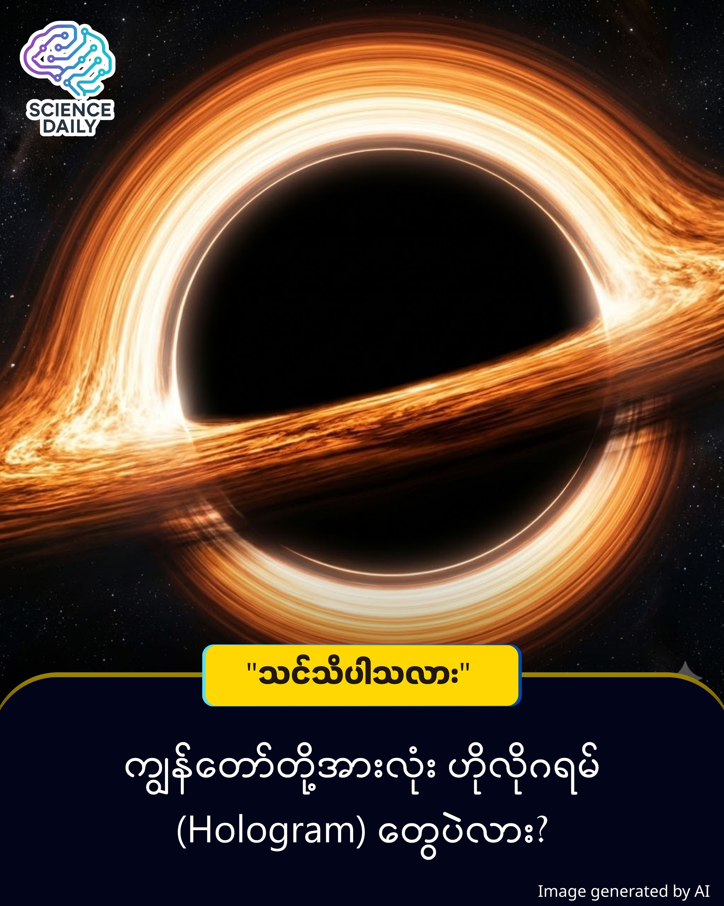

title: ကျွန်တော်တို့ စကြဝဠာကြီးက ဧရာမ တွင်းနက်ကြီးတစ်ခုရဲ့ အတွင်းပိုင်း ဖြစ်နေနိုင်သလား?
summary: တွင်းနက် (Black Hole) တွေဆိုတာ စကြဝဠာထဲမှာ အထူးဆန်းဆုံး အရာတွေပါ။ ဒါပေမဲ့ ရူပဗေဒပညာရှင်တချို့က ဒီထက်ပိုဆန်းကြယ်တဲ့ မေးခွန်းတစ်ခုကို မေးလာကြပါတယ်။
Date: 2026-01-01
Image: images/Inside of Black Hole.jpg

ကျွန်တော်တို့ စကြဝဠာကြီးက ဧရာမ တွင်းနက်ကြီးတစ်ခုရဲ့ အတွင်းပိုင်း ဖြစ်နေနိုင်သလား?

တွင်းနက် (Black Hole) တွေဆိုတာ စကြဝဠာထဲမှာ အထူးဆန်းဆုံး အရာတွေပါ။ ဒါပေမဲ့ ရူပဗေဒပညာရှင်တချို့က ဒီထက်ပိုဆန်းကြယ်တဲ့ မေးခွန်းတစ်ခုကို မေးလာကြပါတယ်။ အဲဒါကတော့ "ကျွန်တော်တို့ နေထိုင်နေတဲ့ စကြဝဠာတစ်ခုလုံးက ပိုကြီးမားတဲ့ စကြဝဠာကြီးတစ်ခုရဲ့ တွင်းနက်ကြီးထဲမှာ ရှိနေတာများလား" ဆိုတာပါပဲ ။ ဒီအယူအဆက ရုပ်ရှင်ဆန်လွန်းတယ်လို့ ထင်ရပေမဲ့ သိပ္ပံပညာရှင်တွေ ဒီလိုယူဆရတဲ့ ခိုင်လုံတဲ့ အကြောင်းပြချက်တွေ ရှိနေပါတယ်။

အဓိက သဘောတရား

ဒီအယူအဆကို နားလည်ဖို့ "တွင်းနက်" တွေအကြောင်း နည်းနည်းသိဖို့ လိုပါလိမ့်မယ်။

Information Paradox (သတင်းအချက်အလက် ပျောက်ဆုံးခြင်း ပုစ္ဆာ): - ပုံမှန်အားဖြင့် တွင်းနက်တစ်ခုထဲကို အရာဝတ္ထုတစ်ခု ဝင်သွားရင် အဲဒီအရာရဲ့ သတင်းအချက်အလက် (Information) တွေ အားလုံး ပျောက်ဆုံးသွားတတ်ပါတယ် ။ ဒါပေမဲ့ Quantum Mechanics သဘောတရားအရ သတင်းအချက်အလက်ဆိုတာ ဖျက်ဆီးလို့ မရပါဘူး ။ ဒါက ရူပဗေဒမှာ ဖြေရှင်းရခက်တဲ့ ပဋိပက္ခတစ်ခု ဖြစ်လာပါတယ်။

Holographic Principle (ဟိုလိုဂရမ် သဘောတရား): -  ဒီပြဿနာကို ဖြေရှင်းဖို့ ပညာရှင်တွေက "Holographic Principle" ကို တင်ပြခဲ့ကြပါတယ်။ ဒါက ဘာလဲဆိုတော့ တွင်းနက်ထဲ ဝင်သွားတဲ့ 3D အရာဝတ္ထုတွေရဲ့ အချက်အလက်တွေဟာ ပျောက်မသွားဘဲ တွင်းနက်ရဲ့ မျက်နှာပြင် (Event Horizon) မှာ 2D အနေနဲ့ သိမ်းဆည်းခံလိုက်ရတာပါ ။ ဥပမာ - ဘူးခွံတစ်ခုကို ပြားလိုက်ရင် ဘူးရဲ့ အချက်အလက်တွေ ကျန်နေသေးသလိုမျိုးပေါ့။

ဆိုလိုတာက ကျွန်တော်တို့ မြင်နေရတဲ့ 3D ရုပ်ဝတ္ထုတွေအားလုံးဟာ တကယ်တော့ 2D မျက်နှာပြင်တစ်ခုပေါ်က အချက်အလက်တွေရဲ့ အရိပ် (Projection) သက်သက် ဖြစ်နေနိုင်ပါတယ် ။

ဒီသဘောတရားကို ရှင်းရှင်းလင်းလင်း မြင်သာစေဖို့ "စည်သွပ်ဘူး" နဲ့ "ရုပ်ရှင်ရုံ" ဥပမာတွေနဲ့ တွဲပြီး စဉ်းစားကြည့်နိုင်ပါတယ်။

ပထမဦးဆုံး စည်သွပ်ဘူး (Soup Can) တစ်ဘူးကို မြင်ယောင်ကြည့်ပါ။ အထဲက အသား (Soup) က ထုထည်ရှိတဲ့ 3D ဖြစ်ပြီး၊ အပြင်က ကပ်ထားတဲ့ စာရွက်တံဆိပ် (Label) ကတော့ ပြားကပ်နေတဲ့ 2D ဖြစ်ပါတယ်။ ပုံမှန်ဆိုရင် အထဲက အသားက အစစ်ဖြစ်ပြီး စာရွက်က အညွှန်းသဘောပါ။ ဒါပေမဲ့ ဒီသီအိုရီအရတော့ ပြောင်းပြန်ဖြစ်နေပါတယ်။ အပြင်ဘက် 2D မျက်နှာပြင် (စာရွက်) ပေါ်က အချက်အလက်တွေကသာ အဓိက "Source Code" ဖြစ်ပြီး၊ အဲဒီအချက်အလက်တွေက အထဲက 3D ထုထည် (Soup) ကို ဖန်တီးလိုက်တာ ဖြစ်တယ်လို့ ဆိုလိုပါတယ်။

နောက်ထပ် ပိုမြင်သာတဲ့ ဥပမာကတော့ ရုပ်ရှင်ရုံ ပါပဲ။ ရုပ်ရှင်ပိတ်ကားကြီး (Screen) ဟာ ပြားကပ်နေတဲ့ 2D မျက်နှာပြင်တစ်ခုပါ။ ဒါပေမဲ့ ပိတ်ကားပေါ်မှာ အရုပ်တွေ လှုပ်ရှားတဲ့အခါ အနီးအဝေး၊ အတိမ်အနက်နဲ့ ထုထည်ရှိတဲ့ 3D ကမ္ဘာတစ်ခုကို မြင်ရသလို ခံစားရပါတယ်။ တကယ်တမ်းမှာတော့ 3D ကမ္ဘာမရှိပါဘူး။ 2D မျက်နှာပြင်ပေါ်က အလင်းစက် (Pixels) တွေရဲ့ ဖန်တီးမှု သက်သက်ပါပဲ။

သိပ္ပံပညာရှင်တွေက ကျွန်တော်တို့ စကြဝဠာကြီးကိုလည်း ဒီသဘောတရားအတိုင်း ယူဆကြပါတယ်။ ကျွန်တော်တို့ ထိတွေ့ကိုင်တွယ်နေရတဲ့ 3D ရုပ်ဝတ္ထုတွေ (လူတွေ၊ ကမ္ဘာမြေတွေ) အားလုံးဟာ တွင်းနက်ကြီးတစ်ခုရဲ့ မျက်နှာပြင် (2D) ပေါ်မှာ မှတ်သားထားတဲ့ အချက်အလက်တွေကနေ ပုံရိပ်ယောင် (Projection) အဖြစ် ပေါ်ထွက်လာတာ ဖြစ်နိုင်ပါတယ်။

ဒီသီအိုရီကို ပိုပြီး စိတ်ဝင်စားစရာ ကောင်းစေတာကတော့ "ကိန်းဂဏန်းတွေ တိုက်ဆိုင်နေတာ" ပါပဲ။ စကြဝဠာတစ်ခုလုံးရဲ့ အရွယ်အစား (Hubble Radius) နဲ့ အကယ်၍ စကြဝဠာတစ်ခုလုံးက ဒြပ်ထုတွေကို ကျုံ့လိုက်ရင် ဖြစ်လာမယ့် တွင်းနက်ရဲ့ အရွယ်အစား (Schwarzschild radius) ဟာ အံ့သြစရာကောင်းလောက်အောင် တူညီနေတာကို တွေ့ရပါတယ် ။ ဒီအချက်က ကျွန်တော်တို့ စကြဝဠာဟာ ပိုကြီးမားတဲ့ စကြဝဠာကြီးတစ်ခုထဲက တွင်းနက်တစ်ခု ဖြစ်နိုင်တယ်ဆိုတဲ့ အယူအဆကို ပိုအားကောင်းစေပါတယ် ။

ဒါဟာ စိတ်ဝင်စားစရာကောင်းပေမဲ့ လက်ရှိအချိန်ထိတော့ "သီအိုရီ အဆင့် (Hypothesis)" သာ ဖြစ်ပါသေးတယ် ။ စကြဝဠာက တွင်းနက်တစ်ခု ဖြစ်တယ်ဆိုတဲ့ အထောက်အထား ခိုင်ခိုင်လုံလုံ မရှိသေးပါဘူး။ လက်ရှိ ကျွန်တော်တို့ လက်ခံထားတဲ့ ရူပဗေဒ နိယာမတွေက စကြဝဠာရဲ့ လည်ပတ်ပုံကို အကောင်းဆုံး ရှင်းပြနိုင်နေဆဲ ဖြစ်ပါတယ် ။ ဒါကြောင့် ချက်ချင်းကြီး ထိတ်လန့်သွားစရာ မလိုပါဘူး။

ဒီသီအိုရီက မှန်သည်ဖြစ်စေ၊ မှားသည်ဖြစ်စေ ကျွန်တော်တို့ရဲ့ "ဆွဲငင်အား (Gravity)" နဲ့ "ကွမ်တမ် ရူပဗေဒ (Quantum Mechanics)" ကြားက ဆက်နွယ်မှုကို နားလည်ဖို့ အများကြီး အထောက်အကူ ပြုပါတယ်။ တွင်းနက်တွေရဲ့ သဘောသဘာဝကို နားလည်ခြင်းအားဖြင့် စကြဝဠာရဲ့ အစနဲ့ အဆုံးကိုပါ ပိုမို သိရှိလာနိုင်မှာ ဖြစ်ပါတယ် ။

Source Reference:
Article: Are We Living Inside A Black Hole?
Author: James Felton (IFLScience)

#BlackHole #Universe #Physics #ScienceInBurmese #SpaceMysteries #HolographicUniverse #IFLScience #GeneralRelativity
