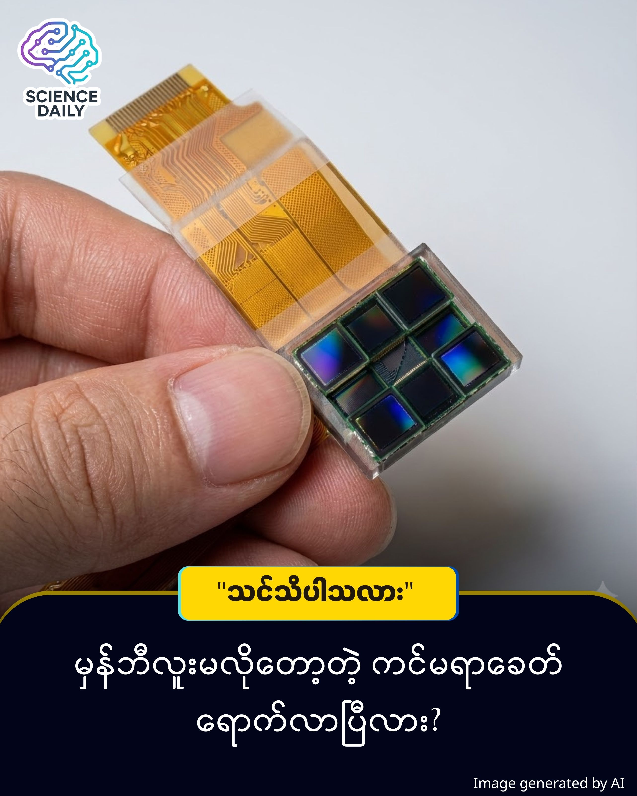

title: မှန်ဘီလူး (Lens) မပါဘဲ ဓာတ်ပုံရိုက်မယ့် အနာဂတ်ကင်မရာများ
summary: ကင်မရာဆိုတာနဲ့ မှန်ဘီလူး (Lens) အကြီးကြီးတွေ၊ အကွာအဝေးချိန်ညှိမှုတွေ လိုအပ်မယ်လို့ ထင်နေတုန်းလား? ဒီအတွေးအခေါ်ဟောင်းကို မေ့လိုက်ပါတော့။ အခုဆိုရင် "မှန်ဘီလူးမလိုတဲ့ ကင်မရာ (Lensless Imager)" နည်းပညာသစ် ပေါ်ထွက်လာပါပြီ! 🤯🚀
Date: 2026-01-02
Image: images/Lensless Imager.jpg

📸 မှန်ဘီလူး (Lens) မပါဘဲ ဓာတ်ပုံရိုက်မယ့် အနာဂတ်ကင်မရာများ

ကင်မရာဆိုတာနဲ့ မှန်ဘီလူး (Lens) အကြီးကြီးတွေ၊ အကွာအဝေးချိန်ညှိမှုတွေ လိုအပ်မယ်လို့ ထင်နေတုန်းလား? ဒီအတွေးအခေါ်ဟောင်းကို မေ့လိုက်ပါတော့။ အခုဆိုရင် "မှန်ဘီလူးမလိုတဲ့ ကင်မရာ (Lensless Imager)" နည်းပညာသစ် ပေါ်ထွက်လာပါပြီ! 🤯🚀

ရိုးရိုးရှင်းရှင်း ပြောရရင်တော့...

Black Hole နည်းပညာကို အတုယူထားတာဖြစ်ပါတယ် ။ ကမ္ဘာကျော် တွင်းနက် (Black Hole) ကြီးကို ဓာတ်ပုံရိုက်တုန်းက တယ်လီစကုပ် (Telescope) အများကြီးကို ပေါင်းပြီး ရိုက်ခဲ့တာ မှတ်မိကြဦးမယ် ထင်ပါတယ်။ ဒီနည်းပညာသစ်ကလည်း အဲဒီသဘောတရားကို အခြေခံထားတာပါ ။

မှန်ဘီလူးကြီးတစ်ခုတည်းကို အားကိုးမယ့်အစား၊ Sensor အသေးလေးအများကြီး (Sensor Arrays) ကို နေရာခွဲပြီး အလုပ်လုပ်ခိုင်းပါတယ် ။

အရင်တုန်းက Sensor တွေ အကုန်ပြိုင်တူအလုပ်လုပ်ဖို့ ခက်ခဲပေမယ့်၊ ဒီနည်းပညာမှာတော့ "MASI (Multiscale Aperture Synthesis Imager)" လို့ခေါ်တဲ့ စနစ်က အလင်းအချက်အလက်တွေကို ဖမ်းယူပြီး ကွန်ပျူတာဆော့ဖ်ဝဲလ် (Computer Algorithms) နဲ့ ပေါင်းစပ်ပြီး ပုံဖော်ပေးတာပါ ။ မှန်ဘီလူးအစား Software က အလုပ်လုပ်ပေးတာပေါ့!

ဘာတွေ ထူးခြားလဲ?

✅ Ultra-high Resolution: မှန်ဘီလူးမပါပေမယ့် မိုက်ခရိုမီတာ (Micrometer) အဆင့်ထိ သေးငယ်တဲ့ အရာတွေကိုပါ ပြတ်ပြတ်သားသား မြင်နိုင်ပါတယ် (ဥပမာ - ကျည်ဆန်ခွံပေါ်က သေးငယ်တဲ့ အရာလေးတွေအထိပါ) ။

✅ No More Bulky Lenses: မှန်ဘီလူးမလိုတဲ့အတွက် ကင်မရာတွေဟာ ပိုပါးလာမယ်၊ ပေါ့ပါးလာမယ် ။

✅ Easy to Scale: ပိုကောင်းတဲ့ပုံလိုချင်ရင် Sensor တွေ ထပ်ထည့်လိုက်ရုံပါပဲ။ ရှုပ်ထွေးတဲ့ ချိန်ညှိမှုတွေ မလိုတော့ပါဘူး ။

ဒါ ဟာ စိတ်ကူးယဉ် မဟုတ်ပါဘူး။ UConn ပါမောက္ခ Guoan Zheng ဦးဆောင်တဲ့ သုတေသနအဖွဲ့က လက်တွေ့စမ်းသပ် အောင်မြင်ထားပြီး၊ နိုင်ငံတကာ သိပ္ပံဂျာနယ် Nature Communications မှာလည်း ဖော်ပြထားပြီး ဖြစ်ပါတယ် ။

ဒီဆောင်းပါးကို Interesting Engineering က ၂၀၂၅ ခုနှစ်၊ ဒီဇင်ဘာ ၂၃ ရက်နေ့မှာ ဖော်ပြခဲ့တဲ့ "Lensless imager uses software to break optical resolution limits" သတင်းဆောင်းပါး နဲ့ Nature Communications ဂျာနယ်မှာ ဖော်ပြထားတဲ့ University of Connecticut (UConn) ရဲ့ သုတေသနတွေ့ရှိချက်တွေကို အဓိက ကိုးကားပြီး ရေးသားထားတာ ဖြစ်ပါတယ် ။

#ScienceUpdate #FutureTech #CameraTechnology #LenslessImaging #Innovation #MyanmarTech #BurmeseScience #UConn #Engineering