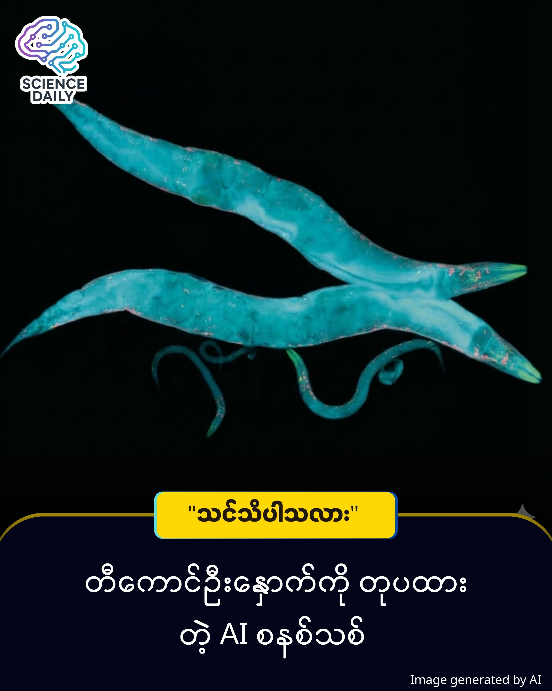

summary:ပိုးကောင်လေးတစ်ကောင်ကြောင့် ပြောင်းလဲသွားမယ့် AI နည်းပညာ
Date: 2025-12-24
Image: images/Liquid Neural Networks.jpg

ပိုးကောင်လေးတစ်ကောင်ကြောင့် ပြောင်းလဲသွားမယ့် AI နည်းပညာ
  
လက်ရှိခေတ်စားနေတဲ့ AI တွေ (ဥပမာ - ChatGPT လိုမျိုး) ဟာ အလွန်ကြီးမားလွန်းပါတယ်။ သူတို့အလုပ်လုပ်နိုင်ဖို့အတွက် ဧရာမ ဆာဗာကြီးတွေ၊ လျှပ်စစ်စွမ်းအင် အများကြီးနဲ့ အင်တာနက်ချိတ်ဆက်မှု အမြဲလိုပါတယ် ။ ဒါပေမဲ့ ဒီအချက်တွေကို ပြောင်းလဲပစ်မယ့် နည်းပညာသစ်တစ်ခု ပေါ်လာပါပြီ။ အဲဒါကတော့ အရွယ်အစား ၁ မီလီမီတာလောက်ပဲရှိတဲ့ တီကောင် (Worm) လေးတစ်ကောင်ရဲ့ ဦးနှောက်ကို အတုယူထားတဲ့ နည်းပညာပါ ။

ဒီနည်းပညာသစ်ကို "Liquid Neural Networks" (အရည်သဏ္ဌာန် ဦးနှောက်ကွန်ရက်) လို့ ခေါ်ပါတယ် ။

သာမန် AI တွေက 'ရိုက်နှိပ်ထားပြီးသား စာအုပ်' တစ်အုပ်လိုပါပဲ။ စာအုပ်ထွက်ပြီးသွားရင် အတွင်းက စာတွေကို ပြင်လို့မရတော့သလို၊ အသစ်ထပ်ထည့်ဖို့လည်း ခက်ခဲပါတယ် ။ "အခြေအနေသစ်နဲ့ ကြုံတဲ့အခါ ပြောင်းလဲနိုင်စွမ်း မရှိတော့ဘူး" ဆိုတဲ့ သဘောကို ပြောချင်တာပါ။ သာမန် AI တွေကို 'ရိုက်နှိပ်ပြီးသား စာအုပ်' လို့ ဆိုလိုတာက သူတို့ကို တည်ဆောက်ပြီးတာနဲ့ အတွင်းက အချက်အလက်တွေက အသေ (Fixed) ဖြစ်သွားလို့ပါ ။  စာအုပ်တစ်အုပ်ကို ပုံနှိပ်ပြီးရင် ပြင်လို့မရတော့သလိုမျိုး  ဒီ AI တွေကလည်း သင်ပေးထားတဲ့အတိုင်းပဲ ပုံသေမှတ်ထားပြီး အခြေအနေသစ်နဲ့ ကြုံရင် ကိုယ့်ဘာသာ ပြောင်းလဲစဉ်းစားဖို့ မတတ်ပါဘူး ။ ဒါပေမဲ့ Liquid AI ကတော့ အလုပ်လုပ်နေရင်းနဲ့ကို အခြေအနေအလိုက် ပြောင်းလဲတွက်ချက်နိုင်စွမ်း တဲ့ 'သက်ရှိ' နဲ့ ပို တူပါတယ်။ 

သူက Caenorhabditis elegans လို့ ခေါ်တဲ့ တီကောင်လေးတစ်ကောင်ရဲ့ ဦးနှောက်အလုပ်လုပ်ပုံကို တုပထားတာကြောင့် အခြေအနေပေါ် မူတည်ပြီး ကိုယ့်ကိုယ်ကိုယ် ပြုပြင်ပြောင်းလဲနိုင်စွမ်း ရှိပါတယ် (ဉာဏ်ရည်ထက်မြက်တဲ့ ဒီတီကောင်လေးမှာ အာရုံကြောဆဲလ် ၃၀၂ ခုပဲ ပါပေမယ့် အခြေအနေအလိုက် လှုပ်ရှားနိုင်သလိုမျိုးပေါ့) ။

ဒီတီ  ကောင်လေးရဲ့ ဦးနှောက်ဆဲလ်တွေက တစ်ခုနဲ့တစ်ခု ရှေ့ပြန်နောက်ပြန် ဆက်သွယ်နိုင်ပြီး အခြေအနေပေါ်မူတည်ကာ အလုပ်လုပ်ပုံ ပြောင်းလဲနိုင်စွမ်းရှိပါတယ် ။ ဒါကြောင့် ဒီနည်းပညာသုံး AI တွေက အချက်အလက်အသစ်ရတိုင်း တွက်ချက်ပုံကို ပြောင်းလဲနိုင်ပြီး အမြဲတမ်း ပြုပြင်ပြောင်းလဲ သင်ယူနေနိုင်ပါတယ် ။

တွေ့ရှိချက်အသစ်

Liquid AI ကုမ္ပဏီရဲ့ CEO ဖြစ်သူ Dr. Ramin Hasani နဲ့ အဖွဲ့ဟာ ဒီပိုးကောင်လေးရဲ့ ဦးနှောက်အလုပ်လုပ်ပုံကို သင်္ချာနည်းအရ ပုံဖော်ခဲ့ကြပါတယ် ။ အစပိုင်းမှာ ဒီကွန်ရက်တွေက ညီမျှခြင်းတွေ အရမ်းရှုပ်ထွေးလို့ တွက်ချက်ရတာ နှေးကွေးခဲ့ပါတယ် ။ ၂၀၂၂ ခုနှစ်မှာတော့ သူတို့အဖွဲ့ဟာ ရှုပ်ထွေးတဲ့ တွက်ချက်မှုတွေကို ဖြတ်လမ်းနည်းနဲ့ မြန်မြန်ဆန်ဆန် ဖြေရှင်းနိုင်မယ့် နည်းလမ်းကို ရှာတွေ့ခဲ့ပြီး Nature Machine Intelligence ဂျာနယ်မှာ ဖော်ပြနိုင်ခဲ့ပါတယ် ။ 

ဒါကြောင့် အခုဆိုရင် ဒီ Liquid Neural Networks တွေဟာ သာမန် AI တွေထက် အဆပေါင်းများစွာ ပိုသေးငယ်ပြီး၊ ပိုမြန်ဆန်လာသလို စွမ်းအင်ကုန်ကျမှုလည်း အလွန်နည်းသွားပါပြီ ။ 

ဒီနည်းပညာဟာ "Nature Machine Intelligence" လို သိပ္ပံဂျာနယ်ကြီးတွေမှာ ဖော်ပြခံထားရပြီး လက်တွေ့စမ်းသပ်မှုတွေ လုပ်ဆောင်နေတဲ့ နည်းပညာစစ်စစ် ဖြစ်ပါတယ် ။ ဒါပေမဲ့ သူ့မှာ ကန့်သတ်ချက်တချို့ ရှိပါသေးတယ်။

ဒီ AI ဟာ ဗီဒီယိုတို့၊ အသံဖိုင်တို့လို အချိန်နဲ့အမျှ ပြောင်းလဲနေတဲ့ ဒေတာ (Time series data) တွေမှာပဲ အလုပ်ကောင်းကောင်း လုပ်နိုင်ပါသေးတယ် ။ ဓာတ်ပုံလို ငြိမ်နေတဲ့ ပုံရိပ် (Static images) တွေကိုတော့ သာမန် AI တွေလောက် ကောင်းကောင်း မခွဲခြားနိုင်သေးပါဘူး ။ ဆေးဝါးဖော်ထုတ်တာလိုမျိုး ကြီးမားတဲ့ တွက်ချက်မှုတွေအတွက်တော့ လက်ရှိ AI ကြီးတွေကိုပဲ ဆက်အားကိုးရဦးမှာပါ ။

Source: BBC Science Focus - "How a tiny worm's brain could transform artificial intelligence"

#ArtificialIntelligence #LiquidNeuralNetworks #FutureTech #ScienceNews #MyanmarTech #AIUpdate #LiquidAI #Neuroscience
