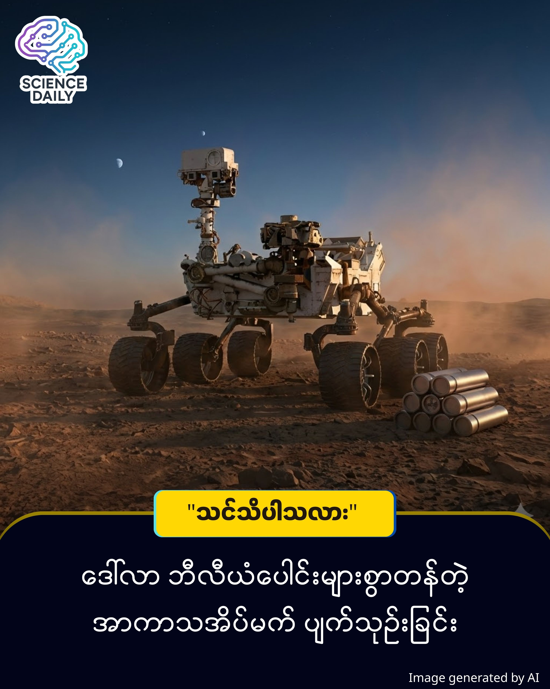

title: အင်္ဂါဂြိုဟ်ပေါ်က အထီးကျန် ရတနာသိုက်နှင့် ပျက်သုဉ်းသွားသော မျှော်လင့်ချက်
summary: မိတ်ဆွေ... လက်တစ်ကမ်းမှာရှိနေပေမယ့် လှမ်းယူလို့မရတဲ့ ရတနာသိုက်တစ်ခုအကြောင်း စဉ်းစားဖူးလား? မိတ်ဆွေရဲ့ မျက်စိရှေ့မှာ သက်ရှိတွေရဲ့ လျှို့ဝှက်ချက်တွေပါတဲ့ သေတ္တာတစ်လုံးရှိနေတယ်။ 
Date: 2026-01-13
Image: images/Mission Kill.jpg

အင်္ဂါဂြိုဟ်ပေါ်က အထီးကျန် ရတနာသိုက်နှင့် ပျက်သုဉ်းသွားသော မျှော်လင့်ချက်

မိတ်ဆွေ... လက်တစ်ကမ်းမှာရှိနေပေမယ့် လှမ်းယူလို့မရတဲ့ ရတနာသိုက်တစ်ခုအကြောင်း စဉ်းစားဖူးလား? မိတ်ဆွေရဲ့ မျက်စိရှေ့မှာ သက်ရှိတွေရဲ့ လျှို့ဝှက်ချက်တွေပါတဲ့ သေတ္တာတစ်လုံးရှိနေတယ်။ ဒါပေမယ့် အဲဒီသေတ္တာကို သယ်ယူဖို့ စရိတ်က အရမ်းကြီးလွန်းလို့ မိတ်ဆွေ လက်လျော့လိုက်ရတယ်ဆိုရင် ဘယ်လိုခံစားရမလဲ?

အခု NASA မှာဖြစ်ပျက်နေတာက အဲဒီအတိုင်းပါပဲ။ ကမ္ဘာ့အကြီးကျယ်ဆုံး အာကာသစီမံကိန်းကြီးတစ်ခုဖြစ်တဲ့ Mars Sample Return (MSR) မစ်ရှင်ဟာ ဘဏ္ဍာရေး အခက်အခဲတွေကြောင့် "ကျဆုံး" သွားခဲ့ပါပြီ.

💭 စိတ်ကူးကြည့်လိုက်ပါ

မိုင်ပေါင်း သန်း ၆၀ အကွာ အင်္ဂါဂြိုဟ်နီကြီးပေါ်မှာ Perseverance လို့ခေါ်တဲ့ စက်ရုပ်ယာဉ်လေး (Rover) တစ်စီးတည်း အထီးကျန်စွာ ရှိနေတယ်။ သူဟာ သာမန် ကျောက်တုံးတွေကို ကောက်နေတာမဟုတ်ပါဘူး။ စကြာဝဠာမှာ ငါတို့အပြင် တခြားသက်ရှိတွေ ရှိသလားဆိုတဲ့ မေးခွန်းကို ဖြေပေးနိုင်မယ့် အထောက်အထား (Biosignatures) တွေကို ပြွန်ချောင်းလေး ၃၃ ခုထဲမှာ သေချာထည့်ပြီး သိမ်းဆည်းထားခဲ့တာပါ.

ဒါပေမယ့် ဝမ်းနည်းစရာကောင်းတာက... သူ့ဆီကနေ အဲဒီအထုပ်ကို သွားယူမယ့် "Delivery ယာဉ်" က ဘယ်တော့မှ ရောက်လာတော့မှာ မဟုတ်ပါဘူး။ အမေရိကန် လွှတ်တော်နဲ့ အစိုးရသစ်ရဲ့ ဘတ်ဂျက်ဖြတ်တောက်မှုတွေကြောင့် ဒီအပြန်ခရီးစဉ်ကို ဖျက်သိမ်းလိုက်ရပြီ ဖြစ်ပါတယ်.

ဘာကြောင့် ဒီလောက် အရေးကြီးတဲ့ မစ်ရှင်ကို ဖျက်သိမ်းလိုက်ရတာလဲ? အဖြေကတော့ ရှင်းပါတယ်။ "ပိုက်ဆံ" ကြောင့်ပါပဲ။

ကုန်ကျစရိတ် ပြဿနာ: မူလက ဒီကျောက်ခဲတွေကို ပြန်သယ်ဖို့ ဒေါ်လာ ၁၁ ဘီလီယံလောက် ကုန်မယ်လို့ ခန့်မှန်းခဲ့ကြတယ်. ဒါဟာ အရမ်းများလွန်းတဲ့ ပမာဏပါ။ ဈေးသက်သာအောင် ၇ ဘီလီယံလောက်နဲ့ လုပ်ဖို့ ကြိုးစားခဲ့ပေမယ့် အဆင်မပြေခဲ့ပါဘူး.

နည်းပညာ အခက်အခဲ: အင်္ဂါဂြိုဟ်ပေါ်ကနေ ဒုံးပျံတစ်ခုကို ပြန်လွှတ်တင်ဖို့ဆိုတာ မယုံနိုင်လောက်အောင် ခက်ခဲတဲ့ ကိစ္စပါ။

တရုတ်ရဲ့ ခြေလှမ်း: တစ်ဖက်မှာလည်း တရုတ်နိုင်ငံက ၂၀၃၁ ခုနှစ်လောက်မှာ အင်္ဂါဂြိုဟ်က ကျောက်ခဲတွေကို သွားယူမယ်လို့ ကြေညာထားပါတယ်. ဒါပေမယ့် သူတို့နည်းလမ်းက NASA လောက် မတိကျပါဘူး။ သူတို့က တွေ့ရာကျောက်ကို ကောက်ပြီး ပြန်တက်လာမယ့် သဘောရှိတာကြောင့် သက်ရှိလက္ခဏာ ရှာတွေ့ဖို့ အခွင့်အလမ်း နည်းနိုင်ပါတယ်.

ဒီဖြစ်ရပ်က ကျွန်တော်တို့ကို ဘာသင်ပေးလိုက်သလဲ? လူသားတွေဟာ "စကြာဝဠာထဲမှာ ငါတို့တစ်ယောက်တည်းလား" ဆိုတဲ့ အဖြေကို သိချင်ကြပေမယ့်၊ လက်တွေ့ဘဝရဲ့ စီးပွားရေးနဲ့ နိုင်ငံရေး အကန့်အသတ်တွေက အိပ်မက်တွေကို တားဆီးနိုင်စွမ်းရှိနေဆဲ ဆိုတာပါပဲ။

သိပ္ပံပညာရှင်တွေကတော့ အရမ်းကို စိတ်ပျက်နေကြပါတယ်. "ငါတို့ဟာ အာကာသမှာ ဦးဆောင်သူဖြစ်ချင်တယ်လို့ ပြောနေပြီးတော့၊ အခုလို ရည်မှန်းချက်ကြီးတဲ့ အရာကို စွန့်လွှတ်လိုက်တာ အံ့သြစရာပဲ" လို့ NASA ရဲ့ အကြံပေးပုဂ္ဂိုလ်တစ်ဦးက ပြောခဲ့ပါတယ်

ဒါပေမယ့် စိတ်မပျက်ပါနဲ့ မိတ်ဆွေ။ အခုအချိန်မှာ မစ်ရှင်ရပ်နားသွားပေမယ့် Perseverance စုဆောင်းထားတဲ့ ကျောက်ခဲ နမူနာတွေဟာ လေလုံပြွန်ချောင်းတွေထဲမှာ နှစ်ပေါင်းများစွာ ပျက်စီးမသွားဘဲ ရှိနေဦးမှာပါ.

တစ်နေ့နေ့၊ တစ်ချိန်ချိန်မှာ နည်းပညာတွေ ပိုတိုးတက်လာပြီး၊ ကုန်ကျစရိတ်တွေ သက်သာလာတဲ့အခါ ကျွန်တော်တို့ အဲဒီ "ရတနာသိုက်" ကို သွားပြန်ယူနိုင်ဦးမှာပါ။ အခုလောလောဆယ်တော့ အင်္ဂါဂြိုဟ်ပေါ်က စက်ရုပ်လေးဟာ သူ့ရဲ့လျှို့ဝှက်ချက်တွေနဲ့အတူ အချိန်တန်မယ့် လူသားတွေကို စောင့်မျှော်နေရှာမှာ ဖြစ်ပါတယ်။

SOURCES REFERENCE

Mars Sample Return (MSR) Cancellation: NASA's plan to retrieve samples is effectively dead due to budget cuts and high costs.
Current Status: Perseverance has collected samples stored in 33 tubes, awaiting retrieval.

Author's Note: ဒီဆောင်းပါးသည် IFLScience မှ ဖော်ပြထားသော အချက်အလက်များကို အခြေခံထားခြင်းဖြစ်ပါသည်။ နိုင်ငံရေးအမြင်များထက် သိပ္ပံပညာရပ်ဆိုင်ရာ သက်ရောက်မှုများကိုသာ ဦးစားပေး တင်ပြထားခြင်း ဖြစ်ပါသည်။

#NASA #MarsSampleReturn #SpaceExploration #ScienceNews #PerseveranceRover #MarsMission #MyanmarTechCommunity #BurmeseScience #DeepTech #Aliens

