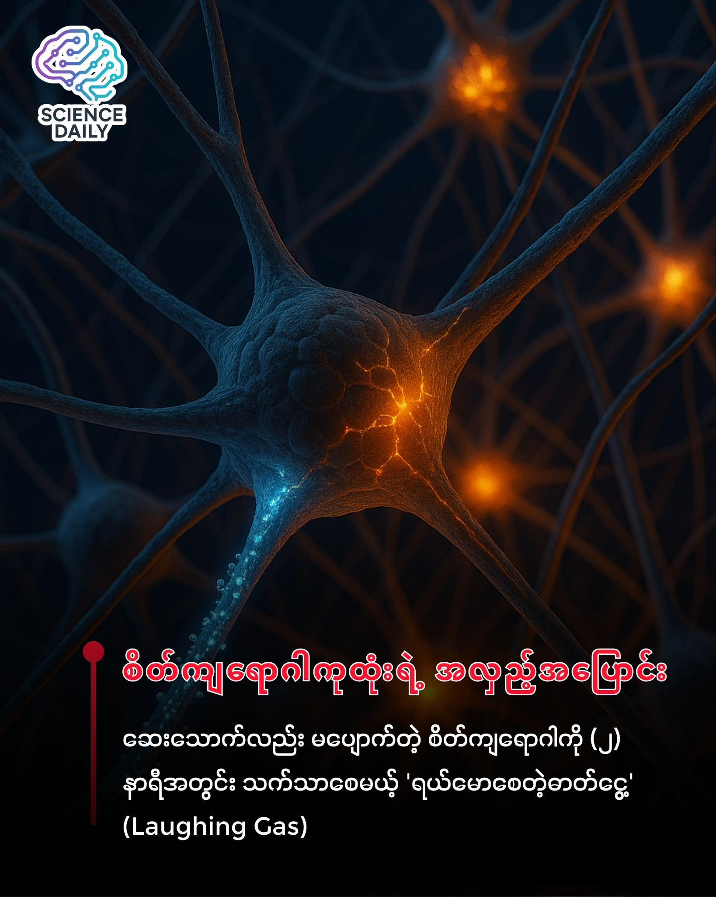

summary:ရယ်မောစေတဲ့ဓာတ်ငွေ့ (Laughing Gas) က ကုသရခက်တဲ့ စိတ်ကျရောဂါသည်တွေအတွက် မျှော်လင့်ချက်အသစ် ဖြစ်လာမလား? 
Date: 2025-12-04

ရယ်မောစေတဲ့ဓာတ်ငွေ့ (Laughing Gas) က ကုသရခက်တဲ့ စိတ်ကျရောဂါသည်တွေအတွက် မျှော်လင့်ချက်အသစ် ဖြစ်လာမလား?
 🎭🧪

သွားဆရာဝန်ဆီသွားပြီး ပြန်လာတဲ့အခါ သွားကိုက်ပျောက်သွားရုံတင်မကဘဲ နာတာရှည် စိတ်ကျရောဂါပါ သက်သာသွားမယ်ဆိုရင် ခင်ဗျားယုံမလား? 🤯 ဒါဟာ သိပ္ပံဇာတ်လမ်းဆန်ဆန် ထင်ရပေမဲ့ လက်တွေ့ဖြစ်လာနိုင်ချေရှိတဲ့ စိတ်ဝင်စားစရာ ဆေးပညာတွေ့ရှိမှုတစ်ခုအကြောင်း ဒီနေ့ ပြောပြချင်ပါတယ်။

၁။ လက်ရှိအခြေအနေက ဘာလဲ? (Context) 📉
ကျွန်တော်တို့ ပတ်ဝန်းကျင်မှာ စိတ်ကျရောဂါ (Depression) ခံစားနေရတဲ့သူတွေ မနည်းလှပါဘူး။ ဒီအထဲကမှ ထက်ဝက်နီးပါးလောက်ဟာ သာမန်စိတ်ကျရောဂါဆေး (Antidepressants) တွေနဲ့ ကုလို့မရတဲ့ "Treatment-Resistant Depression" လို့ခေါ်တဲ့ အခြေအနေမျိုးကို ခံစားနေရပါတယ်။

သာမန်ဆေးတွေက သောက်ပြီးရင် အာနိသင်ပြဖို့ ရက်သတ္တပတ်ပေါင်းများစွာ စောင့်ရတတ်ပါတယ်။ ဆေး ၄ မျိုးလောက် ပြောင်းသောက်ပြီးတာတောင် မသက်သာတဲ့ လူနာတွေအတွက်ကတော့ မျှော်လင့်ချက်မဲ့သလို ခံစားရပြီး အရမ်းပင်ပန်းကြရပါတယ်။

၂။ ရယ်မောစေတဲ့ဓာတ်ငွေ့ဆိုတာ ဘာလဲ? (The "What") 🎈
သိပ္ပံနာမည်အရ Nitrous Oxide လို့ခေါ်ပြီး လွန်ခဲ့တဲ့ နှစ် ၁၀၀ ကျော်ကတည်းက မေ့ဆေး၊ ထုံဆေးအဖြစ် သွားဘက်ဆိုင်ရာနဲ့ ခွဲစိတ်ခန်းတွေမှာ သုံးခဲ့ကြပါတယ်။ ရှူရှိုက်လိုက်ရင် လူကို စိတ်ရွှင်လန်းပြီး ရယ်မောချင်စိတ်ဖြစ်ပေါ်စေလို့ "Laughing Gas" လို့ လူသိများပါတယ်။
ပါတီပွဲတွေမှာ အလွဲသုံးစားလုပ်ကြတာမျိုး ရှိပေမဲ့ ဆေးပညာလောကမှာတော့ ဒါဟာ အန္တရာယ်ကင်းစိတ်ချရတဲ့ မေ့ဆေးတစ်မျိုးပါ။

၃။ တွေ့ရှိချက်အသစ်က ဘာလဲ? (The New Discovery) 🧬

University of Birmingham နဲ့ University of Oxford တို့က သုတေသီတွေ ပူးပေါင်းပြီး eBioMedicine ဂျာနယ်မှာ ဖော်ပြခဲ့တဲ့ Meta-analysis (လေ့လာမှုပေါင်းချုပ်) စစ်တမ်းသစ်တစ်ခုအရ ရလဒ်ကောင်းတွေ တွေ့ရှိခဲ့ပါတယ်။ Kiranpreet Gill ဦးဆောင်တဲ့ ဒီအဖွဲ့က ကမ္ဘာတစ်ဝှမ်းက စမ်းသပ်ချက် (၇) ခုကို ပြန်လည်သုံးသပ်ခဲ့ကြတာပါ။

တွေ့ရှိချက်တွေကတော့ -

မြန်ဆန်သော အာနိသင်: ၅၀% ပြင်းအားရှိတဲ့ $N_2O$ ကို ရှူရှိုက်ပြီး ၂ နာရီအတွင်းမှာပဲ စိတ်ကျရောဂါ လက္ခဏာတွေ သိသိသာသာ လျော့ကျသွားတာကို တွေ့ရပါတယ်။ (သာမန်ဆေးတွေလို ရက်သတ္တပတ်ချီ စောင့်စရာမလိုပါဘူး)။ ⚡️

ဦးနှောက်ကို ဘယ်လိုပြုပြင်လဲ: ဒီဓာတ်ငွေ့က ဦးနှောက်ထဲက Glutamate system ကို သွားပြီး သက်ရောက်မှုရှိပါတယ်။ စိတ်ခံစားချက် (Mood) နဲ့ဆိုင်တဲ့ ဦးနှောက်ရဲ့ အာရုံကြော ကွန်ရက်လမ်းကြောင်းတွေ (Neural Circuits) တွေကို ထိန်းညှိပေးပြီး ဦးနှောက်ရဲ့ လုပ်ဆောင်ချက်တွေကို ပြန်လည်မျှတ (Rebalance) အောင် လုပ်ဆောင်ပေးတာပါ။ 🧠

ရေရှည်အတွက်: တစ်ခါရှူရင် အာနိသင်က ခဏပဲခံတဲ့အတွက် ရေရှည်အကျိုးရှိဖို့ဆိုရင်တော့ ကုသမှုအကြိမ်အရေအတွက် (Multiple treatment sessions) ယူဖို့ လိုအပ်မယ်လို့ ဆိုပါတယ်။

၄။ သတိပြုစရာများ (Scientific Caution) ⚠️

ဒီသတင်းကို ဖတ်ပြီး "ဒါဆို အပြင်မှာ ဝယ်ရှူလို့ရတာပဲ" လို့ လုံးဝ (လုံးဝ) မတွေးလိုက်ပါနဲ့နော်။

ဆေးဘက်ဆိုင်ရာ vs အပျော်တမ်း: အခုစမ်းသပ်မှုဟာ ဆရာဝန်ကြီးကြပ်မှုအောက်မှာ သန့်စင်ထားတဲ့ ဆေးဘက်ဝင် အချိုးအစားနဲ့ ကုသတာဖြစ်ပါတယ်။ အပြင်မှာရောင်းတဲ့ ဓာတ်ငွေ့ဘူးတွေ (Balloons) ကို အလွဲသုံးစားလုပ်တာက အာရုံကြောပျက်စီးတာ၊ လေဖြတ်တာလိုမျိုး ဆိုးရွားတဲ့ ကျန်းမာရေးပြဿနာတွေ ဖြစ်စေနိုင်ပါတယ်။ 🚫

အတည်ပြုချက်: လောလောဆယ်မှာ ရလဒ်တွေက ကောင်းမွန်တယ်ဆိုပေမဲ့ လူနာအများကြီးနဲ့ စမ်းသပ်တဲ့ အဆင့်တွေ ဆက်လုပ်ဖို့ လိုပါသေးတယ်။ ဒါဟာ ကုထုံးတစ်ခုအနေနဲ့ တရားဝင် အတည်မပြုခင် အစပျိုးအဆင့်ပဲ ရှိပါသေးတယ်။

၅။ နိဂုံး (Conclusion) 🌟

သာမန်ဆေးတွေနဲ့ မတိုးတော့လို့ စိတ်ဓာတ်ကျပြီး မျှော်လင့်ချက်မဲ့နေတဲ့ လူနာတွေအတွက်တော့ ဒါဟာ သတင်းကောင်းတစ်ခုပါပဲ။ ပါမောက္ခ Steven Marwaha ပြောသလိုပါပဲ၊ လက်ရှိကုထုံးတွေနဲ့ အဆင်မပြေတဲ့ လူနာတွေအတွက် ရယ်မောစေတဲ့ဓာတ်ငွေ့ဟာ အနာဂတ်မှာ အရေးပါတဲ့ ကုထုံးတစ်ခု ဖြစ်လာနိုင်ပါတယ်။

သွားနုတ်ဖို့သုံးတဲ့ ဓာတ်ငွေ့လေးက လူ့စိတ်ကို ကုစားပေးနိုင်မယ့် ဆေးစွမ်းကောင်း ဖြစ်လာမလားဆိုတာ ကျွန်တော်တို့ ဆက်လက်စောင့်ကြည့်ရမှာပါခင်ဗျာ။

#စိတ်ကျန်းမာရေး #စိတ်ကျရောဂါ #LaughingGas #NitrousOxide #DepressionTreatment #ကျန်းမာရေး #ဆေးပညာဗဟုသုတ #ScienceNewsMyanmar
