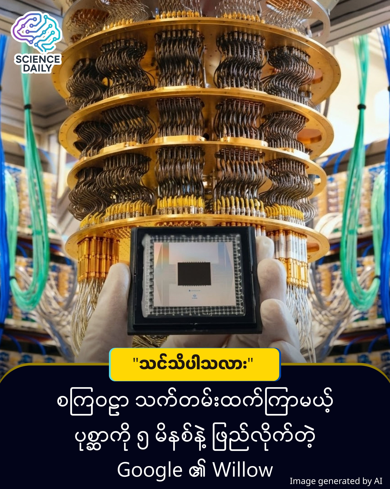

title: 🌌 စကြဝဠာသက်တမ်းထက် ပိုကြာမယ့် ပုစ္ဆာကို ၅ မိနစ်နဲ့ ဖြေရှင်းခြင်း (သို့မဟုတ်) Quantum ခေတ်သို့ ခြေလှမ်းသစ်
summary: မိတ်ဆွေ... သင့်လက်ထဲမှာ Password မသိတဲ့ အလွန်လုံခြုံရေးမြင့်မားတဲ့ ဖုန်းတစ်လုံး ရှိတယ်လို့ စိတ်ကူးကြည့်ပါ။ အဲဒီဖုန်းရဲ့ Password ကို သိဖို့အတွက် လက်ရှိ ကမ္ဘာ့အမြန်ဆုံး Supercomputer ကြီးကို အဖြေရှာခိုင်းမယ်ဆိုရင်တောင် နှစ်ပေါင်း ၁၀ Septillion (၁ နောက်မှာ သုည ၂၄ လုံး) အထိ စောင့်ရပါလိမ့်မယ်။
Date: 2026-01-12
Image: images/Quantum Supremacy 2.0.jpg

🌌 စကြဝဠာသက်တမ်းထက် ပိုကြာမယ့် ပုစ္ဆာကို ၅ မိနစ်နဲ့ ဖြေရှင်းခြင်း (သို့မဟုတ်) Quantum ခေတ်သို့ ခြေလှမ်းသစ်

မိတ်ဆွေ... သင့်လက်ထဲမှာ Password မသိတဲ့ အလွန်လုံခြုံရေးမြင့်မားတဲ့ ဖုန်းတစ်လုံး ရှိတယ်လို့ စိတ်ကူးကြည့်ပါ။ အဲဒီဖုန်းရဲ့ Password ကို သိဖို့အတွက် လက်ရှိ ကမ္ဘာ့အမြန်ဆုံး Supercomputer ကြီးကို အဖြေရှာခိုင်းမယ်ဆိုရင်တောင် နှစ်ပေါင်း ၁၀ Septillion (၁ နောက်မှာ သုည ၂၄ လုံး) အထိ စောင့်ရပါလိမ့်မယ်။ ဆိုလိုတာက စကြဝဠာကြီး ပျက်သွားရင်တောင် အဲဒီကွန်ပျူတာက အဖြေရှာလို့ ပြီးမှာ မဟုတ်ပါဘူး။ ဒါပေမဲ့ Google ရဲ့ Willow Chip ကတော့ အဲဒီအလုပ်ကို ၅ မိနစ်တည်းနဲ့ ပြီးအောင် လုပ်ပြလိုက်တာပါ။

ဒါပေမဲ့... အဲဒီ နှစ်ပေါင်းကမ္ဘာမက ကြာမယ့်အလုပ်ကို ၅ မိနစ် တည်းနဲ့ ပြီးသွားအောင် လုပ်နိုင်တဲ့ အရာတစ်ခု ပေါ်လာပြီဆိုရင်ရော မိတ်ဆွေ ယုံမလား ။

ကယ်ဒါက မြင်သာအောင် ဥပမာနဲ့ပြောပြတာပါ ဥပမာတွေ ဖယ်ပြီး တကယ့်လက်တွေ့မှာ Willow လုပ်ပြလိုက်တဲ့ "အလုပ်" က ဘာလဲဆိုတာ အတိအကျ ရှင်းပြပေးပါမယ်။

တကယ်တမ်း Willow လုပ်ပြလိုက်တဲ့ အလုပ်ရဲ့ နာမည်က "Random Circuit Sampling (RCS)" လို့ ခေါ်တဲ့ စမ်းသပ်ချက်တစ်ခု ဖြစ်ပါတယ် ။ ဒီ RCS ဆိုတာ ဘာလဲ၊ ဘာလို့ ဒါကို စမ်းသပ်တာလဲ ဆိုတာကို ရှင်းရှင်းလင်းလင်း ပြောပြပါမယ်။

ဒီစမ်းသပ်ချက်က သာမန်ရုံးလုပ်ငန်း၊ စာရင်းတွက်တာမျိုး မဟုတ်ပါဘူး။ ဒါဟာ "ကွန်ပျူတာတွေရဲ့ စွမ်းရည်ကို အကဲဖြတ်တဲ့ အခက်ခဲဆုံး စာမေးပွဲ" တစ်ခုလို့ မြင်ကြည့်နိုင်ပါတယ်။

Qubit (Quantum Bit) တွေကို အလွန်ရှုပ်ထွေးတဲ့ နည်းလမ်းတွေနဲ့ ချိတ်ဆက်ပြီး "ဂဏန်းအစီအစဉ်" (Pattern) တွေကို ထုတ်ခိုင်းတာ ဖြစ်ပါတယ်။ ဒီ Pattern တွေက ဘယ်လောက် ရှုပ်ထွေးသလဲဆိုရင် သာမန်ကွန်ပျူတာတွေက ဒီအဖြေမှန်ကို လိုက်တွက်ဖို့ (Simulation လုပ်ဖို့) မဖြစ်နိုင်သလောက် ခက်ခဲပါတယ် ။

ဒီ RCS စမ်းသပ်ချက်ကို ဖြေဆိုရာမှာ -

Google Willow (105 Qubits) က ဒီပုစ္ဆာကို ၅ မိနစ် ပဲ အချိန်ယူပြီး ဖြေဆိုသွားနိုင်ခဲ့ပါတယ် ။

Frontier (ကမ္ဘာ့အမြန်ဆုံး Supercomputer) က ဒီပုစ္ဆာကိုပဲ ဖြေမယ်ဆိုရင် နှစ်ပေါင်း ၁၀ Septillion (၁၀ နောက်မှာ သုည ၂၄ လုံး) ကြာမှ ပြီးမယ်လို့ Google က ခန့်မှန်းထားပါတယ် ။

ဒီလောက် ခက်တဲ့ ဂဏန်းတွက်တာကြီးက လက်တွေ့ဘဝမှာ ဘာသုံးလို့ရလဲ" လို့ မေးစရာ ရှိပါတယ်။

လက်ရှိမှာတော့ ဒီ RCS စမ်းသပ်ချက်က "လက်တွေ့ အသုံးချဖို့ထက်" Willow ရဲ့ စွမ်းရည်က လက်ရှိ ကွန်ပျူတာတွေ လိုက်မမီတော့ဘူးဆိုတာကို သက်သေပြဖို့ (Proof of Concept) လုပ်ပြလိုက်တာ ဖြစ်ပါတယ်။ အတိုချုံးပြောရရင်တော့ - Google Willow လုပ်ပြလိုက်တာက "Random Circuit Sampling" လို့ခေါ်တဲ့ အလွန်ရှုပ်ထွေးတဲ့ သင်္ချာပုစ္ဆာကြီး တစ်ပုဒ်ကို ဖြေဆိုပြလိုက်ခြင်း ဖြစ်ပါတယ်ခင်ဗျာ။

ဒါဟာ သိပ္ပံစိတ်ကူးယဉ် ဇာတ်လမ်းမဟုတ်ပါဘူး။ ဒါဟာ Google ရဲ့ နောက်ဆုံးပေါ် Quantum Chip ဖြစ်တဲ့ "Willow" ရဲ့ လက်တွေ့စွမ်းဆောင်ရည်ပါပဲ ။

သာမန်ကွန်ပျူတာ (Supercomputer) တွေနဲ့ ဒီ Quantum ကွန်ပျူတာ ဘာကွာလဲဆိုတာကို ရိုးရိုးရှင်းရှင်းလေး ပြောပြမယ်နော်။

ဝင်္ကပါ (Maze) တစ်ခုကို စိတ်ကူးကြည့်ပါ။

သာမန်ကွန်ပျူတာ (Classical Computer) က ဝင်္ကပါထဲမှာ လူတစ်ယောက် လမ်းလျှောက်သလိုပါပဲ။ လမ်းတစ်ခုကို စမ်းမယ်၊ မရရင် နောက်ပြန်ဆုတ်မယ်၊ နောက်လမ်းတစ်ခု ထပ်စမ်းမယ်။ တစ်ခါသွားရင် လမ်းကြောင်းတစ်ခု (0 သို့မဟုတ် 1) ပဲ သွားလို့ရပါတယ် ။

Google Willow (Quantum Computer) ကျတော့ ဝင်္ကပါတစ်ခုလုံးကို "အပေါ်စီးကနေ ငုံ့ကြည့်လိုက်သလို" ပါပဲ။ လမ်းကြောင်းအားလုံးကို တစ်ပြိုင်နက်တည်း မြင်နိုင်ပြီး အဖြေကို ချက်ချင်း ရှာတွေ့နိုင်ပါတယ် ။

ဒါကြောင့်လည်း ကမ္ဘာ့အမြန်ဆုံး Frontier Supercomputer ကြီးက နှစ်ပေါင်းများစွာ တွက်ရမယ့် အလုပ်ကို Willow က ကော်ဖီတစ်ခွက်သောက်စာ အချိန်လေးနဲ့ ပြီးသွားခဲ့တာပေါ့ ။

ဒီနေရာမှာ မိတ်ဆွေ သိထားရမှာက Willow မှာ Qubit (Quantum Bit) ပေါင်း ၁၀၅ ခု ပါဝင်ပါတယ် ။ သာမန်ကွန်ပျူတာတွေက 0 နဲ့ 1 (Binary) နဲ့ပဲ အလုပ်လုပ်ပေမယ့်၊ Qubit တွေကတော့ 0 ရော 1 ရော၊ နှစ်ခုစလုံး ဖြစ်နေနိုင်တဲ့ အခြေအနေ (Superposition) မှာ ရှိနေနိုင်လို့ပါပဲ ။

အရင်တုန်းက Quantum ကွန်ပျူတာတွေမှာ အဓိက ပြဿနာတစ်ခုရှိတယ်။ အဲဒါက "အမှား" (Errors) ပါပဲ။ တွက်ချက်မှု မြန်ပေမယ့် အမှားတွေလည်း များတတ်ကြတယ် ။ ဒါပေမဲ့ Google Willow ရဲ့ ထူးခြားချက်ကတော့ အဲဒီအမှားတွေကို ကိုယ်တိုင် ပြန်လည်ပြင်ဆင်နိုင်စွမ်း (Real-time Error Correction) ရှိလာတာပါပဲ ။ ဒါဟာ နည်းပညာလောကအတွက် ဂိမ်းအပြောင်းအလဲကြီး တစ်ခုပါပဲ။

ဒါဆို ဒီကွန်ပျူတာကြီးက ငါတို့ ဖုန်းသုံးတာ၊ ရုံးလုပ်ငန်းလုပ်တာတွေအတွက်လား" လို့ မေးစရာရှိပါတယ်။ အဖြေကတော့ "မဟုတ်ပါဘူး" ။

Willow လို နည်းပညာမျိုးက လူသားတွေ လုံးဝ မဖြေရှင်းနိုင်ခဲ့တဲ့ ပြဿနာကြီးတွေကို ကိုင်တွယ်ဖို့ပါ ။

ရောဂါကုသဆေးသစ်တွေ ဖော်ထုတ်တာ၊

ရာသီဥတုဖောက်ပြန်မှုကို ကုစားမယ့် နည်းလမ်းတွေရှာတာ၊

စွမ်းအင်အသစ်တွေ ဖန်တီးတာမျိုးပေါ့ ။

ဒါပေမဲ့... ကြောက်စရာကောင်းတဲ့ ဘက်ကိုလည်း ကျွန်တော်တို့ မေ့ထားလို့ မရပါဘူး။ ဒီလောက် စွမ်းအားကြီးတဲ့ တွက်ချက်မှုဟာ ကျွန်တော်တို့ လက်ရှိသုံးနေတဲ့ လုံခြုံရေးစနစ် (Encryption) တွေ၊ Blockchain နည်းပညာတွေနဲ့ နိုင်ငံတော် လျှို့ဝှက်ချက်တွေကို စက္ကန့်ပိုင်းအတွင်း ဖောက်ထွင်းပစ်နိုင်ပါတယ် ။

Hartmut Neven (Google ရဲ့ Quantum AI အကြီးအကဲ) ကတော့ ဒီစွမ်းအင်တွေဟာ "ပြိုင်ဘက်စကြဝဠာ (Parallel Universes)" တွေဆီကနေများ ရယူထားသလားလို့တောင် တင်စား ပြောဆိုခဲ့ပါတယ် ။ တကယ်တော့ ဒါဟာ ၂၁ ရာစုရဲ့ "နျူကလီးယား နှိုင်းယှဉ်ပွဲ" အသစ် တစ်ခု ဖြစ်လာနေပါပြီ။ အမေရိကန်နဲ့ တရုတ်နိုင်ငံတို့ဟာ ဒီနည်းပညာကို ဦးဆောင်နိုင်ဖို့ အကြီးအကျယ် ပြိုင်ဆိုင်နေကြပြီ ဖြစ်ပါတယ် ။

မိတ်ဆွေ... ကျွန်တော်တို့ဟာ ခေတ်သစ်တစ်ခုရဲ့ တံခါးဝကို ရောက်နေပါပြီ။ ကီးဘုတ်မရှိ၊ မော်နီတာမရှိဘဲ အနုတ် ဒီဂရီ အအေးဓာတ်အောက်မှာ အလုပ်လုပ်နေတဲ့ ဒီ Willow Chip လေးဟာ လူသားတွေရဲ့ အနာဂတ်ကို ပြောင်းလဲပစ်မယ့် သော့ချက် ဖြစ်လာနိုင်ပါတယ် ။

အရေးကြီးတာက ဒီသော့ကို ကိုင်ပြီး ကျွန်တော်တို့ ဘယ်တံခါးကို ဖွင့်မလဲ ဆိုတာပါပဲ။ ရောဂါကင်းစင်တဲ့ ကမ္ဘာလား... ဒါမှမဟုတ် လျှို့ဝှက်ချက်မရှိတော့တဲ့ ကမ္ဘာလား...။

အချိန်ကပဲ စကားပြောသွားပါလိမ့်မယ်။

SOURCES REFERENCE
Google Quantum AI Team: For technical details regarding the Willow chip's performance, its 105 qubits, and the breakthrough in real-time error correction technology.
Interesting Engineering: For the comparative analysis with the Frontier supercomputer and insights into the global quantum race and geopolitical implications.

#QuantumComputing #GoogleWillow #FutureTech #MyanmarTechKnowledge #ScienceExplained #QuantumLeap #TechnologyNews #KnowledgeSharing #DeepTech
