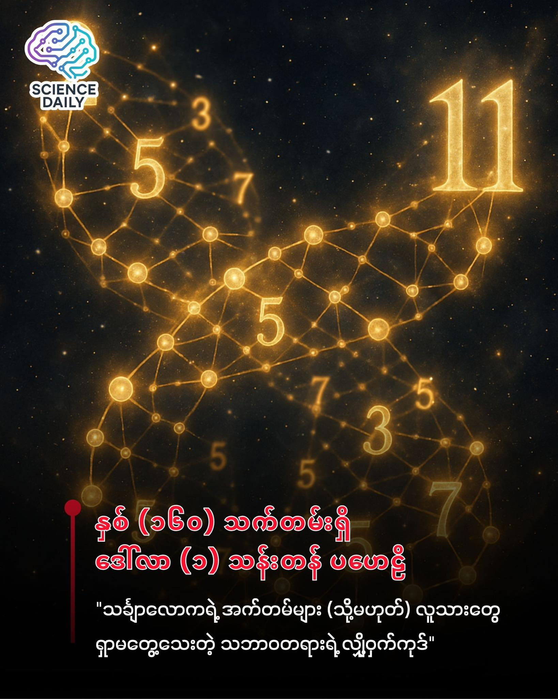

summary:သင်္ချာလောကရဲ့ "အက်တမ်" များနဲ့ လူသားတွေ နှစ်ပေါင်း (၁၆၀) ကျော် ဖြေရှင်းမရသေးတဲ့ ဒေါ်လာ (၁) သန်းတန် ပဟေဠိကြီး
Date: 2025-12-03

သင်္ချာလောကရဲ့ "အက်တမ်" များနဲ့ လူသားတွေ နှစ်ပေါင်း (၁၆၀) ကျော် ဖြေရှင်းမရသေးတဲ့ ဒေါ်လာ (၁) သန်းတန် ပဟေဠိကြီး

ကျွန်တော်တို့ ငယ်ငယ်က ကျောင်းသင်္ချာသင်ခန်းစာတွေမှာ "သုဒ္ဓကိန်း" (Prime Numbers) ဆိုတာကို စတင်သင်ကြားခဲ့ဖူးကြမှာပါ။ ၂၊ ၃၊ ၅၊ ၇၊ ၁၁၊ ၁၃ စသဖြင့် ကိုယ်တိုင်နဲ့ ၁ ကလွဲပြီး စားလို့မပြတ်တဲ့ ကိန်းဂဏန်းတွေပေါ့။ ငယ်စဉ်ကတော့ ဒါဟာ သင်္ချာရဲ့ သာမန်အစိတ်အပိုင်းလေးတစ်ခု၊ စာမေးပွဲဖြေဖို့လောက်သာ အရေးပါတယ်လို့ ထင်ခဲ့ကြပါလိမ့်မယ်။ ဒါပေမဲ့ တကယ်တမ်းမှာတော့ ဒီရိုးရှင်းတယ်ထင်ရတဲ့ ကိန်းဂဏန်းတွေဟာ လူသားမျိုးနွယ်တစ်ခုလုံးအတွက် အကြီးမားဆုံး ပဟေဠိကြီးတစ်ခု ဖြစ်နေတယ်ဆိုတာ သင်သိပါသလား။ 🤯

ရူပဗေဒပညာရှင်တွေမှာ အရာရာကို ဖွဲ့စည်းထားတဲ့ အခြေခံအကျဆုံး "အက်တမ်" (Atom) တွေ ရှိသလိုမျိုးပဲ၊ သင်္ချာပညာရှင်တွေမှာလည်း အခြေခံအကျဆုံး တည်ဆောက်ပုံအဖြစ် "သုဒ္ဓကိန်း" တွေ ရှိပါတယ်။ ကမ္ဘာပေါ်မှာရှိတဲ့ ကိန်းဂဏန်းမှန်သမျှကို ဒီသုဒ္ဓကိန်းတွေနဲ့ မြှောက်ပြီး ဖွဲ့စည်းထားရတာပါ။ Warwick တက္ကသိုလ်က ပါမောက္ခ Adam Harper ပြောသလိုပါပဲ၊ သုဒ္ဓကိန်းတွေဟာ ဂဏန်းတွေရဲ့ အခြေခံအုတ်မြစ်တွေ ဖြစ်ပါတယ်။ ပြဿနာက ဘာလဲဆိုတော့ ဒီသုဒ္ဓကိန်းတွေရဲ့ နေရာချထားပုံက မင်းမဲ့စရိုက် ဆန်လွန်းနေတာပါပဲ။ ဘာပုံသေနည်း၊ ဘာနိယာမမှ မရှိဘဲ ကျပန်းသဘောမျိုး ပေါ်ချင်တဲ့နေရာမှာ ပေါ်လာသလို ဖြစ်နေလို့ပါပဲ။ 🎲

လွန်ခဲ့တဲ့ နှစ်ပေါင်း ၂,၂၀၀ လောက်က Eratosthenes (အရပ်တိုစတီး) ဆိုတဲ့ ပညာရှင်ကြီးက သုဒ္ဓကိန်းတွေကို ရှာဖွေနိုင်မယ့် "Sieve of Eratosthenes" နည်းလမ်းကို စတင်ဖော်ထုတ်ခဲ့ပါတယ်။ သူ့နည်းလမ်းက အရမ်းကောင်းလွန်းလို့ ဒီနေ့ခေတ်ထိ အလုပ်ဖြစ်နေတုန်းပါပဲ။ ဒါပေမဲ့ Oxford တက္ကသိုလ်က Fields Medal ဆုရှင် James Maynard ပြောပြတဲ့ အချက်က စိတ်ဝင်စားဖို့ ကောင်းပါတယ်။ "Eratosthenes ရဲ့ နည်းလမ်းက ဘယ်ဂဏန်းဟာ သုဒ္ဓကိန်းဖြစ်တယ်ဆိုတာ ပြောပြနိုင်ပေမဲ့၊ ဘာကြောင့် ဒီလိုဖြစ်ရသလဲဆိုတဲ့ သီအိုရီသဘောတရားကိုတော့ ရှင်းမပြနိုင်ပါဘူး" တဲ့။ ဆိုလိုတာက ဂဏန်းတွေကိုတော့ ရှာတွေ့တယ်၊ ဒါပေမဲ့ သူတို့ရဲ့ ဖြစ်တည်ပုံ ပုံစံ (Pattern) ကိုတော့ ကျွန်တော်တို့ နားမလည်နိုင်သေးပါဘူး။

ဒီမင်းမဲ့စရိုက်ဆန်တဲ့ ဂဏန်းတွေကို စနစ်တကျ ရှင်းပြဖို့ ကြိုးစားခဲ့သူကတော့ ၁၈၅၉ ခုနှစ်မှာ ဂျာမန်သင်္ချာပညာရှင် Bernhard Riemann (ဘန်းဟတ် ရိုင်မန်) ဖြစ်ပါတယ်။ ရိုင်မန်က သုဒ္ဓကိန်းတွေရဲ့ ရှုပ်ထွေးပွေလီတဲ့ ဖြန့်ကျက်မှုပုံစံအနောက်မှာ "လျှို့ဝှက်တဲ့ စည်းချက် (Hidden Harmony)" တစ်ခု ရှိနေတယ်လို့ ယုံကြည်ခဲ့ပါတယ်။ သူက "Riemann Zeta Function" လို့ခေါ်တဲ့ ရှုပ်ထွေးတဲ့ ညီမျှခြင်းတစ်ခုကို အသုံးပြုပြီး သုဒ္ဓကိန်းတွေရဲ့ သဘောသဘာဝကို ဖော်ထုတ်ဖို့ ကြိုးစားခဲ့ပါတယ်။ 🎼

ရိုင်မန်ရဲ့ တွေ့ရှိချက်အရ ဒီ Zeta Function ရဲ့ တန်ဖိုး "သုည (Zero)" ဖြစ်စေတဲ့ အမှတ်နေရာတွေက သုဒ္ဓကိန်းတွေ ဘယ်လိုဖြန့်ကျက်တည်ရှိနေလဲဆိုတာကို ညွှန်ပြနေတယ်လို့ ဆိုပါတယ်။ ရိုင်မန်က ဒီသုညအမှတ်တွေ အားလုံးဟာ မျဉ်းဖြောင့်တစ်ကြောင်းတည်း ပေါ်မှာပဲ တန်းစီပြီး တည်ရှိနေလိမ့်မယ်လို့ ဟောကိန်းထုတ်ခဲ့ပါတယ်။ ဒါကို "Riemann Hypothesis" လို့ လူသိများကြပါတယ်။ ဒီအချက်သာ မှန်ကန်ခဲ့ရင် သုဒ္ဓကိန်းတွေဟာ ကျပန်းဖြစ်နေတာ မဟုတ်ဘဲ၊ သဘာဝတရားရဲ့ အလွန်လှပသေသပ်တဲ့ စည်းမျဉ်းတစ်ခုအောက်မှာ ရှိနေတယ်ဆိုတာ သက်သေပြနိုင်မှာ ဖြစ်ပါတယ်။

ဒါပေမဲ့ ခက်တာက... ရိုင်မန်က ဒါကို "မှန်လိမ့်မယ်" လို့ပဲ အဆိုပြုခဲ့တာပါ။ သင်္ချာနည်းအရ ရာနှုန်းပြည့် တိကျတဲ့ သက်သေပြချက် (Proof) ကိုတော့ သူကိုယ်တိုင်လည်း မချပြနိုင်ခဲ့သလို၊ သူ့နောက်ပိုင်း ပေါ်ပေါက်လာတဲ့ ဘယ်သင်္ချာပညာရှင်ကမှလည်း နှစ်ပေါင်း ၁၆၀ ကျော်ကြာတဲ့အထိ သက်သေမပြနိုင်သေးပါဘူး။ ဒီပုစ္ဆာဟာ ဘယ်လောက်တောင် အရေးကြီးလဲဆိုရင် ၂၀၀၀ ပြည့်နှစ်မှာ Clay Mathematics Institute ကနေ ဖြေရှင်းရန် အခက်ခဲဆုံး ထောင်စုနှစ် ပြဿနာကြီး (၇) ခုထဲမှာ ထည့်သွင်းခဲ့ပြီး၊ ဖြေရှင်းနိုင်သူကို အမေရိကန်ဒေါ်လာ (၁) သန်း ဆုချမယ်လို့ ကြေညာထားပါတယ်။ 💰

လက်ရှိ နည်းပညာအခြေအနေမှာတော့ Supercomputer တွေကို အသုံးပြုပြီး ဂဏန်းပေါင်း (၁၀) ထရီလီယံ (သုည ၁၃ လုံးပါတဲ့ ပမာဏ) အထိ စစ်ဆေးကြည့်တဲ့အခါ ရိုင်မန်ရဲ့ အဆိုပြုချက်က မှန်ကန်နေတာကို တွေ့ရပါတယ်။ ဒါပေမဲ့ သင်္ချာလောကမှာက "ထရီလီယံအထိ မှန်တာနဲ့ အားလုံးမှန်တယ်" လို့ ယူဆလို့ မရပါဘူး။ ဂဏန်းအရေအတွက်က အဆုံးမရှိ (Infinity) ဖြစ်တဲ့အတွက် တစ်နေရာရာမှာ လွဲချော်သွားနိုင်မလား ဆိုတာကို သံသယ ရှင်းရှင်းလင်းလင်းဖြစ်အောင် သက်သေပြဖို့ လိုအပ်နေတာပါ။ 💻

ဒါပေမဲ့ လူသားတွေဟာ ဒီပုစ္ဆာကြီးကို လက်ပိုက်ကြည့်မနေပါဘူး။ ပြီးခဲ့တဲ့ ဆယ်စုနှစ်အတွင်းမှာ တိုးတက်မှုကြီးကြီးမားမားတွေ ရှိခဲ့ပါတယ်။ အထူးသဖြင့် "Twin Prime Conjecture" (ခြားနားခြင်း ၂ သာရှိတဲ့ သုဒ္ဓကိန်းစုံတွဲများ၊ ဥပမာ - ၁၁ နှင့် ၁၃) နဲ့ ပတ်သက်ပြီး Yitang Zhang ဆိုတဲ့ ပညာရှင်က အံ့မခန်း သက်သေပြနိုင်ခဲ့ပါတယ်။ အစပိုင်းမှာ ကွာဟချက် သန်း ၇၀ အတွင်းမှာ ဒီလိုအတွဲတွေ ရှိနေကြောင်း သက်သေပြခဲ့ရာကနေ နောက်ပိုင်းမှာ Terence Tao နဲ့ Polymath Project အဖွဲ့သားတွေက ကွာဟချက် ၂၄၆ အထိ ကျဉ်းမြောင်းအောင် လုပ်ဆောင်နိုင်ခဲ့ကြပါတယ်။ ဒါဟာ လူသားတွေရဲ့ ဉာဏ်ရည်တိုးတက်မှုကို ပြသနေတဲ့ မှတ်တိုင်တစ်ခုပါပဲ။ 🚀

ဒီပုစ္ဆာကြီးကို ဖြေရှင်းနိုင်ခြင်း၊ မနိုင်ခြင်းက ကျွန်တော်တို့ နေ့စဉ်ဘဝအပေါ်မှာရော သက်ရောက်မှု ရှိလားလို့ မေးစရာရှိပါတယ်။ အဖြေကတော့ "ရှိပါတယ်"။ အထူးသဖြင့် ဆိုက်ဘာလုံခြုံရေး (Cybersecurity) အပိုင်းမှာပါ။ ဒီနေ့ခေတ် ကျွန်တော်တို့ သုံးနေတဲ့ ဘဏ်ကတ်တွေ၊ အင်တာနက် လုံခြုံရေးစနစ်တွေ (RSA Encryption) တော်တော်များများက သုဒ္ဓကိန်းကြီးတွေကို ခွဲခြမ်းစိတ်ဖြာရခက်တယ်ဆိုတဲ့ အချက်ပေါ်မှာ အခြေခံထားတာပါ။ တကယ်လို့များ တစ်စုံတစ်ယောက်က သုဒ္ဓကိန်းတွေရဲ့ ပုံစံကို အတိအကျ သိသွားခဲ့မယ်ဆိုရင်၊ ဒါမှမဟုတ် ရိုင်မန်ရဲ့ သီအိုရီကို ဖြေရှင်းရင်း ဖြတ်လမ်းနည်းတွေ ပေါ်လာခဲ့မယ်ဆိုရင် ကမ္ဘာ့ဒစ်ဂျစ်တယ် လုံခြုံရေးစနစ်တစ်ခုလုံး ပြောင်းလဲသွားနိုင်ပါတယ်။ 🔐

နိဂုံးချုပ်ရရင်တော့ သုဒ္ဓကိန်းတွေနဲ့ ပတ်သက်ပြီး ပြီးပြည့်စုံတဲ့ နားလည်မှုကို ရရှိဖို့ဆိုတာ မနက်ဖြန် သဘက်ခါ ဖြစ်လာမှာတော့ မဟုတ်ပါဘူး။ ပါမောက္ခ Maynard ကတော့ "သုဒ္ဓကိန်းတွေဟာ ပင်ကိုသဘာဝအရကို ရှုပ်ထွေးလွန်းပြီး ပြီးပြည့်စုံတဲ့ တည်ဆောက်ပုံ မရှိတာလည်း ဖြစ်နိုင်တယ်" လို့ ဆိုပါတယ်။ ဒါပေမဲ့ Riemann Hypothesis လို ပုစ္ဆာကြီးတွေကို ဖြေရှင်းဖို့ ကြိုးစားရင်းနဲ့ လူသားတွေဟာ သင်္ချာဆိုင်ရာ "လက်နက်ကိရိယာ" အသစ်တွေကို တီထွင်ဖန်တီးနိုင်လာကြပါတယ်။ အဖြေကို ရှာမတွေ့ခင်မှာတောင်၊ အဖြေရှာဖို့ လျှောက်လှမ်းနေတဲ့ လမ်းခရီးကတင် ကျွန်တော်တို့ရဲ့ နည်းပညာနဲ့ တွေးခေါ်မှုတွေကို အဆမတန် မြင့်မားစေခဲ့ပြီ ဖြစ်ပါတယ်။

ဒါကြောင့် နောက်တစ်ခါ ၂၊ ၃၊ ၅၊ ၇ ဆိုတဲ့ ဂဏန်းလေးတွေကို မြင်တဲ့အခါ ရိုးရှင်းတဲ့ ဂဏန်းတွေလို့ မမြင်ဘဲ သဘာဝတရားကြီးက ဖုံးကွယ်ထားတဲ့၊ လူသားတွေ ရှာဖွေနေဆဲဖြစ်တဲ့ အနက်ရှိုင်းဆုံး လျှို့ဝှက်ချက်တွေအဖြစ် ရှုမြင်ကြည့်ကြပါစို့။ 🌌✨

