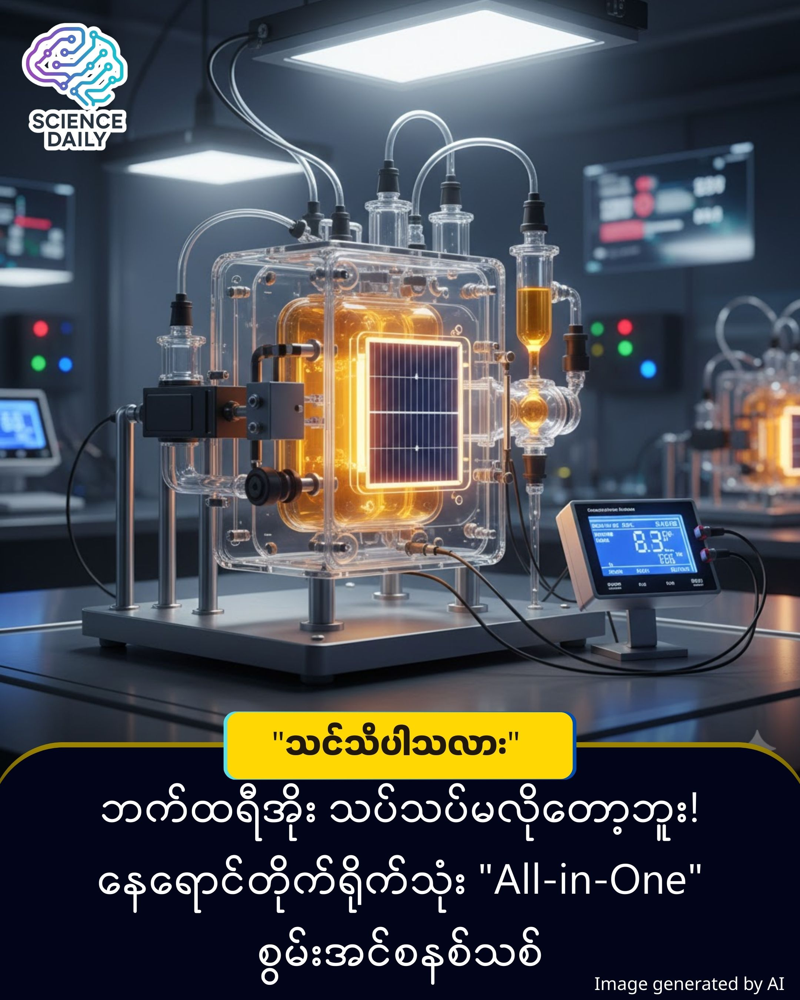

title: စွမ်းအင်လောကရဲ့ ခြေလှမ်းသစ်! တရုတ်သိပ္ပံပညာရှင်တွေရဲ့ အလင်းအားသွင်း ဘက်ထရီအသစ်
summary: နေရောင်ခြည်ပြား (Solar Panel) တွေကနေ ဘက်ထရီအိုးအကြီးကြီးတွေဆီ ကြိုးတွေနဲ့ သွယ်တန်းစရာမလိုတော့ဘဲ "နေရောင်ပြတာနဲ့ ဓာတ်အားကို တန်းပြီး သိုလှောင်ပေးနိုင်မယ့်" နည်းပညာကို မြင်ယောင်ကြည့်လိုက်ပါ။
Date: 2025-12-30
Image: images/SRFB.jpg

🌞 စွမ်းအင်လောကရဲ့ ခြေလှမ်းသစ်! တရုတ်သိပ္ပံပညာရှင်တွေရဲ့ "အလင်းအားသွင်း" ဘက်ထရီအသစ် ⚡️

နေရောင်ခြည်ပြား (Solar Panel) တွေကနေ ဘက်ထရီအိုးအကြီးကြီးတွေဆီ ကြိုးတွေနဲ့ သွယ်တန်းစရာမလိုတော့ဘဲ "နေရောင်ပြတာနဲ့ ဓာတ်အားကို တန်းပြီး သိုလှောင်ပေးနိုင်မယ့်" နည်းပညာကို မြင်ယောင်ကြည့်လိုက်ပါ။

မကြာသေးမီက တရုတ်နိုင်ငံ၊ Jiangsu ပြည်နယ်၊ Nanjing Tech University က သုတေသီတွေဟာ ဒီလိုမျိုး ဆန်းသစ်တဲ့ Solar Redox Flow Battery (SRFB) နည်းပညာကို တီထွင်နိုင်ခဲ့ပါပြီ။ 

🔋 "အလုပ်ရှုပ်သက်သာမယ့်" ဒီဇိုင်းအသစ်
ပုံမှန်ဆိုရင် Solar စနစ်တွေမှာ ဆိုလာပြားရယ်၊ သိုလှောင်တဲ့ ဘက်ထရီရယ် သီးသန့်ခွဲထားရလေ့ရှိပါတယ် ။ ဒါပေမဲ့ ဒီနည်းပညာအသစ်ကတော့...

✅ All-in-One ပါ: လျှပ်စစ်ထုတ်လုပ်တာနဲ့ စွမ်းအင်သိုလှောင်တာကို စနစ်တစ်ခုတည်းမှာ ပေါင်းစပ်ထားတာပါ။ ✅ တိုက်ရိုက်စွမ်းအင်ရယူခြင်း: နေရောင်ခြည်ကနေ လျှပ်စစ်အဖြစ် အရင်ပြောင်းစရာမလိုဘဲ အရည် (Electrolytes) ထဲမှာရှိတဲ့ ဓာတုဓာတ်ပြုမှုကို တိုက်ရိုက်ဖြစ်ပေါ်စေပြီး စွမ်းအင်သိမ်းဆည်းပေးတာ ဖြစ်ပါတယ်။ 

ဒီစက်ပစ္စည်းလေးက "နေရောင်ခြည်ကို ရှူရှိုက်နေတဲ့ အရည်ဘက်ထရီ" တစ်လုံးနဲ့ တူပါတယ်။ 🌊

အလင်းဖမ်းယူခြင်း: သုတေသီတွေက အရည်အသွေးမြင့် (triple-junction amorphous-silicon) ဆဲလ်တွေကို အသုံးပြုထားပါတယ်။ 

ဓာတုဓာတ်ပြုခြင်း: အလင်းရောင်ရတာနဲ့ အရည်ထဲမှာရှိတဲ့ organic molecules တွေက ဓာတ်ပြုပြီး စွမ်းအင်ကို သိုလှောင်လိုက်ပါတယ်။ 

စမ်းသပ်မှုရလဒ်: နေရောင်ခြည်တုအောက်မှာ စမ်းသပ်ချက်အရ ဒီဘက်ထရီဟာ ပြင်ပလျှပ်စစ်အကူအညီမလိုဘဲ အားသွင်းနိုင်ပြီး 4.2% သော စွမ်းအင်ပြောင်းလဲမှုနှုန်း (Efficiency) ကို ရရှိခဲ့ပါတယ်။

Flow Battery (အရည်စီးဆင်းမှုသုံး ဘက်ထရီ) နည်းပညာတွေက ပုံမှန် Lithium ဘက်ထရီတွေထက် ပိုပြီး စိတ်ချရပြီး မီးလောင်လွယ်တဲ့ အန္တရာယ်နည်းပါတယ်။ ဒီနည်းပညာသာ တွင်တွင်ကျယ်ကျယ် ဖြစ်လာရင် အနာဂတ်မှာ ပိုသန့်ရှင်းတဲ့ စွမ်းအင်တွေကို အိမ်တိုင်းမှာ အလွယ်တကူ သုံးလာနိုင်တော့မှာပါ။

Source: Interesting Engineering 

#SolarEnergy #BatteryTech #GreenEnergy #CleanEnergy #SolarPower #Engineering
