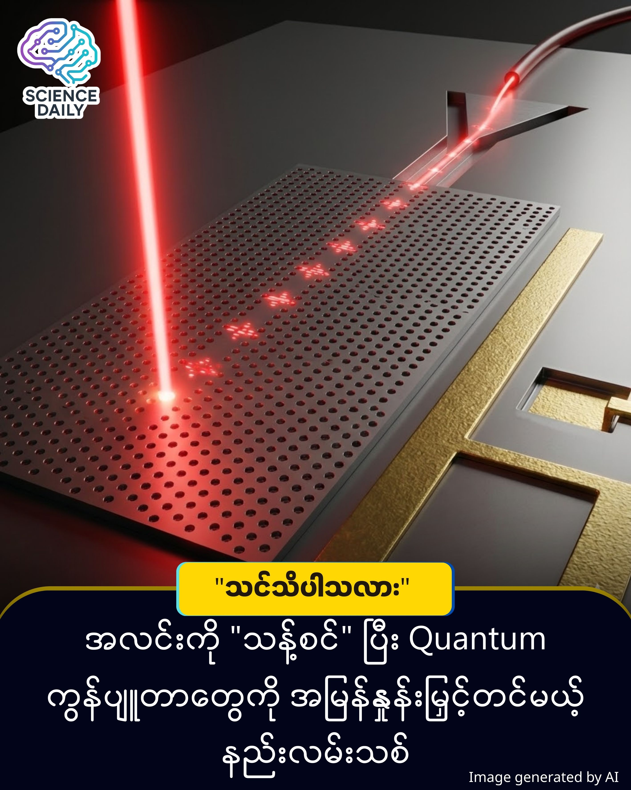

title:Quantum ကွန်ပျူတာတွေအတွက် အလင်း "သန့်စင်" ပေးမယ့် နည်းပညာသစ်
summary:အလင်း (Light) ဆိုတာ သတင်းအချက်အလက်တွေကို သယ်ဆောင်ဖို့ အသန့်ရှင်းဆုံး နည်းလမ်းလို့ ထင်ရပေမယ့် Quantum ကမ္ဘာမှာတော့ အလင်းမှာလည်း "ဆူညံသံ" (Noise) တွေ ရှိနေတတ်ပါတယ် ။
Date: 2025-12-28
Image: images/Single Photons.jpg

Quantum ကွန်ပျူတာတွေအတွက် အလင်း "သန့်စင်" ပေးမယ့် နည်းပညာသစ်

အလင်း (Light) ဆိုတာ သတင်းအချက်အလက်တွေကို သယ်ဆောင်ဖို့ အသန့်ရှင်းဆုံး နည်းလမ်းလို့ ထင်ရပေမယ့် Quantum ကမ္ဘာမှာတော့ အလင်းမှာလည်း "ဆူညံသံ" (Noise) တွေ ရှိနေတတ်ပါတယ် ။ အခုအခါမှာတော့ University of Iowa က သုတေသီတွေဟာ အလင်းမှုန် (Photons) တွေကို သန့်စင်ပေးနိုင်မယ့် နည်းလမ်းသစ်တစ်ခုကို ရှာဖွေတွေ့ရှိခဲ့ပါပြီ ။ ဒီတွေ့ရှိမှုဟာ ပိုမြန်ပြီး ပိုလုံခြုံတဲ့ Quantum ကွန်ပျူတာတွေ ပေါ်ပေါက်လာဖို့ အဓိက အတားအဆီးကြီးတစ်ခုကို ဖယ်ရှားပေးနိုင်ဖွယ် ရှိနေပါတယ် ။

ရိုးရိုးကွန်ပျူတာတွေက Bits (0 နဲ့ 1) ကို သုံးပြီး အလုပ်လုပ်ပေမယ့် Quantum ကွန်ပျူတာတွေကတော့ Qubits တွေကို သုံးပါတယ် ။ ဒီ Qubits တွေ အလုပ်လုပ်ဖို့အတွက် "Single Photons" လို့ခေါ်တဲ့ အလင်းမှုန်လေးတွေကို တစ်လုံးချင်းစီ တိတိကျကျ လွှတ်ပေးဖို့ လိုအပ်ပါတယ် ။

ဒါပေမဲ့ ပြဿနာက အလင်းမှုန်တွေကို တစ်လုံးချင်းစီ သီးသန့်ထုတ်လုပ်ဖို့ အရမ်းခက်ခဲနေတာပါပဲ ။ လေဆာနဲ့ အက်တမ် (Atom) တွေကို ပစ်လိုက်တဲ့အခါ မလိုချင်တဲ့ အလင်းမှုန်တွေ ပိုထွက်လာတာမျိုး (Multi-photon emission) သို့မဟုတ် လေဆာအလင်း ပြန့်ကျဲသွားတာမျိုး (Laser scatter) တွေ ဖြစ်တတ်ပါတယ် ။ ဒါက Quantum စနစ်အတွက်တော့ အနှောင့်အယှက် (Noise) ဖြစ်နေစေပါတယ် ။

ဒီပြဿနာကို ဖြေရှင်းဖို့ Iowa သုတေသနအဖွဲ့က ထူးခြားတဲ့ နည်းလမ်းတစ်ခုကို သုံးခဲ့ပါတယ် - အဲဒါကတော့ "အနှောင့်အယှက်တွေကို အချင်းချင်း ပြန်တိုက်ခိုက်ခိုင်းလိုက်တာ" ပါပဲ ။ လေဆာကြောင့် ဖြစ်ပေါ်လာတဲ့ မလိုလားအပ်တဲ့ အလင်းပြန့်ကျဲမှုနဲ့ အလင်းမှုန်အပိုထွက်တာတွေက တူညီတဲ့ လှိုင်းသဏ္ဍာန် (Wavelength/Waveform) ရှိနေတာကို တွေ့ရှိခဲ့ပါတယ် ။ လေဆာရဲ့ ပစ်လိုက်တဲ့ ထောင့် (Angle) နဲ့ ပုံစံ (Shape) ကို သေချာချိန်ညှိလိုက်မယ်ဆိုရင် ဒီအနှောင့်အယှက်နှစ်ခုက တစ်ခုနဲ့တစ်ခု ပြန်ချေဖျက် (Cancel out) သွားပြီး သန့်စင်တဲ့ အလင်းမှုန်စီးကြောင်း (Pure photon stream) ကိုပဲ ကျန်ရစ်စေမှာ ဖြစ်ပါတယ် ။ 

ဒီနည်းလမ်းဟာ မလိုချင်တဲ့ အလင်းတွေကို ဖယ်ရှားပစ်ရုံမကဘဲ အရင်က ပြဿနာလို့ သတ်မှတ်ထားတဲ့ အရာကို အသုံးဝင်တဲ့ ကိရိယာအဖြစ် ပြောင်းလဲပစ်လိုက်တာလည်း ဖြစ်ပါတယ် ။

ဒီတွေ့ရှိမှုကို Optica Quantum ဂျာနယ်မှာ ဖော်ပြထားပါတယ် ။ သတိပြုရမယ့် အချက်ကတော့ ဒီနည်းလမ်းဟာ လက်ရှိမှာ "သီအိုရီပိုင်းဆိုင်ရာ တွေ့ရှိချက်" (Theoretical breakthrough) အဆင့်မှာသာ ရှိပါသေးတယ်

သုတေသီတွေအနေနဲ့ ဒီမော်ဒယ်ကို လက်တွေ့စမ်းသပ်ခန်းထဲမှာ သက်သေပြဖို့ ပြင်ဆင်နေကြပါတယ် ။ ဒီပရောဂျက်ကို အမေရိကန် ကာကွယ်ရေးဌာန (U.S. Department of Defense) က ထောက်ပံ့ထားတာ ဖြစ်ပါတယ် ။

အကယ်၍ လက်တွေ့စမ်းသပ်မှုတွေမှာ အောင်မြင်ခဲ့မယ်ဆိုရင် - Quantum ကွန်ပျူတာတွေရဲ့ တွက်ချက်နိုင်စွမ်း ပိုမြန်လာပြီး အမှားအယွင်း နည်းသွားပါလိမ့်မယ် ။ ဟက်ခ် (Hack) လုပ်ဖို့ ခက်ခဲတဲ့ Quantum ဆက်သွယ်ရေးကွန်ရက်တွေ တည်ဆောက်ရာမှာ အလွန်အရေးပါလာပါလိမ့်မယ် ။

Source: Interesting Engineering / University of Iowa Research

#QuantumComputing #ScienceNews #Innovation #Technology #Photonics #MyanmarTech #FutureTech #UniversityOfIowa

