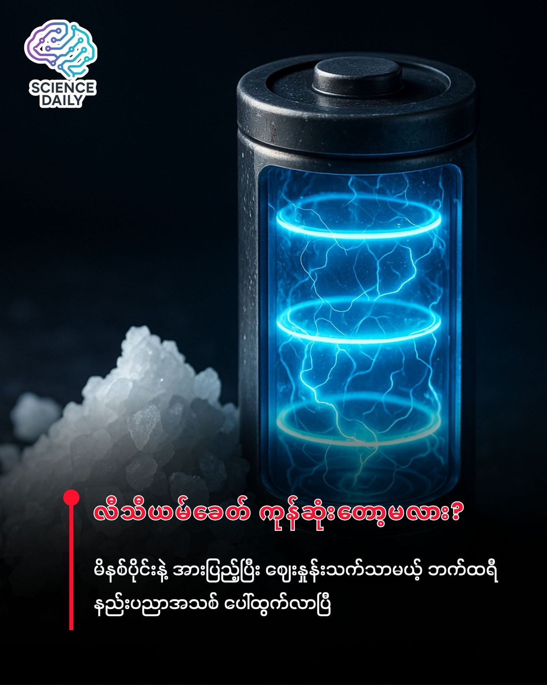

summary:ဆားတစ်ပွင့်ကနေ စွမ်းအင်ကမ္ဘာကို ပြောင်းလဲပစ်မလား? (ဆိုဒီယမ်ဘက်ထရီ နည်းပညာအသစ်)
Date: 2025-12-05

ဆားတစ်ပွင့်ကနေ စွမ်းအင်ကမ္ဘာကို ပြောင်းလဲပစ်မလား? (ဆိုဒီယမ်ဘက်ထရီ နည်းပညာအသစ်)

သင့်ဖုန်းကို မိနစ်ပိုင်းလေးနဲ့ အားပြည့်စေပြီး၊ ကုန်ကျစရိတ်ကလည်း လက်ရှိထက် အများကြီး သက်သာမယ့် ဘက်ထရီမျိုး ပေါ်လာရင် ဘယ်လိုနေမလဲ? ကမ္ဘာမြေပေါ်မှာ အပေါများဆုံးအရာတစ်ခုဖြစ်တဲ့ "ဆိုဒီယမ်" (ဆား) ကို အသုံးပြုပြီး လျှပ်စစ်စွမ်းအင်ကို လျင်မြန်စွာ သိုလှောင်နိုင်မယ့် နည်းပညာသစ်တစ်ခုကို သိပ္ပံပညာရှင်တွေ ရှာဖွေတွေ့ရှိလိုက်ပါပြီ။

လက်ရှိ ကျွန်တော်တို့သုံးနေတဲ့ ဖုန်းတွေ၊ လျှပ်စစ်ကား (EV) တွေမှာ လီသီယမ် (Lithium-ion) ဘက်ထရီတွေက ဘုရင်တစ်ပါးလို နေရာယူထားပါတယ်။ ဒါပေမဲ့ လီသီယမ်က ရှားပါးတယ်၊ တူးဖော်ရခက်တယ်၊ ဈေးကြီးတယ်။ ဒါကြောင့် သိပ္ပံပညာရှင်တွေက လီသီယမ်နဲ့ ဂုဏ်သတ္တိတူပြီး ကမ္ဘာ့သမုဒ္ဒရာတွေထဲမှာ အများကြီးရှိတဲ့ ဆိုဒီယမ် (Sodium) ကို အစားထိုးဖို့ ကြိုးစားလာတာ ကြာပါပြီ။

ဒါပေမဲ့ အဓိက အခက်အခဲကတော့ "Anode" လို့ခေါ်တဲ့ ဘက်ထရီရဲ့ အနုတ်ငုတ်ပိုင်းမှာ ရှိပါတယ်။ ပုံမှန်သုံးနေကျ "Hard Carbon" (ကာဗွန်အခဲ) တွေဟာ ဆိုဒီယမ်အိုင်းယွန်းတွေကို သယ်ဆောင်တဲ့နေရာမှာ အရမ်းနှေးကွေးလွန်းနေလို့ပါပဲ။

ဘာတွေထူးခြားသွားတာလဲ? 

ဆိုဒီယမ်အိုင်းယွန်းတွေဟာ လီသီယမ်ထက် အရွယ်အစား ပိုကြီးပါတယ်။ ဘက်ထရီအထဲမှာ ဒီကောင်ကြီးတွေ ဝင်လိုက်ထွက်လိုက် လုပ်တဲ့အခါ ကာဗွန်အလွှာတွေကြားမှာ ပိတ်မိနေတတ်ပါတယ်။ ဒါကို သိပ္ပံစကားနဲ့ "Interlayer Confinement" (အလွှာကြား ပိတ်မိခြင်း) လို့ ခေါ်ပါတယ်။ ကားလမ်းကျဉ်းကျဉ်းလေးမှာ ကားကြီးတွေ ပိတ်မိနေသလိုမျိုးပေါ့။

ဒီပြဿနာကို ဖြေရှင်းဖို့ အရင်က ကာဗွန်ကို အပေါက်လေးတွေ ဖောက်ဖို့ ကြိုးစားခဲ့ဖူးကြပေမယ့်၊ အပေါက်များသွားပြန်ရင်လည်း ဘက်ထရီရည် (Electrolyte) တွေ ပျက်စီးပြီး အနည်ထိုင် (SEI layer ထူလာ) တာကြောင့် ဘက်ထရီ သက်တမ်းမခံပြန်ပါဘူး။

တွေ့ရှိမှုအသစ် (The Discovery) 

ဒီအခက်အခဲကို ကျော်လွှားဖို့ တရုတ်သိပ္ပံအကယ်ဒမီ၊ Hefei Institutes of Physical Science (HFIPS) က သုတေသီ Zhao Weiwei ဦးဆောင်တဲ့ အဖွဲ့က နည်းလမ်းသစ်တစ်ခု ရှာတွေ့ခဲ့ပါတယ်။ သူတို့ရဲ့ တွေ့ရှိမှုကို ACS Nano ဂျာနယ်မှာ ဖော်ပြထားပါတယ်။

သူတို့ ဘာလုပ်ခဲ့သလဲဆိုတော့ -

Amino-Nitrogen Strategy: ကာဗွန် (Carbon) ကို ဘက်ထရီအဖြစ်သုံးဖို့ အပူပေးပြီး ပြုပြင်ဖန်တီးတဲ့အချိန်မှာ သူတို့က "အမိုးနီးယား (Ammonia)" ဓာတ်ငွေ့ကို ထည့်သွင်းအသုံးပြုခဲ့ပါတယ်။  ဒီ "အမိုးနီးယား" က ကာဗွန်ရဲ့ အတွင်းပိုင်းဖွဲ့စည်းပုံကို ပြောင်းလဲပစ်ဖို့ အဓိက သော့ချက် ဖြစ်ပါတယ်။

ဒေါင်လိုက် လမ်းကြောင်းများ (Vertical Through-Pores): သာမန် ကာဗွန်အခဲတွေရဲ့ အတွင်းပိုင်းက ရှုပ်ထွေးပိတ်လှောင်နေတဲ့ ဝင်္ကပါလို ဖြစ်နေတတ်ပါတယ်။ ဆိုဒီယမ်အိုင်းယွန်းတွေက တစ်ဖက်ကနေ တစ်ဖက်ရောက်ဖို့ အကြာကြီး လှည့်ပတ်သွားရပါတယ်။ အမိုးနီးယားကို သုံးပြီး ကာဗွန်သားထဲမှာ "ဒေါင်လိုက် လိုဏ်ခေါင်းလမ်းကြောင်း" တွေ ဖောက်လိုက်ပါတယ်။ တောင်ကို ကွေ့ပတ်မောင်းစရာမလိုဘဲ တောင်ကို ဖောက်ထားတဲ့ ဥမင်လိုဏ်ခေါင်းထဲကနေ တန်းမောင်းသွားရသလိုမျိုး ဆိုဒီယမ်တွေက ဟိုဘက်ဒီဘက်ကို ချက်ချင်းရောက်သွားစေပါတယ်။ ဒါကြောင့် "Ultrafast" (အလွန်မြန်တယ်) လို့ ဆိုတာပါ။

Changing Nitrogen Types : ကာဗွန်ထဲမှာ မူလကတည်းက နိုက်ထရိုဂျင် (Nitrogen) ဓာတ်တွေ ပါဝင်ပါတယ်။ ဒါပေမဲ့ အရင်ကပါတဲ့ နိုက်ထရိုဂျင်တွေ (Pyrrolic N) က ပျင်းတဲ့ ဝန်ထမ်းတွေလိုပါပဲ၊ လျှပ်စစ်စီးဆင်းမှုကို ကောင်းကောင်း မကူညီနိုင်ပါဘူး။ နည်းပညာသစ်က အဲဒီ ပျင်းတဲ့ကောင်တွေကို ဖယ်ရှားပြီး၊ တက်ကြွတဲ့ နိုက်ထရိုဂျင်ပုံစံသစ် (Pyridinic N) တွေနဲ့ အစားထိုးလိုက်သလို ဖြစ်သွားပါတယ်။ ဒီကောင်တွေက လျှပ်စစ်စီးဆင်းမှုကို ပိုကောင်းစေပြီး ဘက်ထရီအားကို ပိုထိန်းနိုင်ပါတယ်။

အကာအကွယ်အလွှာ (Stable SEI): ဘက်ထရီတွေ စသုံးတာနဲ့ ဘက်ထရီအရည်နဲ့ ကာဗွန်ပြား ထိတွေ့ပြီး SEI လို့ခေါ်တဲ့ အလွှာပါးလေး တစ်ခု ဖြစ်ပေါ်လာလေ့ရှိပါတယ်။ ပုံမှန်ဆိုရင် ဒီအလွှာက ထူပြီး ကြမ်းတမ်းလို့ ဘက်ထရီအသွားအလာကို ပိတ်ဆို့တတ်ပါတယ်။ သူတို့ရဲ့ နည်းပညာက ဒီအလွှာကို "ပါးပါးလေးနဲ့ အရမ်းမာကျောအောင်" (Fluoride-rich) ဖန်တီးပေးလိုက်ပါတယ်။ ဒါကြောင့် ဘက်ထရီက ပျက်စီးလွယ်တဲ့ ဒဏ်ကိုခံနိုင်ပြီး သက်တမ်းအကြာကြီး သုံးလို့ရသွားတာ ဖြစ်ပါတယ်။

ရလဒ်ကတော့ ဆိုဒီယမ်အိုင်းယွန်းတွေဟာ ဘက်ထရီထဲမှာ အလွန်လျင်မြန်စွာ (Ultrafast) ဝင်ထွက်နိုင်ပြီး၊ အကြိမ်ပေါင်း ထောင်ချီ အားသွင်းသုံးစွဲတာတောင် ပျက်စီးမှုမရှိသလောက် (Highly Reversible) ဖြစ်တာကို တွေ့ရှိခဲ့ရပါတယ်။

သတိပြုစရာ (Scientific Caution) 

ဒီသတင်းက စွမ်းအင်လောကအတွက် အရမ်းအားတက်စရာ ကောင်းပါတယ်။ ဒါပေမဲ့ -

ဒါဟာ ဓာတ်ခွဲခန်းအဆင့် (Lab Scale) အောင်မြင်မှု ဖြစ်ပါတယ်။

စီးပွားဖြစ် အမြောက်အမြား ထုတ်လုပ်နိုင်ဖို့နဲ့ တခြား ဘေးကင်းရေးဆိုင်ရာ စမ်းသပ်မှုတွေ (Scaling up) ကို ဆက်လက် လုပ်ဆောင်ဖို့ လိုအပ်ပါသေးတယ်။ သိပ္ပံပညာရှင်တွေအနေနဲ့ ဒီနည်းပညာကို စက်ရုံတွေမှာ တကယ်လက်တွေ့ သုံးလို့ရမရ ဆက်လက် အတည်ပြု လေ့လာနေကြဆဲ ဖြစ်ပါတယ်။

 နိဂုံး (Conclusion) 

ဒီတွေ့ရှိမှုဟာ ဆိုဒီယမ်ဘက်ထရီ နည်းပညာအတွက် ကြီးမားတဲ့ အောင်မြင်မှု တစ်ခုပါပဲ။ တကယ်လို့သာ ဒီနည်းပညာ အောင်မြင်လာခဲ့ရင် အနာဂတ်မှာ လျှပ်စစ်ကား (EV) တွေ ဈေးပိုသက်သာလာမယ်၊ နေရောင်ခြည်စွမ်းအင်လိုမျိုး Renewable Energy စွမ်းအင်တွေကို သိုလှောင်ဖို့ စရိတ်စက အများကြီး လျော့ကျသွားပါလိမ့်မယ်။ လီသီယမ်ကို မှီခိုနေရတဲ့ ခေတ်ကနေ ဆားတစ်ပွင့်ကို အားကိုးရမယ့်ခေတ်ကို ပြောင်းလဲရောက်ရှိလာနိုင်ပါတယ်။

#SodiumIonBattery #SodiumBattery #ဆိုဒီယမ်ဘက်ထရီ #BatteryTechnology #ဘက်ထရီနည်းပညာ #ScienceNews #TechUpdate #သိပ္ပံနှင့်နည်းပညာ #နည်းပညာဗဟုသုတ #တီထွင်မှုများ #CleanEnergy #RenewableEnergy #GreenTech #ပြန်ပြည့်မြဲစွမ်းအင် #စွမ်းအင်သစ် #လျှပ်စစ်ကား  #FutureTech #EnergyRevolution #Innovation #SaltBattery 
