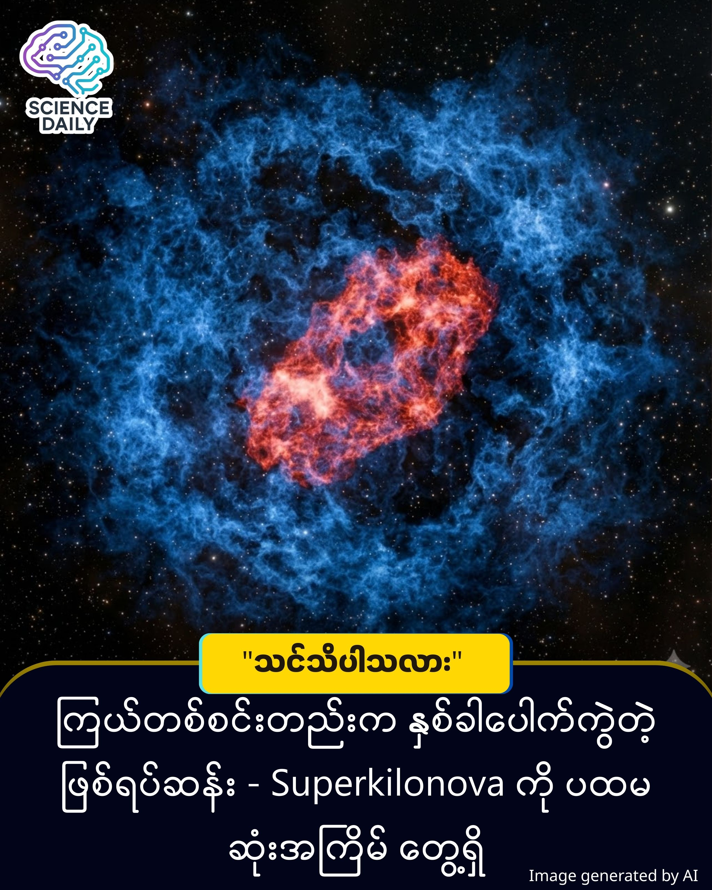

title: ကြယ်တစ်စင်းတည်းက နှစ်ခါပေါက်ကွဲတဲ့ စူပါကီလိုနိုဗာ (Super Kilonova) ဆိုတာ တကယ်ရှိလား?
summary: စူပါနိုဗာ (Supernova) နဲ့ ကီလိုနိုဗာ (Kilonova) ပေါင်းစပ်ထားတဲ့ ဖြစ်ရပ်ဆန်းကို သိပ္ပံပညာရှင်တွေ ပထမဆုံးအကြိမ် တွေ့ရှိ ။ အာကာသသိပ္ပံလောကမှာ ထူးဆန်းတဲ့ ဖြစ်ရပ်တစ်ခုကို မကြာသေးမီကမှ တွေ့ရှိခဲ့ရပါတယ်။ 
Date: 2025-12-29
Image: images/Super Kilonova.jpg

ကြယ်တစ်စင်းတည်းက နှစ်ခါပေါက်ကွဲတဲ့ စူပါကီလိုနိုဗာ (Super Kilonova) ဆိုတာ တကယ်ရှိလား?

စူပါနိုဗာ (Supernova) နဲ့ ကီလိုနိုဗာ (Kilonova) ပေါင်းစပ်ထားတဲ့ ဖြစ်ရပ်ဆန်းကို သိပ္ပံပညာရှင်တွေ ပထမဆုံးအကြိမ် တွေ့ရှိ

အာကာသသိပ္ပံလောကမှာ ထူးဆန်းတဲ့ ဖြစ်ရပ်တစ်ခုကို မကြာသေးမီကမှ တွေ့ရှိခဲ့ရပါတယ်။ ပုံမှန်အားဖြင့် ကြယ်တစ်စင်း သေဆုံးသွားတဲ့အခါ တစ်ကြိမ်ပဲ ပေါက်ကွဲလေ့ရှိပေမဲ့၊ အခုတွေ့ရှိချက်မှာတော့ ကြယ်တစ်စင်းက ပုံစံမတူတဲ့ ပေါက်ကွဲမှုကြီးနှစ်ခုကို ဆက်တိုက်ဆိုသလို လုပ်ဆောင်သွားတာ ဖြစ်နိုင်တယ်လို့ သုတေသီတွေက ယူဆနေကြပါတယ်။ ဒီဖြစ်ရပ်ကို "Super Kilonova" လို့ အမည်ပေးထားပါတယ်။

ပုံမှန်အားဖြင့် နေ (Sun) ထက် အဆမတန်ကြီးမားတဲ့ ကြယ်တွေ သက်တမ်းကုန်ဆုံးလို့ ပေါက်ကွဲတာကို Supernova (စူပါနိုဗာ) လို့ခေါ်ပါတယ်။ ဒီလိုပေါက်ကွဲပြီးရင် နျူထရွန်ကြယ် (Neutron Star) လို့ခေါ်တဲ့ သိပ်သည်းဆ အရမ်းများတဲ့ ကြယ်အူတိုင်တစ်ခု ကျန်ရစ်လေ့ရှိပါတယ်။

နောက်ထပ် Kilonova (ကီလိုနိုဗာ) ဆိုတာကတော့ နျူထရွန်ကြယ် နှစ်စင်း တိုက်မိပြီး ပေါက်ကွဲတာပါ။ ဒီလိုတိုက်မိတဲ့အခါ ရွှေ၊ ပလက်တီနမ်လို တန်ဖိုးကြီး သတ္တုတွေ အများကြီး ထွက်လာတတ်ပါတယ်။

အခုတွေ့ရှိရတဲ့ Super Kilonova ဆိုတာကတော့ ဒီနှစ်ခု ပေါင်းသွားတာပါ။ ကြီးမားတဲ့ ကြယ်ကြီးတစ်လုံး ပေါက်ကွဲတယ် (Supernova)။ ဒါပေမဲ့ ပုံမှန်လို နျူထရွန်ကြယ် တစ်လုံးတည်း ကျန်ခဲ့တာ မဟုတ်ဘဲ၊ ကြယ်အူတိုင်က နှစ်ခြမ်းကွဲပြီး နျူထရွန်ကြယ် နှစ်လုံး ဖြစ်သွားတယ်။ အဲဒီနှစ်လုံးက ချက်ချင်းပြန်တိုက်မိပြီး ထပ်ပေါက်ကွဲတယ် (Kilonova)။

ဒါကြောင့် ကြယ်တစ်စင်းတည်းကနေ ပေါက်ကွဲမှုကြီး နှစ်ဆင့် ဆက်တိုက်ဖြစ်သွားတဲ့ သဘောပါပဲ ။

ဘယ်လို စတင်တွေ့ရှိခဲ့တာလဲ?

၂၀၂၅ ခုနှစ်၊ သြဂုတ်လ ၁၈ ရက်နေ့မှာ သိပ္ပံပညာရှင်တွေဟာ ကမ္ဘာနဲ့ အလင်းနှစ် ၁.၃ ဘီလီယံအကွာကနေ လာတဲ့ ဆွဲငင်အားလှိုင်း (Gravitational Waves) တွေကို ဖမ်းယူရရှိခဲ့ပါတယ် ။ ဒီဖြစ်စဉ်ကို AT2025ulz လို့ နာမည်ပေးထားပါတယ်။

ထူးခြားတာက အစပိုင်းမှာ ရွှေလို သတ္တုတွေလောင်ကျွမ်းတဲ့ အနီရောင်အလင်းတန်း (Kilonova လက္ခဏာ) ကို တွေ့ရပြီး၊ ရက်အနည်းငယ်ကြာတဲ့အခါမှာ ဟိုက်ဒရိုဂျင်ဓာတ်ငွေ့တွေပါတဲ့ အလင်း (Supernova လက္ခဏာ) ကို ထပ်တွေ့ရတာပါပဲ ။ ဒီအချက်ကပဲ သုတေသီတွေကို ခေါင်းရှုပ်စေခဲ့ပြီး "ဒါဟာ ရိုးရိုးပေါက်ကွဲမှု မဟုတ်ဘူး" ဆိုတာကို သတိထားမိစေခဲ့တာ ဖြစ်ပါတယ်။

ဒီတွေ့ရှိချက်ကို Caltech (California Institute of Technology) ဦးဆောင်တဲ့ သုတေသနအဖွဲ့က The Astrophysical Journal Letters မှာ ဖော်ပြခဲ့တာ ဖြစ်ပါတယ် ။

ဒါပေမဲ့ ဒါဟာ "ဖြစ်နိုင်ခြေ အရှိဆုံး ယူဆချက်" သာ ဖြစ်ပါသေးတယ်။ သုတေသီတွေက ဒီလိုဖြစ်ရပ်မျိုး နောက်ထပ်တွေ့ရဖို့ လိုသေးတယ်လို့ ဆိုပါတယ်။ လက်ရှိမှာတော့ ဒါဟာ ပထမဆုံးသော Super Kilonova လို့ ယူဆရတဲ့ အထောက်အထားပါ ။

ဒီတွေ့ရှိချက်က စကြဝဠာထဲမှာ ရွှေ၊ ပလက်တီနမ်နဲ့ ယူရေနီယမ်လို အကြီးစားသတ္တုတွေ ဘယ်လိုဖြစ်လာလဲဆိုတာကို ပိုနားလည်လာစေပါတယ်။ ဒါ့အပြင် ကြယ်တွေသေဆုံးတဲ့အခါ ကျွန်တော်တို့ ထင်ထားတာထက် ပိုရှုပ်ထွေးတဲ့ ဖြစ်စဉ်တွေ ရှိနေနိုင်တယ်ဆိုတာကို မီးမောင်းထိုးပြလိုက်တာပါပဲ ။

Source: ScienceAlert (Based on research by Caltech published in The Astrophysical Journal Letters)

#Superkilonova #SpaceDiscovery #Astronomy #ScienceNews #MyanmarTech #SpaceExploration #ScienceAlert #KnowledgeSharing
