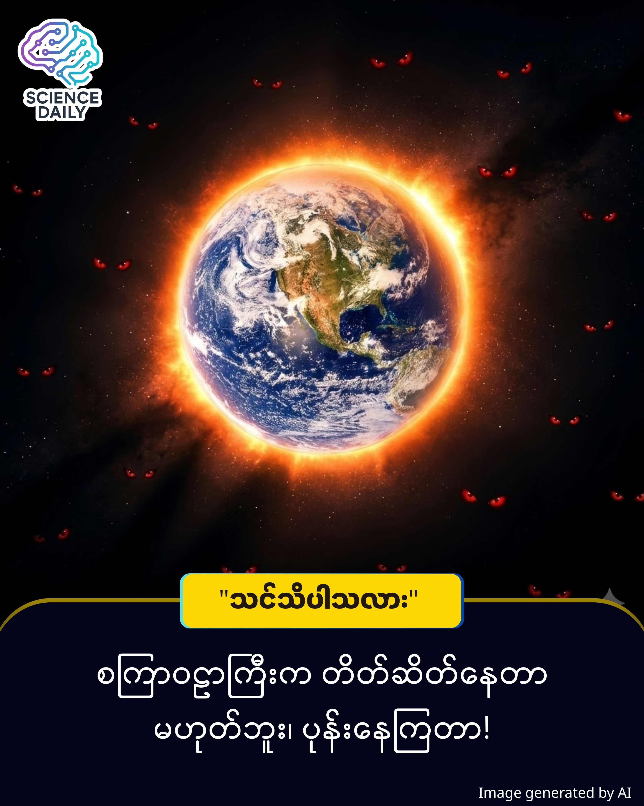

title: စကြာဝဠာကြီးက ဘာလို့ ဒီလောက် တိတ်ဆိတ်နေတာလဲ? The Dark Forest Theory အကြောင်း
summary: ကြယ်တွေစုံနေတဲ့ ညဉ့်ကောင်းကင်ယံကို ကြည့်လိုက်တဲ့အခါ သင် ဘာခံစားရလဲ? "လှလိုက်တာ" လို့ တွေးမိသလား၊ ဒါမှမဟုတ် "ငြိမ်းချမ်းလိုက်တာ" လို့ ခံစားရသလား။ 
Date: 2026-01-10
Image: images/The Dark Forest Theory.jpg

စကြာဝဠာကြီးက ဘာလို့ ဒီလောက် တိတ်ဆိတ်နေတာလဲ? The Dark Forest Theory အကြောင်း

မိတ်ဆွေ... ညဘက် မှာ ကောင်းကင်ကြီးကို မော့ကြည့်ဖူးလား?

ကြယ်တွေစုံနေတဲ့ ညဉ့်ကောင်းကင်ယံကို ကြည့်လိုက်တဲ့အခါ သင် ဘာခံစားရလဲ? "လှလိုက်တာ" လို့ တွေးမိသလား၊ ဒါမှမဟုတ် "ငြိမ်းချမ်းလိုက်တာ" လို့ ခံစားရသလား။ တကယ်တော့ အဲ့ဒီ "တိတ်ဆိတ်ငြိမ်သက်နေမှု" က ငြိမ်းချမ်းခြင်းကြောင့် မဟုတ်ဘဲ "ကြောက်လန့်ခြင်း" ကြောင့် ဖြစ်နေခဲ့ရင်ကော…

ကျွန်တော်တို့ ငယ်ငယ်ကတည်းက မေးလာခဲ့တဲ့ မေးခွန်းတစ်ခုရှိတယ်— "ဒီစကြာဝဠာကြီးထဲမှာ ငါတို့အပြင် တခြားသက်ရှိတွေ (Aliens) ရှိနေမလား?" ဆိုတဲ့ မေးခွန်း ပါ။

သိပ္ပံပညာရှင်တွေ တွက်ချက်ထားချက်အရ ဒီစကြာဝဠာကြီးထဲမှာ ကမ္ဘာလိုဂြိုဟ်မျိုး သန်းပေါင်းများစွာ ရှိနေပါတယ်။ ဒါဆိုရင်... ဘာလို့ ဒီအချိန်ထိ ဘယ်သူမှ ကျွန်တော်တို့ကို လာမဆက်သွယ်ကြတာလဲ? ဘာလို့ အာကာသကြီးက ဒီလောက် တိတ်ဆိတ်နေတာလဲ?

ဒီမေးခွန်းအတွက် အဖြေကတော့ The Dark Forest Theory (အမှောင်ထုတောအုပ် သီအိုရီ) ပါပဲ။

🌲 စိတ်ကူးကြည့်ပါ... (The Imagine This Section)
မိတ်ဆွေကို ဥပမာလေးတစ်ခု ပေးပါရစေ။

ညဘက် အလွန်မှောင်မဲနေတဲ့ တောအုပ်ကြီးတစ်ခုထဲမှာ သင်တစ်ယောက်တည်း ရှိနေတယ်လို့ မြင်ယောင်ကြည့်ပါ။ သင်ဟာ တောကောင်ရိုင်းတွေကို ရှာဖွေနေတဲ့ "မုဆိုး" (Hunter) တစ်ယောက်ပါ။ ဒါပေမဲ့ ပြဿနာက... ဒီတောအုပ်ထဲမှာ သင်တစ်ယောက်တည်း ရှိနေတာ ဟုတ်၊ မဟုတ် သင်မသိပါဘူး။ တခြား မုဆိုးတွေ၊ ဒါမှမဟုတ် သင့်ထက်အစွမ်းထက်တဲ့ သားရဲတွေ ရှိနေနိုင်ပါတယ်။

ဒီတော့ သင်ဘာလုပ်မလဲ? မီးပုံကြီးဖိုပြီး "ဟေး... ငါဒီမှာရှိတယ်" လို့ အော်ဟစ်မလား? လုံးဝမလုပ်ပါဘူးနော်။ အဲ့လိုလုပ်လိုက်တာနဲ့ အမှောင်ထဲက တခြားသတ္တဝါတွေက သင့်ကို အန္တရာယ်ပြုဖို့ ရောက်လာပါလိမ့်မယ်။

ဒါကြောင့် အကောင်းဆုံး နည်းလမ်းကတော့— "အသက်ရှုသံတောင် မကြားရအောင် ငြိမ်နေခြင်း" ပါပဲ။ ခြေသံလုံလုံနဲ့ ပုန်းလျှိုးကွယ်လျှိုး သွားနေရပါမယ်။ အကယ်၍ တောထဲမှာ တခြားသက်ရှိတစ်ခုခု (ဥပမာ- တခြားမုဆိုးတစ်ယောက်) ကို တွေ့လိုက်ရပြီ ဆိုပါစို့။ သူက မိတ်ဆွေလား ရန်သူလား သင်မသိနိုင်ပါဘူး။ အန္တရာယ်မဖြစ်ခင် သူ့ကို အရင်ရှင်းပစ်မလား၊ ဒါမှမဟုတ် ကိုယ်မှန်းမသိအောင် ဆက်ပုန်းနေမလား?

ဒါဟာ စကြာဝဠာထဲက ဂြိုဟ်သားတွေရဲ့ အခြေအနေပါပဲ။

🔬 သိပ္ပံပညာရပ်ရှုထောင့် (The Scientific View)
ဒီသီအိုရီကို တရုတ် သိပ္ပံစာရေးဆရာကြီး Liu Cixin က သူ့ရဲ့ နာမည်ကျော် "The Three-Body Problem" ဝတ္ထုတွဲမှာ မိတ်ဆက်ခဲ့တာ ဖြစ်ပါတယ်။ ဒါဟာ Fermi Paradox (ဖာမီ၏ ပဟေဠိ - ဂြိုဟ်သားတွေ ရှိသင့်လျက်နဲ့ ဘာလို့မတွေ့ရတာလဲ ဆိုတဲ့ မေးခွန်း) ကို ဖြေရှင်းပေးမယ့် အကြမ်းတမ်းဆုံး အဖြေတစ်ခု ဖြစ်လာပါတယ်။

ဒီသီအိုရီရဲ့ အခြေခံ သဘောတရား (Axioms) နှစ်ခုကတော့ -

Survival is the primary need: သက်ရှိအဖွဲ့အစည်းတိုင်းအတွက် "အသက်ရှင်ရပ်တည်ရေး" ဟာ ပထမဆုံး လိုအပ်ချက် ဖြစ်တယ်။

Resources are finite: စကြာဝဠာကြီးက ကျယ်ပေမယ့် သယံဇာတနဲ့ နေစရာနေရာတွေက အကန့်အသတ်ရှိတယ်။

ဒီအချက်နှစ်ချက် ပေါင်းလိုက်တဲ့အခါ... အဆင့်မြင့် ဂြိုဟ်သား ယဉ်ကျေးမှုအဖွဲ့အစည်းတွေဟာ တခြားသူတွေကို "ရန်သူ" လို့ပဲ သတ်မှတ်ကြပါတယ်။ သူတို့ဟာ ကိုယ့်ထက်သာတဲ့ နည်းပညာတွေနဲ့ ငါတို့ကို လာတိုက်ခိုက်မလားဆိုတာ မသိနိုင်တဲ့အတွက်၊ သူတို့မတွေ့ခင် ကိုယ်က အရင်ပုန်းနေတာ (သို့မဟုတ်) တွေ့တာနဲ့ အရင်ဖျက်ဆီးပစ်တာက အလုံခြုံဆုံးပါပဲ။

ဒါကြောင့် စကြာဝဠာကြီး တိတ်ဆိတ်နေတာဟာ သက်ရှိမရှိလို့ မဟုတ်ပါဘူး။ "ရှိနေကြပေမယ့် အသံထွက်လိုက်တာနဲ့ အသတ်ခံရမယ်ဆိုတာ သိနေကြလို့ တိတ်နေကြတာ" ဖြစ်နိုင်ပါတယ်။

The Philosophical View

ဒီနေရာမှာ ကျွန်တော်တို့ လူသားတွေအတွက် တွေးစရာတစ်ခု ပေါ်လာပါတယ်။

လူသားတွေကတော့ ဆန့်ကျင်ဘက်ပါပဲ။ ကျွန်တော်တို့ဟာ နှစ်ပေါင်းများစွာကြာအောင် ကမ္ဘာမြေပြင်ကနေ ရေဒီယိုလှိုင်းတွေ လွှင့်ထုတ်ပြီး "ဟေး... ငါတို့ ဒီမှာရှိတယ်၊ ငါတို့ကို လာရှာကြပါ" လို့ စကြာဝဠာကြီးကို အော်ဟစ်နေခဲ့ကြတာပါ။ (Voyager ယာဉ်တွေ လွှတ်တင်ခဲ့တာကို မှတ်မိကြဦးမှာပါ)။

Dark Forest Theory သာ မှန်ခဲ့မယ်ဆိုရင်... ကျွန်တော်တို့ လုပ်ရပ်က "မှောင်မဲနေတဲ့ တောအုပ်ကြီးထဲမှာ မီးပုံဖိုပြီး ကခုန်နေတဲ့ ကလေးလေး" နဲ့ တူနေမှာပါ။ အမှောင်ထဲက မျက်လုံးပေါင်းများစွာက ကျွန်တော်တို့ကို ကြည့်ပြီး ဘာလုပ်ရမလဲ စဉ်းစားနေကြလောက်ပြီ။

ဒါဟာ "Chain of Suspicion" (သံသယ သံကြိုးကွင်းဆက်) လို့ ခေါ်ပါတယ်။ "သူက ငါ့ကို ဒုက္ခပေးမလား? ငါက သူ့ကို ဒုက္ခမပေးဘူးဆိုတာ သူယုံပါ့မလား? သူ ငါ့ကို မယုံဘူးလို့ ငါထင်နေတာကို သူကရော သိနေမလား?" ဒီလို အဆုံးမရှိတဲ့ သံသယတွေကြောင့် နောက်ဆုံးမှာတော့ "တိုက်ခိုက်ခြင်း" ကသာ အဖြေဖြစ်သွားတတ်ပါတယ်။

🌟 နိဂုံး (Conclusion)

မိတ်ဆွေ... ဒီသီအိုရီက ကြောက်စရာကောင်းပေမယ့်၊ တစ်ဖက်မှာလည်း ကျွန်တော်တို့ လူသားတွေရဲ့ "အပြစ်ကင်းစင်မှု" နဲ့ "စူးစမ်းလိုစိတ်" ကို ဖော်ပြနေပါတယ်။

ကျွန်တော်တို့ဟာ ကြောက်ရွံ့ခြင်းထက် သိချင်စိတ်ကို ဦးစားပေးတဲ့ မျိုးစိတ်တစ်ခုပါ။ အမှောင်ထုကြီးက ကြောက်စရာ ကောင်းပေမယ့်၊ အဲ့ဒီအမှောင်ထုထဲမှာ မိတ်ဆွေစစ်တွေ ရှိမနေဘူးလို့ ဘယ်သူပြောနိုင်မှာလဲ?

လောလောဆယ်တော့ ညဘက် ကောင်းကင်ကြီးကို မော့ကြည့်တဲ့အခါ... အရင်လို အလှအပ သက်သက် မဟုတ်ဘဲ၊ နက်နဲတဲ့ လျှို့ဝှက်ချက်တွေနဲ့ ပြည့်နှက်နေတဲ့ "တောအုပ်ကြီး" တစ်ခုအဖြစ် ခံစားကြည့်လိုက်ပါ။

ငြိမ်သက်ခြင်းက အမြဲတမ်း ငြိမ်းချမ်းခြင်း မဟုတ်ပါဘူး။ ဒါပေမဲ့ ကျွန်တော်တို့ကတော့ အဲ့ဒီ တိတ်ဆိတ်ခြင်းကို ဖောက်ထွက်ပြီး အဖြေရှာမယ့် လူသားတွေ မဟုတ်လား...။

SOURCES REFERENCE

Liu Cixin: "The Three-Body Problem" & "The Dark Forest" (Book Series) - Originator of the Dark Forest metaphor.
Enrico Fermi: "Fermi Paradox" - The foundational question asking why we haven't found aliens yet.

#DarkForestTheory #MyanmarTech #Philosophy #SpaceScience #Aliens #FermiParadox #KnowledgeSharing #VisionaryStoryteller #Myanmar

