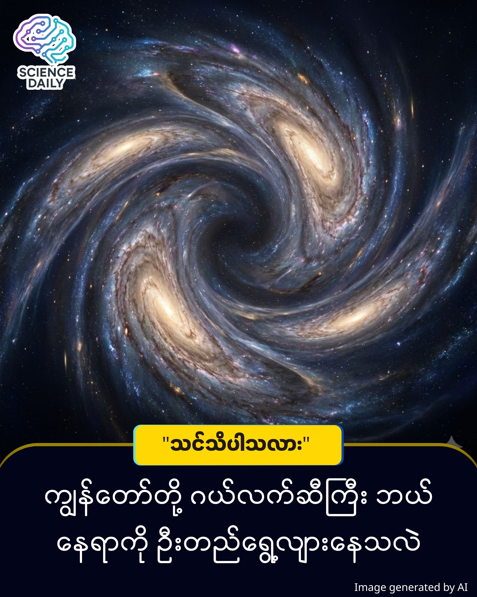

title: စကြဝဠာထဲက လှို့ဝှက်သော ဆွဲငင်အားရှင် (သို့မဟုတ်) The Great Attractor
summary: မိတ်ဆွေ... ကျွန်တော်တို့ နေထိုင်ရာ ကမ္ဘာကြီးက နေကို ဗဟိုပြုပြီး လှည့်ပတ်နေတယ်ဆိုတာ အားလုံးသိကြပြီးသားပါ။ ဒါပေမဲ့ ကျွန်တော်တို့ရဲ့ နေအဖွဲ့အစည်း (Solar System) အပါအဝင် ကြီးမားလှတဲ့ နဂါးငွေ့တန်း ဂယ်လက်ဆီ (Milky Way Galaxy) ကြီးတစ်ခုလုံးကလည်း
Date: 2026-01-28
Image: images/The Great Attractor.jpg

စကြဝဠာထဲက လှို့ဝှက်သော ဆွဲငင်အားရှင် (သို့မဟုတ်) The Great Attractor

မိတ်ဆွေ... ကျွန်တော်တို့ နေထိုင်ရာ ကမ္ဘာကြီးက နေကို ဗဟိုပြုပြီး လှည့်ပတ်နေတယ်ဆိုတာ အားလုံးသိကြပြီးသားပါ။ ဒါပေမဲ့ ကျွန်တော်တို့ရဲ့ နေအဖွဲ့အစည်း (Solar System) အပါအဝင် ကြီးမားလှတဲ့ နဂါးငွေ့တန်း ဂယ်လက်ဆီ (Milky Way Galaxy) ကြီးတစ်ခုလုံးကလည်း တစ်နေရာရာဆီကို အရှိန်အဟုန်ပြင်းပြင်းနဲ့ ဦးတည်ရွေ့လျားနေတယ်ဆိုတာကို မိတ်ဆွေ သတိထားမိပါရဲ့လား။

အာကာသသိပ္ပံပညာရပ်မှာ "The Great Attractor" လို့ခေါ်တဲ့ "မဟာဆွဲငင်အားကြီး" ဟာ စကြဝဠာရဲ့ အကြီးမားဆုံး ပဟေဠိတစ်ခု ဖြစ်ပါတယ်။ ဒီဆောင်းပါးမှာ ကျွန်တော်က ဒီအရာဝတ္ထုကြီးအကြောင်းကို သိပ္ပံနည်းကျ အချက်အလက်တွေနဲ့ ရိုးရှင်းစွာ ရှင်းပြပေးသွားပါမယ်။

ကျွန်တော်တို့ ဘယ်ကို သွားနေကြတာလဲ

    
နက္ခတ္တဗေဒပညာရှင်တွေ လေ့လာတွေ့ရှိချက်အရ ကျွန်တော်တို့ရဲ့ ဂယ်လက်ဆီဟာ တစ်စက္ကန့်ကို ကီလိုမီတာ ၆၀၀ (တစ်နာရီကို မိုင်ပေါင်း ၁.၃ သန်းခန့်) နှုန်းနဲ့ အာကာသဟင်းလင်းပြင်ထဲမှာ ရွေ့လျားနေပါတယ်။ ဒီလောက် မြန်ဆန်တဲ့နှုန်းနဲ့ ကျွန်တော်တို့ကို ဆွဲယူနေတဲ့အရာက ဘာလဲဆိုတာ မေးခွန်းထုတ်စရာ ဖြစ်လာပါတယ်။

အဖြေကတော့ ကျွန်တော်တို့ ကမ္ဘာကနေ အလင်းနှစ် (Light Years) သန်းပေါင်း ၁၅၀ မှ ၂၅၀ ကြား အကွာအဝေးမှာရှိတဲ့ "The Great Attractor" ပဲဖြစ်ပါတယ်။ ဒါဟာ သာမန် တွင်းနက် (Black Hole) တစ်ခု မဟုတ်ပါဘူး။ တွင်းနက်ပေါင်းများစွာ၊ ဂယ်လက်ဆီပေါင်းများစွာ စုဝေးနေတဲ့ ဒြပ်ထုကြီး (Mass Concentration) တစ်ခုဖြစ်ပြီး သူ့ရဲ့ ဆွဲငင်အားက အဆမတန် ကြီးမားလွန်းတာကြောင့် ကျွန်တော်တို့ အပါအဝင် အနီးနားက ဂယ်လက်ဆီထောင်ပေါင်းများစွာကို သံလိုက်တုံးကြီးသဖွယ် ဆွဲယူနေခြင်း ဖြစ်ပါတယ်။

ဘာကြောင့် သူ့ကို ရှင်းရှင်းလင်းလင်း မမြင်ရတာလဲ

ဒီနေရာမှာ မိတ်ဆွေ စဉ်းစားစရာရှိတာက "ဒီလောက်ကြီးမားတဲ့ အရာကြီးကို ဘာကြောင့် ကျွန်တော်တို့ ကောင်းကောင်း မမြင်ရတာလဲ" ဆိုတဲ့ မေးခွန်းပါ။ အကြောင်းရင်းကတော့ The Great Attractor ဟာ ကျွန်တော်တို့ ဂယ်လက်ဆီရဲ့ "Zone of Avoidance" လို့ခေါ်တဲ့ နေရာမှာ ရှိနေလို့ပါပဲ။

ရိုးရိုးရှင်းရှင်း ပြောရရင် ကျွန်တော်တို့ ဂယ်လက်ဆီထဲမှာရှိတဲ့ ထူထပ်လှတဲ့ ဓာတ်ငွေ့တွေ၊ ဖုန်မှုန့်တွေနဲ့ ကြယ်တွေက ဒီ "မဟာဆွဲငင်အားကြီး" ကို ကွယ်ထားသလို ဖြစ်နေပါတယ်။ ဒါဟာ ကိုယ့်အိမ်ရှေ့က သစ်ပင်အုပ်ကြောင့် ဟိုဘက်လမ်းမကြီးကို မမြင်ရသလိုမျိုးပါပဲ။ ဒါကြောင့် သိပ္ပံပညာရှင်တွေဟာ သာမန် မှန်ပြောင်းတွေအစား ရေဒီယိုလှိုင်းတွေ၊ X-rays တွေကို အသုံးပြုပြီး ဒီနေရာကို လေ့လာခဲ့ရပါတယ်။

Laniakea ဆိုတဲ့ ကြီးမားသော အိမ်

နောက်ဆုံးပေါ် လေ့လာတွေ့ရှိချက်တွေအရ The Great Attractor ဟာ Laniakea Supercluster (လာနီယာကီယာ စူပါကလပ်စတာ) လို့ခေါ်တဲ့ ဂယ်လက်ဆီ အစုအဝေးကြီးရဲ့ ဗဟိုချက်မနားမှာ ရှိနေနိုင်ပါတယ်။ ကျွန်တော်တို့အားလုံးဟာ မြစ်ရေစီးကြောင်းတစ်ခုလို ဒီဆွဲငင်အား ဗဟိုချက်ဆီကို ဖြည်းဖြည်းချင်း စီးဆင်းနေကြတာပါ။

နိဂုံးချုပ်အနေနဲ့ ပြောရရင် 

The Great Attractor ဆိုတာ စကြဝဠာရဲ့ သဘာဝ တည်ဆောက်ပုံတစ်ခုမျှသာ ဖြစ်ပါတယ်။ ဒါက ကျွန်တော်တို့ကို ချက်ချင်းကြီး ဝါးမျိုးပစ်မယ့် အန္တရာယ်တစ်ခု မဟုတ်ပါဘူး။ ဒါပေမဲ့ ဒီအရာက ကျွန်တော်တို့ လူသားတွေရဲ့ အသိပညာဟာ ဒီစကြဝဠာကြီးနဲ့ ယှဉ်လိုက်ရင် ဘယ်လောက်သေးငယ်နေသေးလဲ ဆိုတာကို သတိပေးနေတဲ့ ပြယုဂ်တစ်ခုပဲ ဖြစ်ကြောင်း ကျွန်တော် သုံးသပ်တင်ပြလိုက်ရပါတယ်။

"The Great Attractor" (မဟာဆွဲငင်အားရှင်) သည် ဒဏ္ဍာရီတစ်ခု မဟုတ်ဘဲ NASA (အမေရိကန် အမျိုးသား လေကြောင်းနှင့် အာကာသ အုပ်ချုပ်မှုအဖွဲ့) နှင့် ESA (ဥရောပ အာကာသ အေဂျင်စီ) ကဲ့သို့သော ကမ္ဘာ့ထိပ်တန်း အာကာသသိပ္ပံ အဖွဲ့အစည်းများက တရားဝင် အသိအမှတ်ပြု လက်ခံထားသည့် သိပ္ပံဖြစ်ရပ်မှန် တစ်ခုဖြစ်ပါသည်။ ဤတွေ့ရှိချက်ကို ၁၉၈၀ ပြည့်လွန်နှစ်များကတည်းက စတင်အတည်ပြုခဲ့ပြီး၊ ၂၀၁၄ ခုနှစ်တွင် ကမ္ဘာကျော်သိပ္ပံဂျာနယ် Nature ၌ ဖော်ပြခဲ့သော "The Laniakea Supercluster of Galaxies" သုတေသနစာတမ်းတွင် ၎င်း၏ တည်ရှိပုံနှင့် ဂယ်လက်ဆီများအပေါ် သက်ရောက်မှုကို ခိုင်မာသော အထောက်အထားများဖြင့် အတိအကျ ဖော်ပြထားပြီး ဖြစ်ပါသည်။

#TheGreatAttractor #Cosmology #AstronomyMyanmar #SpaceScience #KnowledgeSharing #BurmeseArticles #UniverseMysteries
