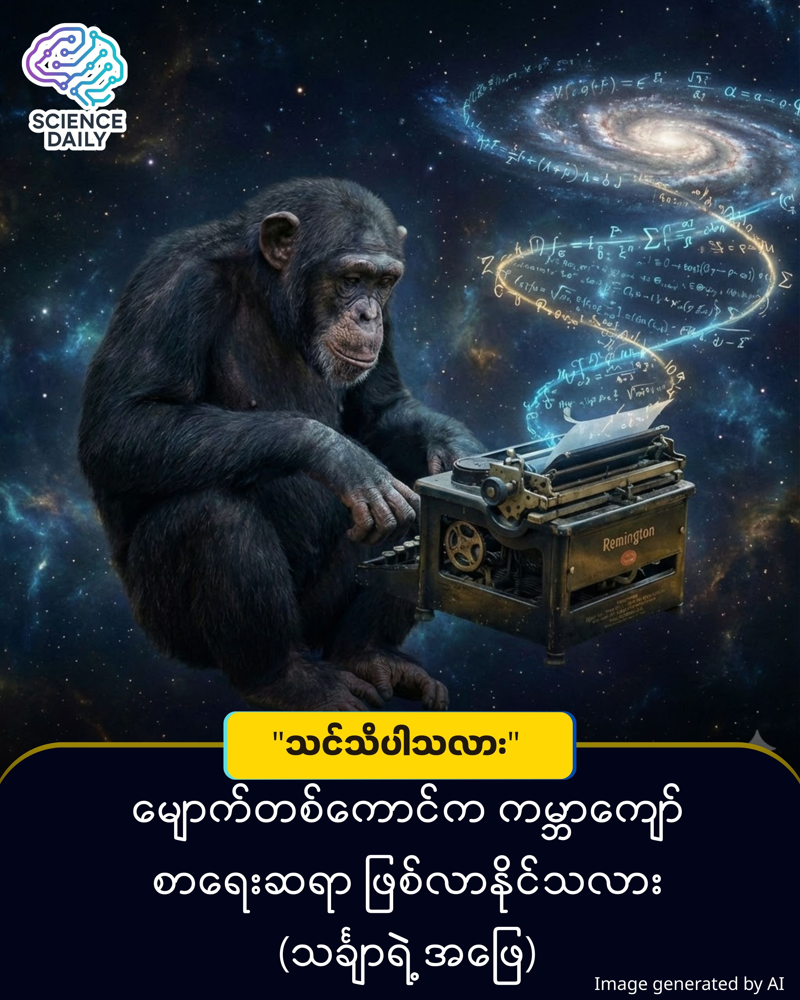

title: အနန္တ၊ မျောက်တစ်ကောင်နှင့် ရှိတ်စပီးယား - သင်္ချာ၏ ရူးသွပ်ဖွယ် အံ့မခန်း ဖြစ်တန်စွမ်း
summary: မိတ်ဆွေ... စိတ်ကူးယဉ်ကြည့်လိုက်ပါ။ စာရိုက်စက် (Typewriter) တစ်လုံးရဲ့ ရှေ့မှာထိုင်နေတဲ့ မျောက်တစ်ကောင် ရှိတယ်ဆိုပါစို့။ သူက စာလုံးတွေကို နားလည်လို့ ရိုက်နေတာ မဟုတ်ဘူး။
Date: 2026-01-20
Image: images/The Infinite Monkey Theorem.jpg

အနန္တ၊ မျောက်တစ်ကောင်နှင့် ရှိတ်စပီးယား - သင်္ချာ၏ ရူးသွပ်ဖွယ် အံ့မခန်း ဖြစ်တန်စွမ်း

မိတ်ဆွေ... စိတ်ကူးယဉ်ကြည့်လိုက်ပါ။ စာရိုက်စက် (Typewriter) တစ်လုံးရဲ့ ရှေ့မှာထိုင်နေတဲ့ မျောက်တစ်ကောင် ရှိတယ်ဆိုပါစို့။ သူက စာလုံးတွေကို နားလည်လို့ ရိုက်နေတာ မဟုတ်ဘူး။ ခလုတ်တွေကို "တောက်... တောက်... တောက်" နဲ့ ကျပန်း (Random) လျှောက်နှိပ်နေတာပါ။

ဒီမြင်ကွင်းက ရယ်စရာကောင်းနေနိုင်ပါတယ်။ ဒါပေမဲ့ သင်္ချာပညာရှင်တွေနဲ့ ဒဿနပညာရှင်တွေကတော့ ဒီအခြေအနေကို စကြဝဠာရဲ့ အနက်ရှိုင်းဆုံး မေးခွန်းတစ်ခုအဖြစ် ရှုမြင်ကြပါတယ်။ အဲဒါကတော့ "Infinite Monkey Theorem" ပါပဲ။

အဆိုပြုချက်က ရိုးရှင်းပေမဲ့ ရင်သပ်ရှုမောဖွယ် ကောင်းပါတယ် - "အကယ်၍ မျောက်တစ်ကောင်ဟာ အချိန်အကန့်အသတ်မရှိ (Infinite Time) ခလုတ်တွေကို လျှောက်နှိပ်နေမယ်ဆိုရင် တချိန်ချိန်မှာ ဝီလျံရှိတ်စပီးယားရဲ့ 'Hamlet' ပြဇာတ်ကြီး တစ်ခုလုံးကို အတိအကျ ရိုက်နှိပ်မိသွားပါလိမ့်မယ်။"

ဒါဟာ လက်တွေ့ဖြစ်နိုင်ပါ့မလား။ ဒါမှမဟုတ် သင်္ချာသဘောတရား သက်သက်ပဲလား။ သိပ္ပံပညာရဲ့ မျက်လုံးနဲ့ ကြည့်ကြရအောင်။

ဖြစ်တန်စွမ်း၏ ကစားပွဲ (The Game of Probability)

ဒီသီအိုရီရဲ့ အဓိက သော့ချက်က "အနန္တ (Infinity)" ဆိုတဲ့ သဘောတရားပါပဲ။

အင်္ဂလိပ် အက္ခရာ ၂၆ လုံးရှိတဲ့ ကီးဘုတ်တစ်ခုမှာ ပထမ စာလုံး "t" ကို ရိုက်မိဖို့ ဖြစ်နိုင်ခြေက ၂၆ ပုံ ၁ ပုံ ရှိပါတယ်။ ဒါပေမဲ့ "to" ဆိုတဲ့ စာလုံးဖြစ်လာဖို့ကျတော့ (၂၆ x ၂၆) = ၆၇၆ ပုံ ၁ ပုံ ဖြစ်သွားပါပြီ။ စာလုံးရေ သိန်းချီပါတဲ့ 'Hamlet' ပြဇာတ်တစ်ခုလုံး ဖြစ်လာဖို့ဆိုတာကတော့ သင်္ချာအရ Non-zero probability (လုံးဝ မဖြစ်နိုင်တာ မဟုတ်) ဖြစ်ပေမဲ့ ဖြစ်နိုင်ခြေ သုညနီးပါး သေးငယ်လွန်းလှပါတယ်။

ဒါပေမဲ့ ဒီနေရာမှာ "အနန္တအချိန်" ဆိုတဲ့ မှော်ဆရာ ဝင်လာပါတယ်။ သင်္ချာသဘောတရားအရ အချိန်က အကန့်အသတ်မရှိ ရှည်ကြာမယ်ဆိုရင်၊ ဖြစ်တန်စွမ်း သေးငယ်လွန်းတဲ့ အရာတစ်ခုဟာ နောက်ဆုံးမှာ "မဖြစ်မနေ ဖြစ်လာရမယ့်အရာ (Certainty)" အဖြစ် ပြောင်းလဲသွားပါတယ်။

သိပ္ပံနည်းကျ အချက်အလက်များကို ရှင်းလင်းခြင်း (Clarifying the Science)

ဒီနေရာမှာ အထင်အမြင်လွဲမှားမှုတစ်ခုကို ရှင်းလင်းဖို့ လိုပါတယ်။

သင်္ချာသဘောတရားအရ ဖြစ်နိုင်တယ်ဆိုပေမဲ့၊ ရူပဗေဒ (Physics) အရတော့ မဖြစ်နိုင်ပါဘူး။ ဘာကြောင့်လဲဆိုတော့ ကျွန်တော်တို့ရဲ့ စကြဝဠာမှာ သက်တမ်းတစ်ခု ရှိနေလို့ပါပဲ။ သိပ္ပံပညာရှင်တွေ တွက်ချက်ထားချက်အရ မျောက်တစ်ကောင်က 'Hamlet' ကို အောင်မြင်စွာ ရိုက်နှိပ်နိုင်ဖို့ ကြာမယ့်အချိန်ဟာ လက်ရှိ စကြဝဠာသက်တမ်း (Age of the Universe) ထက် အဆပေါင်းများစွာ ပိုကြာပါလိမ့်မယ်။ စကြဝဠာကြီး အေးခဲပျက်သုဉ်းသွားချိန် (Heat Death) ရောက်တဲ့အထိ စောင့်ရင်တောင် မျောက်က ရိုက်လို့ ပြီးချင်မှ ပြီးပါလိမ့်မယ်။

ဒဿနနှင့် နည်းပညာ ရှုထောင့်

ဒီ "Infinite Monkey" သီအိုရီက ကျွန်တော်တို့ကို ဘာသင်ပေးသလဲ။ 

၁။ ကျပန်းသဘောတရား (Randomness): စနစ်တကျ စီစဉ်မှုမရှိဘဲ ကျပန်းလုပ်ဆောင်မှုတွေထဲကနေ အဓိပ္ပာယ်ရှိတဲ့ အရာတစ်ခု ထွက်လာနိုင်သလားဆိုတာကို မေးခွန်းထုတ်ပါတယ်။ (ဥပမာ - AI တွေက Data အများကြီးကနေ Pattern တွေ ရှာဖွေသလိုပါပဲ)။ 

၂။ အချိန်၏ တန်ခိုး: အချိန်သာ အကန့်အသတ်မရှိခဲ့ရင် ဘယ်အရာမဆို ဖြစ်လာနိုင်တယ်ဆိုတဲ့ သဘောတရားကို မီးမောင်းထိုးပြနေပါတယ်။

နိဂုံး

မျောက်တစ်ကောင်က ရှိတ်စပီးယား ဖြစ်လာဖို့ဆိုတာ လက်တွေ့မှာ မဖြစ်နိုင်ပေမဲ့၊ ဒီသီအိုရီက ကျွန်တော်တို့ကို နှိမ့်ချတတ်ဖို့ သင်ပေးပါတယ်။ အတိုင်းအဆမရှိ ကျယ်ပြောလှသော (သင်္ချာရေပြင်ကျယ်ကြီး) ထဲမှာ "မဖြစ်နိုင်ဘူး" ဆိုတဲ့အရာ မရှိသလောက်ပါပဲ။ ကွာခြားချက်ကတော့... ကျွန်တော်တို့မှာ စောင့်ဆိုင်းဖို့ အချိန်လုံလောက်သလား ဆိုတာပါပဲ။

ဤအကြောင်းအရာသည် သီးခြား သိပ္ပံအဖွဲ့အစည်းတစ်ခုက "ကြေညာချက်" ထုတ်ပြန်ထားခြင်းမျိုး မဟုတ်ဘဲ၊ သင်္ချာလောက၏ အခိုင်အမာ လက်ခံထားသော သီအိုရီတစ်ခု ဖြစ်သည်။ ၁၉၁၃ ခုနှစ်တွင် ပြင်သစ်သင်္ချာပညာရှင် Émile Borel က သူ၏ ဆောင်းပါး "Mécanique Statistique et Irréversibilité" တွင် စတင်မိတ်ဆက်ခဲ့ခြင်း ဖြစ်သည်။ ယနေ့ခေတ်တွင် ၎င်းကို ဖြစ်တန်စွမ်း သီအိုရီ (Probability Theory) ၏ အရေးပါသော အစိတ်အပိုင်းတစ်ခုအဖြစ် ကမ္ဘာတစ်ဝန်းရှိ တက္ကသိုလ်များနှင့် သင်္ချာပညာရှင်များက တရားဝင် လက်ခံအသုံးပြုလျက် ရှိပါသည်။

နားလည်ရန် လိုအပ်သော အခြေခံသဘောတရား ဤသီအိုရီကို လွယ်ကူစွာ နားလည်နိုင်ရန် "ဖြစ်တန်စွမ်း (Probability)" နှင့် "အနန္တ (Infinity)" သဘောတရား နှစ်ခုကို အကြမ်းဖျင်း သိထားလျှင် လုံလောက်ပါသည်။

SHORT SOURCES REFERENCE
Core Concept: Probability Theory & The Law of Large Numbers.
Reference Theorem: The Infinite Monkey Theorem (Émile Borel, 1913).

#InfiniteMonkeyTheorem #ScienceBurmese #ProbabilityTheory #VisionaryStoryteller #PhilosophyOfMath #BurmeseTech #KnowledgeSharing #ThoughtExperiment

