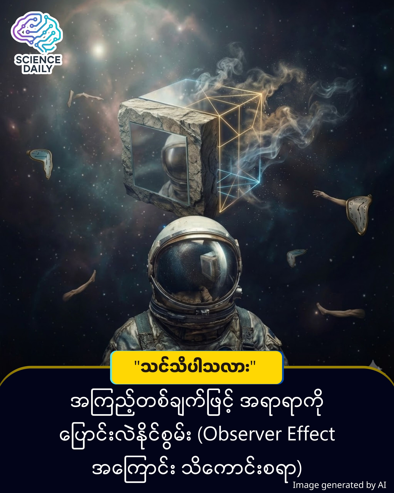

title: ကြည့်ရှုသူရှိနေမှ ဖြစ်တည်လာသော အမှန်တရား (သို့မဟုတ်) The Observer Effect ၏ လှို့ဝှက်ဆန်းကြယ်မှု
summary: အိုင်းစတိုင်း (Albert Einstein) က တစ်ခါက ဒီလို မေးခွန်းထုတ်ခဲ့ဖူးပါတယ်။ "ငါတို့ မကြည့်နေတဲ့အချိန်မှာ လမင်းကြီးက ကောင်းကင်ပေါ်မှာ တကယ်ရှိနေရဲ့လား" တဲ့။
Date: 2026-01-08
Image: images/The Observer Effect.jpg

ကြည့်ရှုသူရှိနေမှ ဖြစ်တည်လာသော အမှန်တရား (သို့မဟုတ်) The Observer Effect ၏ လှို့ဝှက်ဆန်းကြယ်မှု

အိုင်းစတိုင်း (Albert Einstein) က တစ်ခါက ဒီလို မေးခွန်းထုတ်ခဲ့ဖူးပါတယ်။ "ငါတို့ မကြည့်နေတဲ့အချိန်မှာ လမင်းကြီးက ကောင်းကင်ပေါ်မှာ တကယ်ရှိနေရဲ့လား" တဲ့။ ဒီမေးခွန်းဟာ ရူးသွပ်နေတဲ့ မေးခွန်းတစ်ခုလို ထင်ရပေမယ့် ကွမ်တမ်ရူပဗေဒ (Quantum Physics) ရဲ့ ကမ္ဘာမှာတော့ ဒါဟာ အခရာကျတဲ့ မေးခွန်းတစ်ခု ဖြစ်နေပါတယ်။

ဒီနေ့မှာတော့ ကျွန်တော်တို့ဟာ သိပ္ပံပညာရဲ့ အထူးဆန်းဆုံး ဖြစ်ရပ်မှန်တစ်ခုဖြစ်တဲ့ "The Observer Effect" အကြောင်းကို ခရီးနှင်ကြပါမယ်။

အရာအားလုံးဟာ ၁၈၀၁ ခုနှစ်လောက်က Thomas Young ပြုလုပ်ခဲ့တဲ့ Double-Slit Experiment (အပေါက်ငယ်နှစ်ခု စမ်းသပ်ချက်) ကနေ စတင်ခဲ့တာပါ။ သိပ္ပံပညာရှင်တွေဟာ အီလက်ထရွန် (Electron) တွေကို အပေါက်ငယ်နှစ်ခုကနေ ပစ်လွှတ်လိုက်တဲ့အခါ ထူးဆန်းတဲ့အရာကို တွေ့ရှိခဲ့ရပါတယ်။

ဘယ်သူမှ မကြည့်နေတဲ့အချိန်မှာ - အီလက်ထရွန်တွေဟာ "လှိုင်း" (Wave) သဏ္ဍာန် ပြုမူပြီး ဖြစ်နိုင်ချေရှိတဲ့ နေရာအစုံမှာ တပြိုင်နက် ရောက်ရှိနေတတ်ပါတယ်။

စောင့်ကြည့်လိုက်တဲ့အချိန်မှာ - အံ့သြစရာကောင်းလောက်အောင်ပါပဲ... လေ့လာသူ (Observer) တစ်ယောက်က အီလက်ထရွန် ဘယ်အပေါက်ထဲ ဝင်သွားလဲဆိုတာကို အာရုံစိုက် ကြည့်လိုက်တာနဲ့ အီလက်ထရွန်ဟာ ချက်ချင်းဆိုသလို "အမှုန်" (Particle) တစ်ခုအဖြစ် ပြောင်းလဲသွားပြီး ပုံစံတကျ ဖြစ်သွားပါတယ်။

ဒါဟာ ဘာကိုဆိုလိုတာလဲ။ စကြာဝဠာရဲ့ အခြေခံ အစိတ်အပိုင်းတွေဟာ "ငါတို့ကို တစ်ယောက်ယောက် ကြည့်နေတယ်" ဆိုတာကို သိနေသလိုပါပဲ။

သိပ္ပံပညာလား၊ မှော်ပညာလား

ဒါကို နားလည်လွယ်အောင် ပြောရရင်... သင့်အခန်းထဲက ပစ္စည်းတွေဟာ သင်ကြည့်မနေတဲ့အချိန်မှာ ပုံသဏ္ဍာန် အတိအကျမရှိဘဲ တိမ်ဆိုင်တွေလို ဝေဝါးနေပြီး၊ သင်လှည့်ကြည့်လိုက်တဲ့ အခိုက်အတန့်ကျမှ ကုလားထိုင်က ကုလားထိုင်၊ စားပွဲက စားပွဲအဖြစ် ရုပ်လုံးပေါ်လာသလိုပါပဲ။

သိပ္ပံနည်းကျ ရှင်းပြရရင်တော့ "Measurement" (တိုင်းတာခြင်း) ဆိုတဲ့ လုပ်ရပ်က စွမ်းအင်တစ်ခု ဖြစ်ပါတယ်။ အီလက်ထရွန်တစ်ခုကို မြင်ရဖို့အတွက် အလင်း (Photons) တွေနဲ့ ထိတွေ့ရပါတယ်။ ဒီလို ထိတွေ့လိုက်ခြင်းက အီလက်ထရွန်ရဲ့ လမ်းကြောင်းကို ပြောင်းလဲစေတာပါ။ ဒါပေမယ့် ဒီထက်ပိုနက်ရှိုင်းတဲ့ အဓိပ္ပာယ်ကတော့— လေ့လာသူ (Observer) ဟာ ဖြစ်ရပ်တစ်ခုကို အဝေးကနေ ကြည့်ရှုနေသူ သက်သက်မဟုတ်ဘဲ၊ ထိုဖြစ်ရပ်ကို ဖန်တီးသူ (Participant) ဖြစ်နေခြင်းပါပဲ။

The Observer Effect က ကျွန်တော်တို့ကို အရေးကြီးတဲ့ သတင်းစကားတစ်ခု ပါးလိုက်ပါတယ်။ အဲဒါကတော့— အမှန်တရား (Reality) ဆိုတာ ပုံသေမရှိပါဘူး။ သင် ဘယ်လို ရှုမြင်သလဲ၊ သင် ဘယ်လို အာရုံစိုက်သလဲ ဆိုတဲ့အပေါ် မူတည်ပြီး သင့်ဘဝနဲ့ သင့်ပတ်ဝန်းကျင်က ပြောင်းလဲနေတာပါ။

နည်းပညာလောကမှာလည်း ဒီသဘောတရားက မှန်ကန်ပါတယ်။ Facebook တို့၊ Google တို့က ကျွန်တော်တို့ရဲ့ Data တွေကို "စောင့်ကြည့်" (Observe) လိုက်တဲ့အခါ ကျွန်တော်တို့ရဲ့ အွန်လိုင်းအပြုအမူတွေ ပြောင်းလဲသွားကြပါတယ်။ ကွမ်တမ်ကွန်ပျူတာ (Quantum Computer) တွေဟာလည်း ဒီသဘောတရားကို အခြေခံပြီး သမားရိုးကျ ကွန်ပျူတာတွေ မလုပ်နိုင်တဲ့ တွက်ချက်မှုတွေကို လုပ်ဆောင်နေကြပါပြီ။

ကျွန်တော်တို့ဟာ ဧရာမ စကြာဝဠာကြီးထဲက သက်မဲ့ အစိတ်အပိုင်းလေးတွေ မဟုတ်ပါဘူး။ ကျွန်တော်တို့ရဲ့ အကြည့်၊ ကျွန်တော်တို့ရဲ့ အသိစိတ် (Consciousness) ဟာ စကြာဝဠာရဲ့ ဖြစ်တည်မှုကို ပုံဖော်ပေးနေတဲ့ စုတ်တံတွေ ဖြစ်ပါတယ်။

ဒါကြောင့် သတိရပါ။ သင့်ရဲ့ အာရုံစိုက်မှုဟာ စွမ်းအင်တစ်ခုပါ။ သင် ဘယ်အရာကို ကြည့်ရှုပြီး၊ ဘယ်အရာကို အာရုံစိုက်မလဲဆိုတာက သင့်ကမ္ဘာကြီးကို ဖန်တီးပါလိမ့်မယ်။

SHORT SOURCES REFERENCE
Scientific Basis: The Double-Slit Experiment (Thomas Young) & Wave-Particle Duality.
Core Principle: Heisenberg Uncertainty Principle (Werner Heisenberg, 1927).
Interpretation: The Copenhagen Interpretation of Quantum Mechanics (Niels Bohr & Werner Heisenberg).

#TheObserverEffect #QuantumPhysics #ScienceInBurmese #DoubleSlitExperiment #PhilosophyAndTech #FutureThinking #Reality #BurmeseKnowledgeShare
