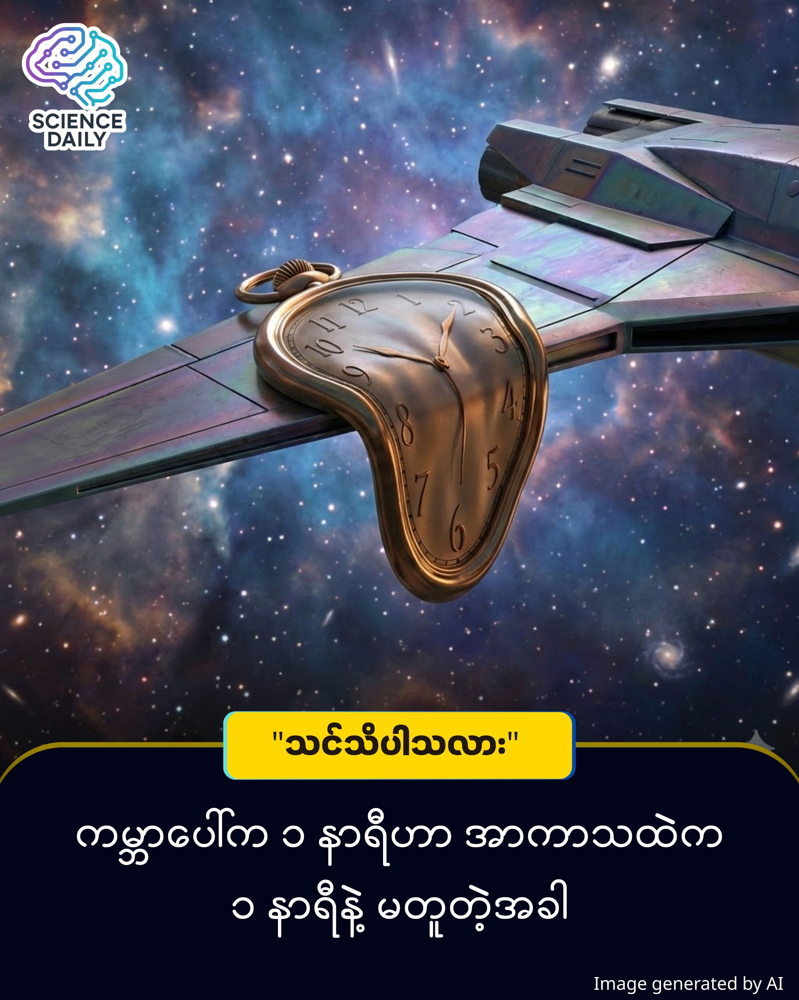

title: အချိန်ဆိုတာ မိတ်ဆွေထင်ထားသလို "ပုံသေ" ဟုတ်ရဲ့လား? (Time Dilation အကြောင်း ရိုးရှင်းစွာ လေ့လာခြင်း) ( အပိုင်း - ၁ )
summary: "တစ်၊ နှစ်၊ သုံး..." စက္ကန့်တံလေး ရွေ့သွားတာကို မြင်ရတယ်မဟုတ်လား။ သင့်ဆီမှာ ကုန်ဆုံးသွားတဲ့ "တစ်စက္ကန့်" ဟာ စကြာဝဠာရဲ့ အခြားတစ်နေရာ၊ ဒါမှမဟုတ် အလင်းအလျင်နဲ့ သွားနေတဲ့ ယာဉ်ပျံပေါ်က "တစ်စက္ကန့်" နဲ့ တူညီတယ်လို့ မိတ်ဆွေ ထင်ပါသလား။
Date: 2026-01-17
Image: images/The Twin Paradox.jpg

အချိန်ဆိုတာ မိတ်ဆွေထင်ထားသလို "ပုံသေ" ဟုတ်ရဲ့လား?
(Time Dilation အကြောင်း ရိုးရှင်းစွာ လေ့လာခြင်း) ( အပိုင်း - ၁ )

မိတ်ဆွေ... သင့်လက်ကောက်ဝတ်က နာရီကို တစ်ချက်လောက် ကြည့်လိုက်ပါ။

"တစ်၊ နှစ်၊ သုံး..." စက္ကန့်တံလေး ရွေ့သွားတာကို မြင်ရတယ်မဟုတ်လား။ သင့်ဆီမှာ ကုန်ဆုံးသွားတဲ့ "တစ်စက္ကန့်" ဟာ စကြာဝဠာရဲ့ အခြားတစ်နေရာ၊ ဒါမှမဟုတ် အလင်းအလျင်နဲ့ သွားနေတဲ့ ယာဉ်ပျံပေါ်က "တစ်စက္ကန့်" နဲ့ တူညီတယ်လို့ မိတ်ဆွေ ထင်ပါသလား။

ဒီမေးခွန်းက ရိုးရှင်းပေမယ့် အဖြေကတော့ သင့်ရဲ့ အသိဉာဏ်ကို တုန်လှုပ်သွားစေပါလိမ့်မယ်။ အဖြေကတော့ "မတူညီပါဘူး" တဲ့။

စိတ်ကူးကြည့်ရအောင် (The Imagine Scenario)

မိတ်ဆွေမှာ အမြွှာညီအစ်ကို တစ်ယောက်ရှိတယ်လို့ သဘောထားလိုက်ပါ။

မိတ်ဆွေက ကမ္ဘာမြေပေါ်မှာပဲ ကော်ဖီသောက်ရင်း ကျန်နေခဲ့မယ်။ သင့်ရဲ့ အမြွှာညီအစ်ကိုကတော့ အလင်းအလျင်နီးပါး (Light Speed) မြန်တဲ့ ဒုံးပျံတစ်ခုကို စီးပြီး အာကာသထဲ ခရီးထွက်သွားမယ်။ သူ့နာရီအရ (၁) နှစ်ကြာတဲ့အခါ သူကမ္ဘာကို ပြန်ရောက်လာတယ်။

ဒါပေမဲ့ ပြဿနာက ဒီမှာ စတာပဲ။ သူပြန်ရောက်လာတဲ့အချိန်မှာ သူက (၁) နှစ်ပဲ အသက်ကြီးသွားပေမယ့်၊ ကမ္ဘာပေါ်မှာကျန်ခဲ့တဲ့ မိတ်ဆွေကတော့ အသက် (၁၀) နှစ်၊ (၂၀) နှစ်လောက် ပိုကြီးရင့်သွားပြီ။ မိတ်ဆွေက အဘိုးကြီးဖြစ်နေချိန်မှာ သူကတော့ လူငယ်လေးအတိုင်း ရှိနေတုန်းပဲ။

ဒါဟာ သိပ္ပံစိတ်ကူးယဉ် ရုပ်ရှင် (Sci-Fi Movie) မဟုတ်ပါဘူး။ ဒါဟာ Time Dilation (အချိန်ဆွဲဆန့်ခြင်း) လို့ခေါ်တဲ့ ရူပဗေဒ အမှန်တရားတစ်ခုပါ။

သိပ္ပံရှုထောင့် (The Scientific Truth)

ဒီသဘောတရားကို ကမ္ဘာကျော်ပညာရှင် အိုင်းစတိုင်း (Albert Einstein) က သူ့ရဲ့ နှိုင်းရသီအိုရီ (Theory of Relativity) မှာ ဖော်ထုတ်ခဲ့ပါတယ်။ အဓိက အချက် (၂) ချက် ရှိပါတယ်။

အလျင်မြန်လေ၊ အချိန်နှေးလေ (Velocity Time Dilation): မိတ်ဆွေက ပိုမြန်မြန်သွားလေလေ၊ မိတ်ဆွေအတွက် အချိန်ကုန်ဆုံးမှုက နှေးကွေးသွားလေလေပါပဲ။ အလင်းအလျင်နဲ့သာ သွားနိုင်ရင် အချိန်ဟာ ရပ်တန့်လုနီးပါး ဖြစ်သွားနိုင်ပါတယ်။

ဆွဲငင်အားများလေ၊ အချိန်နှေးလေ (Gravitational Time Dilation): ကမ္ဘာ့ဆွဲငင်အား (Gravity) ပြင်းထန်တဲ့ နေရာတွေ (ဥပမာ - တွင်းနက် Black Hole အနား) မှာ အချိန်ဟာ ကမ္ဘာပေါ်က အချိန်ထက် ပိုနှေးပါတယ်။ (Interstellar ရုပ်ရှင်ကားကို ကြည့်ဖူးရင် မှတ်မိပါလိမ့်မယ်။ ရေဂြိုဟ်ပေါ်က ၁ နာရီဟာ ကမ္ဘာပေါ်က ၇ နှစ်နဲ့ ညီမျှနေတာမျိုးပေါ့။)

ကျွန်တော်တို့ နေ့တိုင်းသုံးနေတဲ့ GPS စနစ် တွေဟာ ဒီသီအိုရီကို သုံးထားရပါတယ်။ ကမ္ဘာ့ပတ်လမ်းကြောင်းထဲက ဂြိုဟ်တုတွေဟာ မြန်မြန်ရွေ့နေသလို၊ ကမ္ဘာ့ဆွဲငင်အားနဲ့လည်း ဝေးတာကြောင့် သူတို့ရဲ့နာရီတွေက ကမ္ဘာပေါ်က နာရီထက် နေ့စဉ် (၃၈) မိုက္ကရိုစက္ကန့်လောက် ပိုမြန်နေပါတယ်။ ဒီကွာခြားချက်ကို ကွန်ပျူတာနဲ့ တွက်ချက်ပြီး မညှိပေးထားရင် မိတ်ဆွေရဲ့ Google Maps လမ်းညွှန်ချက်တွေ လွဲချော်ကုန်ပါလိမ့်မယ်။

ဒဿနရှုထောင့် (The Philosophical View)

ဒီအချက်က ကျွန်တော်တို့ကို ဘာသင်ပေးသလဲ။ "အချိန်ဆိုတာ ပကတိ တည်ရှိနေတဲ့ အရာတစ်ခု မဟုတ်ဘူး" ဆိုတာပါပဲ။ အချိန်ဆိုတာ ရေလိုပါပဲ။ စီးဆင်းနိုင်တယ်၊ ကွေးညွှတ်နိုင်တယ်၊ ဆွဲဆန့်လို့ရတယ်။

ကျွန်တော်တို့ လူသားတွေဟာ အချိန်မလောက်ဘူးလို့ အမြဲညည်းတွားတတ်ကြတယ်။ ဒါပေမဲ့ တကယ်တမ်းကျတော့ အချိန်ဆိုတာ ကျွန်တော်တို့ရဲ့ ခံစားမှု (Perception) နဲ့ အများကြီး သက်ဆိုင်နေပါတယ်။ ပျော်ရွှင်နေတဲ့အချိန်မှာ အချိန်တွေသိပ်မြန်ပြီး၊ ဒုက္ခရောက်နေချိန်မှာ အချိန်တွေ သိပ်နှေးကွေးနေသလို ခံစားရတာဟာလည်း စိတ်ပိုင်းဆိုင်ရာ Time Dilation တစ်မျိုးပါပဲ။

နိဂုံး (Conclusion)

မိတ်ဆွေ... ရူပဗေဒသဘောအရ ကျွန်တော်တို့ အသက်ရှည်ချင်ရင် အလင်းအလျင်နဲ့ ခရီးသွားဖို့ လိုကောင်းလိုပါလိမ့်မယ်။ ဒါပေမဲ့ လက်တွေ့ဘဝမှာတော့ အဲဒါ မဖြစ်နိုင်သေးပါဘူး။

ဒါကြောင့် အကောင်းဆုံးနည်းလမ်းကတော့ "ပစ္စုပ္ပန်တည့်တည့်မှာ နေထိုင်ခြင်း" ပါပဲ။ ရူပဗေဒအရ အချိန်ကို မဆွဲဆန့်နိုင်သေးရင်တောင်၊ မိတ်ဆွေရဲ့ နေ့ရက်တိုင်းကို အဓိပ္ပာယ်ရှိရှိ ဖြတ်သန်းခြင်းအားဖြင့် သင့်ဘဝရဲ့ အချိန်တွေကို တန်ဖိုးအရှိဆုံး ဖြစ်အောင် ဖန်တီးနိုင်ပါတယ်။

ကဲ... ကော်ဖီလေးသောက်ရင်း အခုလက်ရှိအချိန်လေးကို အရသာခံလိုက်ကြရအောင်ဗျာ။

မိတ်ဆွေက အာကာသထဲကို အလင်းအလျင်နှုန်း ၉၉% နဲ့ ခရီးထွက်ရင် ကမ္ဘာပေါ်မှာ နှစ်ပေါင်း ဘယ်လောက် ကုန်ဆုံးသွားမလဲ? ဆိုတာကို ကိုတိုင် စမ်းကြည့်ချင်ရင် ကျွန်တော် ဖန်တီးပေးထားတဲ့ Time Dilation Simulator  Web App လေးမှာ သွားရောက်စမ်းသပ်နိုင်ပါတယ် ကျွန်တော် Link လေးကို Comment မှာ ချပေးထားပါမယ် နော် ။ 

Author's Note: ဤဆောင်းပါးသည် Einstein ၏ Theory of Relativity ကို အခြေခံထားသော်လည်း အများပြည်သူ နားလည်လွယ်စေရန် ရိုးရှင်းသော ဥပမာများဖြင့်သာ တင်ပြထားခြင်း ဖြစ်ပါသည်။

SOURCES REFERENCE
Albert Einstein: Special and General Theory of Relativity (1905, 1915).
GPS Satellites: Real-world application of time correction due to velocity and gravity.
The Twin Paradox: A thought experiment in special relativity involving identical twins.

#TimeDilation #Einstein #PhysicsInBurmese #GeneralKnowledge #SpaceTime #DeepThinking #ScienceForAll #မြန်မာစာ
