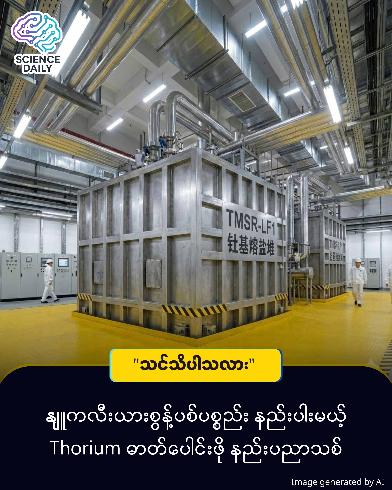

summary:ကမ္ဘာ့ပထမဆုံး Thorium နျူကလီးယားစွမ်းအင် လောင်စာအဖြစ်ပြောင်းလဲမှု တရုတ်အောင်မြင်
Date: 2025-12-24

 

ကမ္ဘာ့ပထမဆုံး Thorium နျူကလီးယားစွမ်းအင် လောင်စာအဖြစ်ပြောင်းလဲမှု တရုတ်အောင်မြင်

တရုတ်နိုင်ငံမှာရှိတဲ့ TMSR-LF1 လို့ခေါ်တဲ့ စမ်းသပ် Thorium ဓာတ်ပေါင်းဖိုကနေ Thorium နဲ့ Uranium လောင်စာကို အောင်မြင်စွာ စတင်လည်ပတ်နိုင်ခဲ့ပါပြီ ။ ဒါဟာ ကမ္ဘာပေါ်မှာ ပထမဆုံးအကြိမ် Thorium ကို Molten Salt Reactor (ဆားရည်ပူ ဓာတ်ပေါင်းဖို) ထဲထည့်ပြီး လက်တွေ့စမ်းသပ်မှု အောင်မြင်ပြီး ဒေတာတွေ ရယူနိုင်ခဲ့တာ ဖြစ်ပါတယ် ။

ပုံမှန် နျူကလီးယား ဓာတ်ပေါင်းဖိုတွေက အစိုင်အခဲ လောင်စာတောင့်တွေ သုံးကြပြီး လောင်စာဖြည့်ချင်ရင် စက်ကို ရပ်ထားရပါတယ် ။ ဒါပေမဲ့ ဒီ Thorium ဓာတ်ပေါင်းဖိုကတော့ ထူးခြားပါတယ်။ သူက လောင်စာကို အရည်ပျော်နေတဲ့ ဆားရည် (Molten Salt) ထဲမှာ ပျော်ဝင်စေပြီး လှည့်ပတ်မောင်းနှင်တာပါ ။ ဒါကြောင့် စက်ရပ်စရာမလိုဘဲ လောင်စာဖြည့်နိုင်သလို အပူကိုလည်း ဆက်တိုက်ထုတ်ပေးနိုင်ပါတယ် ။

၂၀၂၅ ခုနှစ်၊ နိုဝင်ဘာလ ၁ ရက်နေ့မှာ Shanghai Institute of Applied Physics (SINAP) က ဒီစမ်းသပ်မှုအောင်မြင်ကြောင်း ကြေညာခဲ့ပါတယ် ။ ဒီဓာတ်ပေါင်းဖိုမှာ ပါဝင်တဲ့ နည်းပညာအချက်အလက်တွေကတော့ -

Thorium ပမာဏ: ၅၀ ကီလိုဂရမ်လောက်ကို အသုံးပြုထားပါတယ် ။

လောင်စာအချိုးအစား: Uranium-235 ပါဝင်မှုကို ၂၀ ရာခိုင်နှုန်းအောက် လျှော့ချထားတဲ့ လောင်စာကို သုံးထားတာ ဖြစ်ပါတယ် ။

အအေးခံစနစ်: Lithium-beryllium fluoride (FLiBe) လို့ခေါ်တဲ့ အရည်ပျော်ဆားကို အသုံးပြုထားပါတယ် ။

ဒါဟာ စာရွက်ပေါ်က သီအိုရီမဟုတ်တော့ပါဘူး။ ၂၀၂၃ ခုနှစ် ဇွန်လမှာ လည်ပတ်ခွင့်လိုင်စင်ရခဲ့ပြီး၊ အောက်တိုဘာလကတည်းက စက်စတင်လည်ပတ် (First Criticality) ခဲ့တာပါ ။ အခု ၂၀၂၅ မှာတော့ Thorium လောင်စာအသစ်ကို လက်တွေ့ အောင်မြင်စွာ ပြောင်းလဲအသုံးပြုနိုင်ခဲ့တာ ဖြစ်ပါတယ် ။ လက်ရှိမှာ ဒါဟာ ကမ္ဘာပေါ်မှာ Thorium လောင်စာကို အောင်မြင်စွာ ထည့်သွင်းမောင်းနှင်နေတဲ့ တစ်ခုတည်းသော Molten Salt Reactor ဖြစ်ပါတယ် ။

ဒီနည်းပညာရဲ့ အဓိက အားသာချက်ကတော့ နျူကလီးယား စွန့်ပစ်ပစ္စည်း (Radioactive Waste) ထွက်ရှိမှုကို သိသိသာသာ လျှော့ချပေးနိုင်တာပါပဲ ။ လောင်စာကိုလည်း ပိုမိုထိရောက်စွာ အသုံးပြုနိုင်ပါတယ် ။ တရုတ်နိုင်ငံအနေနဲ့ နောက်တစ်ဆင့်အဖြစ် ၂၀၃၅ ခုနှစ်မှာ ၁၀၀ မဂ္ဂါဝပ် (MWt) ထွက်ရှိမယ့် ဓာတ်ပေါင်းဖိုကြီးတွေ တည်ဆောက်ပြီး လက်တွေ့အသုံးချဖို့ ရည်မှန်းထားပါတယ် ။

Thorium (သိုရီယမ်) ဆိုတာ ဘာလဲ? 

Thorium ဆိုတာ သဘာဝကျောက်လွှာတွေနဲ့ သဲတွေထဲမှာ တွေ့ရတတ်တဲ့ ငွေရောင်သတ္တုတစ်မျိုး ဖြစ်ပါတယ်။ သူ့ရဲ့ ထူးခြားချက်ကတော့ -

လောင်စာအဖြစ် ပြောင်းလဲနိုင်စွမ်း: Thorium ဟာ သူ့ချည်းသက်သက်ဆိုရင် နျူကလီးယားလောင်စာအဖြစ် ချက်ချင်းမသုံးနိုင်ပါဘူး။ ဒါပေမဲ့ ဓာတ်ပေါင်းဖိုထဲမှာ တခြားလောင်စာ (ဥပမာ - Uranium) နဲ့ တွဲပြီး အပူပေးလိုက်ရင်တော့ စွမ်းအင်အများကြီးထွက်တဲ့ လောင်စာကောင်း (Uranium-233) အဖြစ် ပြောင်းလဲသွားပါတယ် ။

ပိုပြီး ပေါများတယ်: ကမ္ဘာမြေပေါ်မှာ သမရိုးကျ Uranium သတ္တုထက် Thorium က ပိုပြီး ပေါများစွာ ရှိနေပါတယ်။

စွန့်ပစ်ပစ္စည်း နည်းတယ်: Thorium ကိုသုံးတာက ရေဒီယိုသတ္တိကြွ စွန့်ပစ်ပစ္စည်း ထွက်ရှိမှုကို သိသိသာသာ လျှော့ချပေးနိုင်တဲ့ အားသာချက်ရှိပါတယ် ။

(ရိုးရိုးရှင်းရှင်း ပြောရရင်တော့ Thorium ဆိုတာ "အသင့်စား" လောင်စာမဟုတ်ဘဲ၊ ချက်လိုက်မှ စားလို့ကောင်းတဲ့ "ဟင်းရွက်ကြမ်း" လိုမျိုး စွမ်းအင်အရင်းအမြစ်တစ်ခုပါပဲ။)

Source: World Nuclear News

Disclaimer: This post is for educational purposes only. (ဤပို့စ်သည် နည်းပညာဗဟုသုတ မျှဝေခြင်းသက်သက်သာ ဖြစ်ပြီး၊ နျူကလီးယားစွမ်းအင်ဆိုင်ရာ နည်းပညာအသစ်များကို လေ့လာနိုင်ရန် ရည်ရွယ်ပါသည်။)

#ThoriumEnergy #NuclearTechnology #CleanEnergy #ScienceNews #MyanmarTech #Innovation #FutureEnergy
