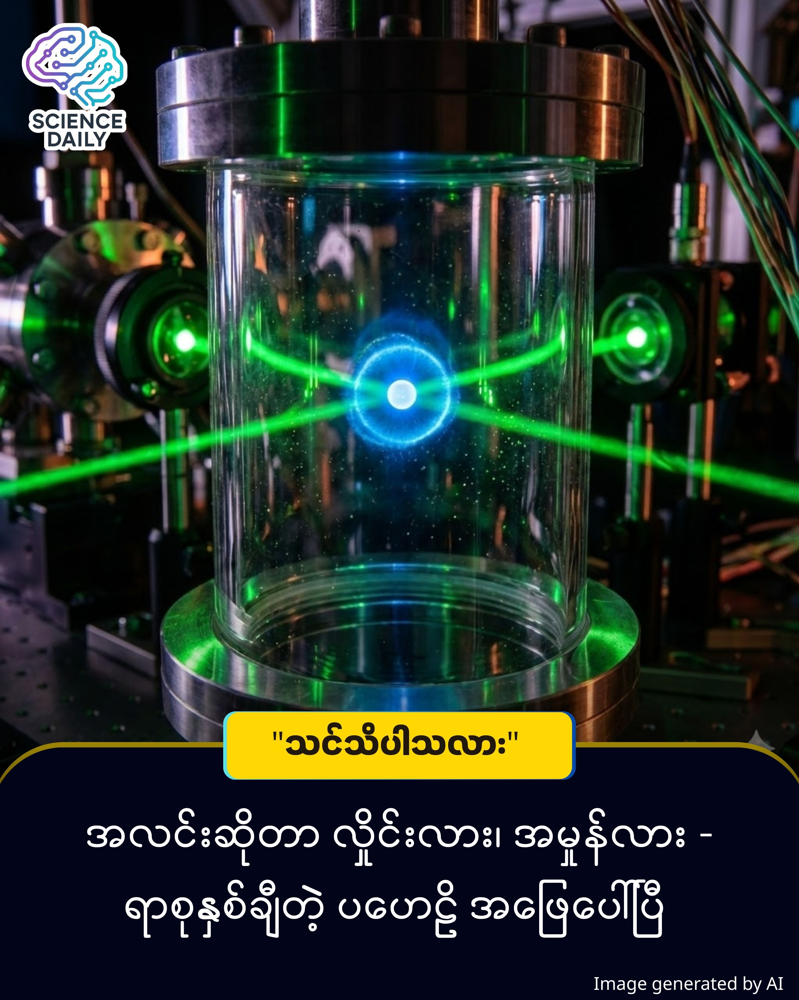

title: အိုင်းစတိုင်းနဲ့ နီးလ်ဘိုးတို့ရဲ့ နှစ် ၁၀၀ ကြာ "ကွမ်တမ် စိန်ခေါ်ပွဲကြီး" အဖြေပေါ်ပြီ
summary: ၁၉၂၇ ခုနှစ်တုန်းက ရူပဗေဒလောကရဲ့ ဆရာကြီးနှစ်ဆူဖြစ်တဲ့ အိုင်းစတိုင်း (Albert Einstein) နဲ့ နီးလ်ဘိုး (Niels Bohr) တို့ကြားမှာ သမိုင်းတွင်မယ့် ငြင်းခုံပွဲတစ်ခု ရှိခဲ့ဖူးပါတယ်။
Date: 2025-12-30
Image: images/Wave or Particle.jpg

အိုင်းစတိုင်းနဲ့ နီးလ်ဘိုးတို့ရဲ့ နှစ် ၁၀၀ ကြာ "ကွမ်တမ် စိန်ခေါ်ပွဲကြီး" အဖြေပေါ်ပြီ

နိဒါန်း 

၁၉၂၇ ခုနှစ်တုန်းက ရူပဗေဒလောကရဲ့ ဆရာကြီးနှစ်ဆူဖြစ်တဲ့ အိုင်းစတိုင်း (Albert Einstein) နဲ့ နီးလ်ဘိုး (Niels Bohr) တို့ကြားမှာ သမိုင်းတွင်မယ့် ငြင်းခုံပွဲတစ်ခု ရှိခဲ့ဖူးပါတယ်။ အဲဒီတုန်းက လက်တွေ့စမ်းသပ်လို့ မရနိုင်သေးဘဲ "စိတ်ကူးယဉ် စမ်းသပ်ချက် (Thought Experiment)" အနေနဲ့ပဲ ရှိခဲ့တဲ့ ဒီအရာကို အခု ၂၀၂၅ ခုနှစ်မှာတော့ တကယ်လက်တွေ့ အကောင်အထည်ဖော် အဖြေထုတ်နိုင်ခဲ့ပါပြီ ။ ဒီစမ်းသပ်ချက်က ကွမ်တမ်ရူပဗေဒရဲ့ အခြေခံအကျဆုံး မေးခွန်းတစ်ခုကို အဖြေပေးလိုက်တာပါပဲ ။

အခြေခံ သဘောတရား

အဓိက ပြဿနာက "အလင်းဆိုတာ လှိုင်း (Wave) လား၊ အမှုန် (Particle) လား" ဆိုတာပါပဲ ။

သာမန်အားဖြင့် အလင်းကို အပေါက်ငယ်နှစ်ခု (Double-slit) ကနေ ဖြတ်သန်းစေရင် တစ်ဖက်က ပိတ်ကားပေါ်မှာ လှိုင်းတွေ ရိုက်ခတ်သလို အစင်းရာတွေ (Interference Pattern) ပေါ်လာတတ်ပါတယ် ။ ဒါကိုကြည့်ပြီး အလင်းဟာ "လှိုင်း" ဖြစ်တယ်လို့ သတ်မှတ်ခဲ့ကြပါတယ် ။

ဒါပေမဲ့ အိုင်းစတိုင်းက ဒါကို သဘောမကျပါဘူး။ သူက အလင်းဟာ "အမှုန်" ဖြစ်တယ်လို့ ယုံကြည်ပြီး၊ အပေါက်တစ်ခုချင်းစီကို အလင်းဖြတ်သွားတာကို တိုင်းတာလို့ရမယ့် စက်ယန္တရားတစ်ခုကို စိတ်ကူးယဉ် ပုံဖော်ခဲ့ပါတယ် ။ သူ့အယူအဆကတော့ အလင်းမှုန် ဘယ်အပေါက်က ဝင်သွားလဲဆိုတာ သိလိုက်တာနဲ့ ဟိုလှိုင်းသဏ္ဌာန် အစင်းရာတွေ ပျောက်သွားရမယ်လို့ ဆိုပါတယ် ။

တွေ့ရှိချက် အသစ်

တရုတ်နိုင်ငံ University of Science and Technology မှ Chao-Yang Lu နဲ့ အဖွဲ့ဟာ အိုင်းစတိုင်းရဲ့ စိတ်ကူးကို လက်တွေ့ အကောင်အထည် ဖော်နိုင်ခဲ့ကြပါတယ် ။

သူတို့ဟာ သာမန် အပေါက် (Slit) အစား လေဆာနဲ့ ထိန်းချုပ်ထားတဲ့ "အက်တမ် (Atom)" တစ်လုံးကို အသုံးပြုခဲ့ကြတာပါ ။

အလင်းမှုန် (Photon) က ဒီအက်တမ်ကို ဝင်တိုက်လိုက်ရင် အက်တမ်က နောက်ကို တွန့်ဆုတ်သွား (Recoil) ပါတယ် ။ ဒီတွန့်ဆုတ်သွားတဲ့ အရှိန် (Momentum) ကို တိုင်းတာပြီး အလင်းရဲ့ လမ်းကြောင်းကို ခြေရာခံနိုင်အောင် ဖန်တီးခဲ့တာ ဖြစ်ပါတယ် ။

ဒီစမ်းသပ်ချက်ဟာ Physical Review Letters မှာ ဖော်ပြခံရပြီး အတည်ပြုထားတဲ့ ရလဒ်ဖြစ်ပါတယ် ။ ရလဒ်ကတော့ နီးလ်ဘိုး (Bohr) ရဲ့ အယူအဆ မှန်ကန်ကြောင်း သက်သေပြလိုက်တာပါပဲ ။

သုတေသီတွေက အက်တမ်ရဲ့ လှုပ်ရှားမှုကို တိတိကျကျ တိုင်းတာလိုက်တာနဲ့ တပြိုင်နက် ဟိုလှိုင်းသဏ္ဌာန် အစင်းရာတွေ (Interference Pattern) ပျောက်ကွယ်သွားတာကို တွေ့ရှိခဲ့ရပါတယ် ။

ပိုစိတ်ဝင်စားဖို့ကောင်းတာက သူတို့ဟာ ကိရိယာတွေကို ချိန်ညှိပြီး "ကြားကာလ" တစ်ခုကို ဖန်တီးနိုင်ခဲ့ပါတယ် ။ အဲဒီအခြေအနေမှာတော့ အလင်းဟာ လှိုင်းအဖြစ်ရော၊ အမှုန်အဖြစ်ရော တစ်ပြိုင်နက်တည်း ပြုမူနေတာကို တွေ့မြင်ခဲ့ရပါတယ် ။

"ကွမ်တမ် မက္ကင်းနစ် (Quantum Mechanics) ကို ဒီလောက် အခြေခံကျကျ လက်တွေ့ မြင်တွေ့ခွင့်ရတာဟာ တကယ့်ကို ရင်သပ်ရှုမောဖွယ်ရာပါပဲ" လို့ သုတေသီ Lu က ဆိုပါတယ် ။ ဒီတွေ့ရှိချက်က ရှုပ်ထွေးတဲ့ ကွမ်တမ်ကမ္ဘာကြီး ဘယ်လိုလည်ပတ်နေလဲဆိုတာကို ပိုမိုခိုင်မာစွာ နားလည်စေပြီး၊ အနာဂတ် ကွမ်တမ်နည်းပညာတွေအတွက် အရေးပါတဲ့ မှတ်တိုင်တစ်ခု ဖြစ်လာမှာပါ ။

Source Reference
Source: New Scientist US - No.35733574, Holiday _ New Year Special, "Quantum test settles an old score"

#QuantumPhysics #EinsteinVsBohr #ScienceNews #MyanmarScience #NewScientist #PhysicsUpdate #KnowledgeSharing #ကွမ်တမ်ရူပဗေဒ
