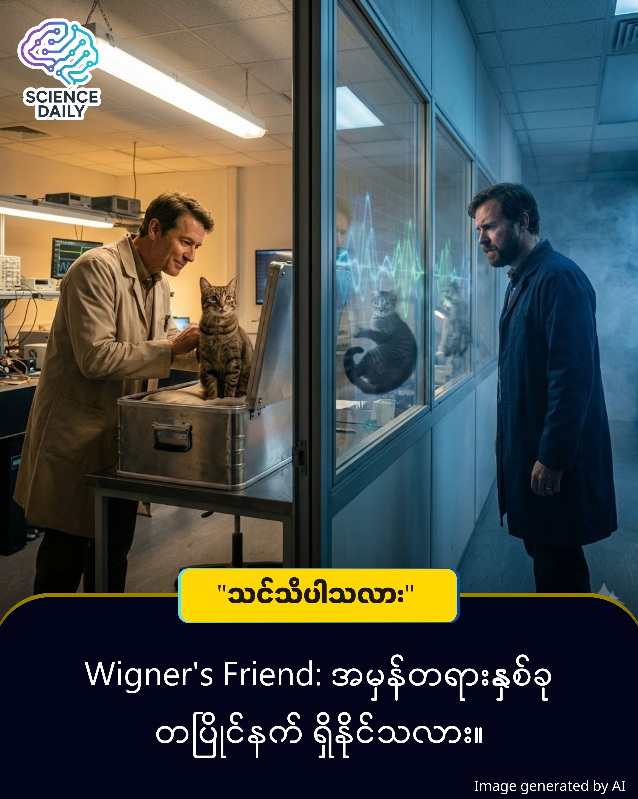

title: နိုဘယ်လ်ဆုရှင် Eugene Wigner ကိုယ်တိုင် ရေးသားခဲ့သည့် စာတမ်း မှ - Wigner's Friend နဲ့ အကဲခတ်သူ ပြဿနာ
summary: မိတ်ဆွေ... အခု ဒီစာကို ဖတ်နေရင်း မိတ်ဆွေရဲ့ ဘေးပတ်ဝန်းကျင်ကို တချက်လောက် ဝေ့ကြည့်လိုက်ပါ။ မိတ်ဆွေရဲ့ ဘေးမှာ ထိုင်နေတဲ့ သူငယ်ချင်း (သို့မဟုတ်) စားပွဲပေါ်က ကော်ဖီခွက်လေး... ဒါတွေက "အစစ်" လို့ မိတ်ဆွေ ယုံကြည်တယ်မလား။
Date: 2026-01-16
Image: images/Wigner’s Friend.jpg

နိုဘယ်လ်ဆုရှင် Eugene Wigner ကိုယ်တိုင် ရေးသားခဲ့သည့် စာတမ်း မှ - Wigner's Friend နဲ့ အကဲခတ်သူ ပြဿနာ

( စာရေးသူ၏ အမှာစကား - "ဒီအကြောင်းအရာသည် အလွန်ခက်ခဲနက်နဲပါတယ်။ လူတိုင်းလည်း နားလည်နိုင်မယ်လို့ မထင်ပါဘူး။ ဒီအကြောင်းအရာကို လူတိုင်းနားလည်နိုင်တဲ့ အခြေအနေနဲ့ ကျွန်တော် မရှင်းပြနိုင်ပါ။ ကျွန်တော့်အနေနဲ့ နားလည်နိုင်ခဲ့တဲ့ နည်းလမ်းနဲ့ ပြန်လည်မျှဝေခြင်းသာ ဖြစ်ပါတယ်။ အတင်းနားလည်နိုင်အောင်လည်း မကြိုးစားပါနဲ့လို့ အကြံပေးချင်ပါတယ်။

ဒါပေမဲ့ Quantum Physics ကို စိတ်ဝင်စားတယ်ဆိုရင်တော့ ဖတ်ကြည့်ပါ။ နားလည်နိုင်တယ်ဆိုရင်တော့ ကျွန်တော် ဝမ်းသာပါတယ်။ ဘယ်လိုမှ နားမလည်ဘူးဆိုရင်လည်း ဘာမှမဖြစ်ပါဘူး။ ကျွန်တော်က မိတ်ဆွေတို့ကို နားလည်အောင် မရှင်းပြနိုင်လို့ပါလား ဆိုပြီးတော့ပဲ အပြစ်ပုံချ ခေါင်းစဉ်တပ်လိုက်ပါလို့ မေတ္တာရပ်ခံပါရစေ။"  )

မိတ်ဆွေ... အခု ဒီစာကို ဖတ်နေရင်း မိတ်ဆွေရဲ့ ဘေးပတ်ဝန်းကျင်ကို တချက်လောက် ဝေ့ကြည့်လိုက်ပါ။ မိတ်ဆွေရဲ့ ဘေးမှာ ထိုင်နေတဲ့ သူငယ်ချင်း (သို့မဟုတ်) စားပွဲပေါ်က ကော်ဖီခွက်လေး... ဒါတွေက "အစစ်" လို့ မိတ်ဆွေ ယုံကြည်တယ်မလား။ မိတ်ဆွေ မြင်နေရတဲ့ အမှန်တရားနဲ့၊ ကျွန်တော် မြင်နေရတဲ့ အမှန်တရားဟာ "တစ်ခုတည်း၊ အတူတူပဲ" လို့ရော မိတ်ဆွေ ရဲရဲကြီး အာမခံနိုင်မလား။

တကယ်လို့များ... "မိတ်ဆွေအတွက် ဖြစ်ပျက်ပြီးသွားတဲ့ ကိစ္စတစ်ခုက၊ ကျွန်တော့်အတွက်တော့ မဖြစ်ပျက်ရသေးဘူး" ဆိုရင်ကော။

ဒီနေ့တော့ ကွမ်တမ်ရူပဗေဒ (Quantum Physics) ရဲ့ ခေါင်းအရှုပ်ဆုံး၊ ဒါပေမဲ့ စိတ်ဝင်စားဖို့ အကောင်းဆုံး "Wigner's Friend Paradox (ဝစ်ဂနာရဲ့ မိတ်ဆွေ ပုစ္ဆာ)" အကြောင်း ပြောပြချင်ပါတယ်။

💭 စိတ်ကူးကြည့်ရအောင်

ဒီသီအိုရီကို နားလည်ဖို့ ဓာတ်ခွဲခန်းတစ်ခုကို စိတ်ကူးထဲမှာ တည်ဆောက်ကြည့်ရအောင်။

၁။ အခန်းထဲမှာ: မိတ်ဆွေရဲ့ သူငယ်ချင်း "မောင်မောင်" ရှိတယ်။ သူ့ရှေ့မှာ သေတ္တာတစ်လုံးရှိပြီး အထဲမှာ ကြောင်တစ်ကောင် ရှိတယ် ။ သေတ္တာထဲက ယန္တရားတစ်ခု အလုပ်လုပ်ပုံပေါ် မူတည်ပြီး၊ ကြောင်လေးရဲ့ ကံကြမ္မာဟာ (အသက်ရှင်ခြင်း) သို့မဟုတ် (အသက်မဲ့သွားခြင်း) တစ်ခုခု ဖြစ်သွားပါလိမ့်မယ်။

၂။ အခန်းပြင်မှာ: ကွမ်တမ် ရူပဗေဒ ပညာရှင် Eugene Wigner (ဝစ်ဂနာ) ဆိုတဲ့ လူက မတ်တပ်ရပ်ပြီး စောင့် နေတယ်။

အခန်းထဲက မောင်မောင်က သေတ္တာကို ဖွင့်ကြည့်လိုက်တယ်။ ကြောင်က "အသက်ရှင်နေတယ်" ဆိုပါစို့။ မောင်မောင်အတွက် အဖြေက "သေချာသွားပြီ (Definite State)"။

ဒါပေမဲ့ ပြဿနာက အခန်းပြင်က ဝစ်ဂနာဆီမှာ စတယ်။ ဝစ်ဂနာက တံခါးပိတ်ထားလို့ ဘာမှမမြင်ရဘူး။ ကွမ်တမ်နည်းအရ ဝစ်ဂနာအတွက် "အခန်းတစ်ခုလုံး (မောင်မောင် + ကြောင်)" ဟာ ဖြစ်နိုင်ချေ နှစ်ခုလုံး ရောထွေးနေတဲ့ အခြေအနေမှာ ရှိနေတုန်းပဲ။

ဒါကို Paradox (ဝိရောဓိ) လို့ ခေါ်ပါတယ်

မောင်မောင်အတွက် - ကြောင်က ရှင်နေတယ်။ (အမှန်တရား A)

ဝစ်ဂနာအတွက် - ကြောင်ဟာ (ရှင်သန်ခြင်း) ရော (မရှိတော့ခြင်း) ရော အခြေအနေနှစ်ခုလုံး ဖြစ်နေတုန်းပဲ။ (အမှန်တရား B)

လူနှစ်ယောက်၊ အချိန်တစ်ခုတည်း၊ ဒါပေမဲ့ "အမှန်တရား (Reality)" က နှစ်ခု ဖြစ်နေတာပါ။

🧠 သိပ္ပံနည်းကျ သုံးသပ်ခြင်း

ဒီဖြစ်စဉ်ကို နားလည်ဖို့ ကွမ်တမ်ရူပဗေဒရဲ့ မဖြစ်မနေ သိထားရမယ့် "Rule" ကြီး (၂) ခုကို မိတ်ဆွေ သိထားဖို့ လိုပါလိမ့်မယ်။

၁။ Superposition (ထပ်တူကျ အခြေအနေ) ကွမ်တမ်လောကမှာ အမှုန်တစ်ခု (ဥပမာ- Electron) ဟာ မတိုင်းတာရသေးသရွေ့ နေရာတကာမှာ တပြိုင်နက် ရှိနေနိုင်သလို၊ အခြေအနေအားလုံးမှာ ဖြစ်တည်နေနိုင်ပါတယ်။ ကြောင်က (ရှင်ခြင်း + မရှိတော့ခြင်း) နှစ်မျိုးစလုံး ဖြစ်နေတဲ့ အခြေအနေပါ။

၂။ Wave Function Collapse (လှိုင်းလုပ်ဆောင်ချက် ပြိုကျခြင်း) ဒါက အရေးကြီးဆုံး စည်းမျဉ်းပါ။ ကွမ်တမ်စနစ်တစ်ခုကို "အကဲခတ်သူ (Observer)" တစ်ယောက်က ကြည့်လိုက်တာနဲ့၊ ခုနက ဖြစ်နိုင်ချေပေါင်းစုံ ရောထွေးနေတာတွေ ပျောက်သွားပြီး၊ ရလဒ် တစ်ခုတည်းအဖြစ် "ပြိုကျ (Collapse)" သွားပါတယ်။

Wigner's Friend မှာ ဘာဖြစ်သွားတာလဲ? အခန်းထဲက မောင်မောင်က ကြောင်ကို ကြည့်လိုက်တော့ သူ့အတွက် Wave Function Collapse ဖြစ်သွားပြီး "ကြောင်အရှင်" ဆိုတဲ့ အဖြေထွက်လာတယ်။ ဒါပေမဲ့ အခန်းပြင်က ဝစ်ဂနာက အခန်းထဲကို မကြည့်ရသေးဘူး။ ဒါကြောင့် ဝစ်ဂနာရဲ့ ရှုထောင့်ကနေ တွက်ချက်ရင် အခန်းတစ်ခုလုံးဟာ Superposition ဖြစ်နေတုန်းပဲ။

ဆိုလိုတာက "Measurement (တိုင်းတာမှု)" ဆိုတာ လူတိုင်းအတွက် တူညီတဲ့ Absolute Fact မဟုတ်ဘဲ၊ ကြည့်တဲ့သူအပေါ် မူတည်တဲ့ Relative Fact ဖြစ်နေတယ်လို့ ၁၉၆၁ ခုနှစ်မှာ Eugene Wigner က သီအိုရီ ထုတ်ခဲ့ပါတယ်။

🤔 ဒဿနိက ရှုထောင့် (The Philosophical Deep Dive)

ဒီနေရာမှာ သိပ္ပံပညာက ဒဿနိက (Philosophy) ဘက်ကို ကူးသွားပါပြီ။ ရှေးယခင်က သိပ္ပံပညာရှင်တွေက "လောကကြီးရဲ့ အမှန်တရားဆိုတာ လူတွေ ကြည့်ကြည့်/မကြည့်ကြည့် ရှိနေတာပဲ" (Objective Reality) လို့ ယုံကြည်ခဲ့ကြတယ်။ ဥပမာ- တောထဲမှာ သစ်ပင်လဲရင်၊ ကြားတဲ့သူ မရှိလည်း အသံက မြည်တာပဲပေါ့။

ဒါပေမဲ့ Wigner's Friend က ဘာပြောလဲဆိုတော့... "အမှန်တရားဆိုတာ အကဲခတ်သူ (Observer) မရှိဘဲ မဖြစ်တည်နိုင်ဘူး" တဲ့။

မိတ်ဆွေ မြင်နေရတဲ့ လောကကြီးက မိတ်ဆွေရဲ့ မျက်လုံး၊ ဦးနှောက်နဲ့ အာရုံခံစားမှုတွေက ဖန်တီးပေးထားတဲ့ ပုံရိပ်တစ်ခု ဖြစ်နိုင်ပါတယ်။ ကျွန်တော့်ရဲ့ လောကနဲ့ မိတ်ဆွေရဲ့ လောက ထပ်တူမကျတာတွေ ရှိနိုင်ပါတယ်။

🌟 နိဂုံး (Author's Note)

မိတ်ဆွေ... ဒီအကြောင်းကို တွေးပြီး "ငါ့ဘဝကြီးက အစစ်ရော ဟုတ်ရဲ့လား" ဆိုပြီး ကြောက်သွားစရာ မလိုပါဘူး။ Wigner's Friend ဟာ ကျွန်တော်တို့ကို တစ်ခု ပြန်သတိပေးနေတာပါ။ အဲဒါကတော့— ကျွန်တော်တို့ တစ်ဦးချင်းစီရဲ့ အမြင်တွေ၊ ယုံကြည်မှုတွေ မတူညီကြပေမယ့်၊ အားလုံးက ကိုယ့်နည်းကိုယ့်ဟန်နဲ့ "အမှန်တရား" တွေ ဖြစ်ကြတယ် ဆိုတာပါပဲ။

နောက်တစ်ခါ မိတ်ဆွေရဲ့ သူငယ်ချင်းနဲ့ စကားပြောဖြစ်ရင် တွေးကြည့်ပါ... "သူ မြင်နေရတဲ့ ကမ္ဘာကြီးနဲ့ ငါမြင်နေရတဲ့ ကမ္ဘာကြီးက တကယ်ရော တူရဲ့လား?" လို့ပေါ့။

📚 ကိုးကားချက် (References)

Eugene Wigner (1961): "Remarks on the Mind-Body Question" - နိုဘယ်လ်ဆုရှင် Eugene Wigner ကိုယ်တိုင် ရေးသားခဲ့သည့် စာတမ်း။

Experimental Verification (2019): Heriot-Watt University (UK) မှ သုတေသီများက အလင်းမှုန် (Photons) များကို အသုံးပြု၍ လက်တွေ့ စမ်းသပ်ခဲ့ကြပြီး၊ ထိုရလဒ်များကို ကမ္ဘာကျော် သိပ္ပံဂျာနယ် "Science Advances" တွင် တရားဝင် ဖော်ပြခဲ့သည်။

ဤအကြောင်းအရာသည် ကမ္ဘာ့ရူပဗေဒ အသိုင်းအဝိုင်း (Global Physics Community) မှ အသိအမှတ်ပြုထားသော Quantum Mechanics ၏ အရေးပါသည့် ဆွေးနွေးစရာ ခေါင်းစဉ်တစ်ခု ဖြစ်ပါသည်။

(မှတ်ချက် - ဤဆောင်းပါးသည် ရှုပ်ထွေးနက်နဲသော Quantum Mechanics သဘောတရားကို ရိုးရှင်းအောင် ဥပမာပေး တင်ပြထားခြင်းဖြစ်ပါသည်။ သိပ္ပံနည်းကျ အသေးစိတ် ညီမျှခြင်းများမှာ ဤထက် ပိုမိုနက်ရှိုင်းနိုင်ပါသည်။)

#QuantumPhysics #Philosophy #WignersFriend #BurmeseScience #DeepTech #RealityCheck #ScienceStoryteller #MyanmarTech

