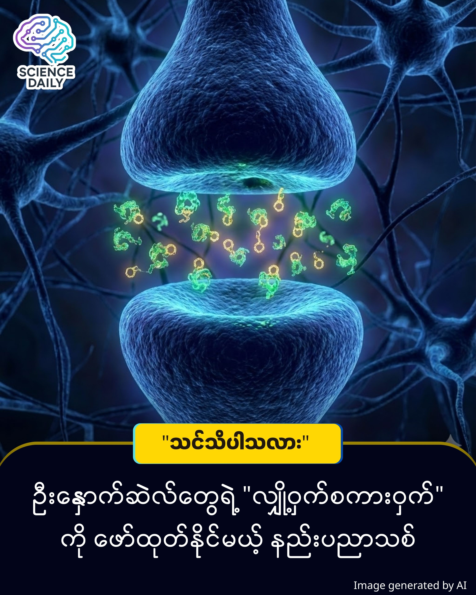

title: ဦးနှောက်ရဲ့ လျှို့ဝှက်ဘာသာစကားကို နားထောင်နိုင်မယ့် နည်းပညာအသစ် ပေါ်ထွက်လာပြီ!
summary: ဦးနှောက်ထဲမှာ ဆဲလ်တွေ ဘယ်လိုအလုပ်လုပ်သလဲဆိုတာကို အရင်ကထက် ပိုပြီးတိတိကျကျ လေ့လာနိုင်မယ့် နည်းပညာအသစ်တစ်ခုကို သိပ္ပံပညာရှင်တွေ ရှာဖွေတွေ့ရှိလိုက်ပါပြီ။ 
Date: 2025-12-31
Image: images/brain’s hidden language.jpg

ဦးနှောက်ရဲ့ လျှို့ဝှက်ဘာသာစကားကို နားထောင်နိုင်မယ့် နည်းပညာအသစ် ပေါ်ထွက်လာပြီ!

ဦးနှောက်ထဲမှာ ဆဲလ်တွေ ဘယ်လိုအလုပ်လုပ်သလဲဆိုတာကို အရင်ကထက် ပိုပြီးတိတိကျကျ လေ့လာနိုင်မယ့် နည်းပညာအသစ်တစ်ခုကို သိပ္ပံပညာရှင်တွေ ရှာဖွေတွေ့ရှိလိုက်ပါပြီ။ ဒီနည်းပညာဟာ ဦးနှောက်ဆဲလ်တွေ အချင်းချင်း ပေးပို့တဲ့ "အဝင် သတင်းအချက်အလက်" (incoming signals) တွေကို ဖမ်းယူနားထောင်ပေးနိုင်မှာ ဖြစ်ပါတယ်။

ဘယ်လို အလုပ်လုပ်သလဲ

ကျွန်တော် တို့ရဲ့ ဦးနှောက်ထဲမှာ နျူရွန် (Neuron) လို့ခေါ်တဲ့ ဦးနှောက်ဆဲလ်ပေါင်း ဘီလီယံများစွာ ရှိပါတယ်။ သူတို့က လျှပ်စစ်စီးကြောင်းလေးတွေ၊ ဓာတုပစ္စည်းလေးတွေနဲ့ အချင်းချင်း စကားပြောကြပါတယ်။

အရင်တုန်းက နည်းပညာတွေဟာ ဆဲလ်တစ်ခုကနေ ထုတ်လွှတ်လိုက်တဲ့ အချက်ပြမှု (Outgoing signals) ကိုပဲ ဖမ်းယူနိုင်ခဲ့ပါတယ်။ ဒါဟာ စကားပြောနေတဲ့ လူနှစ်ယောက်မှာ တစ်ဖက်သတ်ပြောစကားကိုပဲ ကြားရသလို ဖြစ်နေခဲ့တာပါ။ 

အခု တွေ့ရှိချက်အသစ်မှာတော့ iGluSnFR4 လို့ အမည်ပေးထားတဲ့ အာရုံခံ ပရိုတင်း (Protein Sensor) တစ်မျိုးကို တီထွင်လိုက်နိုင်ပါတယ်။ ဒီပရိုတင်းဟာ ဦးနှောက်ဆဲလ်တွေဆီ "ဝင်လာတဲ့" သတင်းအချက်အလက် (Incoming signals) တွေကိုပါ ဖမ်းယူနိုင်စွမ်း ရှိသွားပါပြီ။

ဒီပရိုတင်းဟာ Glutamate လို့ခေါ်တဲ့ ဓာတုပစ္စည်း (Neurotransmitter) ကို ထောက်လှမ်းနိုင်တာ ဖြစ်ပါတယ်။ Glutamate ဟာ ဦးနှောက်ဆဲလ်တွေ ဆက်သွယ်ရာမှာ အရေးအပါဆုံး ဓာတုပစ္စည်းဖြစ်ပေမယ့် အရင်က ဖမ်းယူဖို့ အရမ်းခက်ခဲခဲ့ပါတယ်။ အခုနည်းပညာသစ်ကြောင့် ဦးနှောက်ဆဲလ်တွေကြား ဆက်သွယ်မှု လမ်းကြောင်းတွေကို အချိန်နဲ့တစ်ပြေးညီ (Real-time) ရှင်းရှင်းလင်းလင်း မြင်တွေ့လာရတော့မှာ ဖြစ်ပါတယ်။

ဒီတွေ့ရှိချက်ကို နိုင်ငံတကာ အသိအမှတ်ပြု သိပ္ပံဂျာနယ်ကြီးဖြစ်တဲ့ Nature Methods မှာ ၂၀၂၅ ခုနှစ်၊ ဒီဇင်ဘာ ၂၃ ရက်နေ့က တရားဝင် ဖော်ပြအတည်ပြုခဲ့တာ ဖြစ်ပါတယ်။ ဒါဟာ သီအိုရီအဆင့် မဟုတ်ဘဲ လက်တွေ့စမ်းသပ်အောင်မြင်ထားတဲ့ Peer-Reviewed (ပညာရှင်အချင်းချင်း ပြန်လည်စစ်ဆေးထားသော) ရလဒ်တစ်ခု ဖြစ်ပါတယ်။ ဒီသုတေသနကို Allen Institute နဲ့ HHMI Janelia Research Campus က ပညာရှင်တွေ ပူးပေါင်းလုပ်ဆောင်ခဲ့ကြတာပါ။

ဒီနည်းပညာဟာ ကျန်းမာရေးကဏ္ဍအတွက် အလွန်ကြီးမားတဲ့ အပြောင်းအလဲတွေကို ဖြစ်စေနိုင်ပါတယ် -

ရောဂါရှာဖွေခြင်း: အယ်လ်ဇိုင်းမား (Alzheimer's)၊ စိတ်ကစဉ့်ကလျားရောဂါ (Schizophrenia)၊ အော်တစ်ဇင် (Autism) နဲ့ အတက်ရောဂါ (Epilepsy) တို့လို ဦးနှောက်နဲ့ဆိုင်တဲ့ ရောဂါတွေရဲ့ မူလဇစ်မြစ်ကို ရှာဖွေရာမှာ အထောက်အကူပြုပါမယ်။ 

ဆေးဝါးထုတ်လုပ်ခြင်း: ဦးနှောက်ရောဂါ ကုသဆေးအသစ်တွေကို စမ်းသပ်တဲ့အခါ ဆေးရဲ့ အာနိသင်ကို ပိုပြီး တိတိကျကျ သိမြင်လာနိုင်မှာ ဖြစ်လို့ ပိုကောင်းတဲ့ ဆေးဝါးတွေ ပေါ်ထွက်လာနိုင်ပါတယ်။

Source: Allen Institute & Nature Methods

#Neuroscience #BrainResearch #AllenInstitute #MedicalBreakthrough #MyanmarScience #HealthTech #BrainSecrets #NatureMethods

